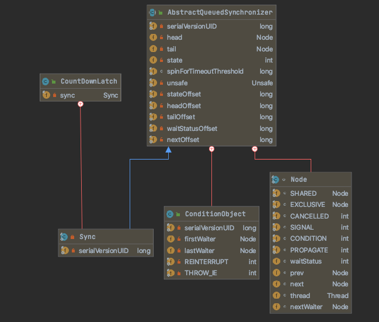

## 一、并发编程的挑战

## 二、 Java并发机制的底层实现原理

2.1 Volatile的应用

2.2 Synchronized的实现原理与应用

## 三、Java内存模型

### 1. Java内存模型的基础

### 2. 重排序

### 3. 顺序一致性

### 4.Syncronized

>  关键字`synchronized` 可以保证同一时刻，只有一个线程在执行一个方法，或者一段代码块。 

#### 4.1 synchronized 实现同步的基础

* Java中的每一个对象都可以作为锁。具体表现为下面三种形式

  * 对于普通同步方法，锁是当**前实例对象**	
  * 对于静态同步方法，锁是当**前类的Class 对象**
  * 对于同步方法块，锁是**synchronize括号里配置的对象**

* 当一个线程试图访问同步代码块时，他首先必须得到锁，退出或者抛出异常时必须释放锁。

* 锁存在哪里？里面存储什么内容？

  * JVM基于进入和退出 `Monitor` 对象实现方法同步和代码块同步。但是两者的实现细节不一样，代码块同步使用`monitorener` 和 `monitorexit` 指令实现的，而方法同步是使用另外一种方式实现的，但方法的同步同样可以用这两个指令来实现。
  * `monitorenter`指令是在编译后插入到同步代码块的开始位置。
  * `monitorexit` 指令是在编译后插入到方法结束和异常处。
  * JVM要保证每个 `monitorenter` 必须有对应的 `monitorexit` 与之配对。
  * 任何对象都有一个 `monitor` 与之关联，当一个 `monitor` 被持有后，它将处于锁定状态。线程执行到 `monitorenter` 指令时，将会尝试获取对象所对应的 `monitor `的所有权，即尝试获得对象的锁。

* Java对象头 

  * synchronized锁是存在Java 对象头里面。

  **表2.1 Java对象头的长度**

  

  **表2.2 Java 对象头中Mark Word的存储结构**

  

  在运行期间，Mark Word里面存储的数据会随着锁标志位的变化而变化。Mark Work可能变化为存储一下四种数据，如表2.3所示。

  **2.3 Mark Word的状态变化**

  

  在64位虚拟机下，Mark Word 是64bit大小的，存储结构如表2.4所示

  **表2.4 64位虚拟机下Mark Word的存储结构**

  

#### 4.2 Synchronized底层优化（偏向锁、轻量级锁)


##### 4.2.1 偏向锁 

是一个标签

**场景：**大多数情况下，锁不仅不存在多线程竞争，而且总是由一线程多次获得，为了让线程获得锁的过程更加低而引入了偏向锁。

**原理**：当线程进入同步块并获取锁时，会在对象头和栈帧中的锁记录里存储偏向锁的线程ID，以后该线程进入和退出同步块时不需要CAS操作进行加锁和解锁，只需要**简单测试一下对象头中的线程ID是否存储着当前线程的线程ID**，如果测试成果则表示看已经获得了锁。如果测试失败，则需要**检查一下偏向锁标志位是否为1**（表示当前是偏向锁）：如果没有设置，则使用CAS竞争锁；如果设置了，则尝试使用CAS将对象头中的偏向锁指向当前线程。

**撤销偏向锁：**

偏向锁的撤销使用一种等到**竞争才释放锁的机制**。所以当其他线程尝试竞争偏向锁时，持有偏向锁的线程才会释放锁。偏向锁的撤销，需要等到全局安全点。

首先暂停拥有偏向锁的线程。然后检查持有偏向锁的线程是否还活着，如果线程不处于活动状态，则将对象头设置为无锁状态；如果线程仍然活着，拥有偏向锁的栈会被执行，遍历偏向对象的锁记录，栈中的锁记录和对象头的Mark Word要么重新偏向于其他线程，要么恢复无锁或者标记对象不适合作为偏向锁，最后唤醒所有暂停的线程。


**关闭偏向锁：**

 -XX:BiasedLockingStartupDelay=0 ,关闭偏向锁的延迟开启。

-XX:UseBiasedLocking=false，进入无偏向锁的状态。

JDK 15废弃了偏向锁。

##### 4.2.2 轻量级锁

**场景：**竞争不会阻塞，提高程序的响应速度，**适用于追求响应速度，同步块执行速度非常快**。（缺点是自旋回消耗CPU）

**原理：**

**加锁：**线程在执行同步块钱，JVM回现在当前线程的栈帧中**创建用于存储锁记录的空间，并将对象头中的Mark Word复制到锁记录中**，官方称为Displaced Mark Word。然后线程尝试使用CAS将对象头中的Mark Word替换为指向锁记录的指针。如果成功，当前线程获得锁，如果失败，表示其他线程获得锁，当前线程便尝试使用自旋来获取锁。

**解锁：**轻量级锁解锁时，会使用原子的CAS操作将Displace Mark Word替换回到对象头，如果成功，则表示没有竞争发生。如果失败，表示当前锁存在竞争，锁就会膨胀成重量级锁。


##### 4.2.3 重量级锁 

内置锁在JAVA中被抽象为监视器锁（monitor）。 在JDK1.6之前，监视器可以认为直接对应底层操作系统中的互斥量（mutex）。这种同步方式的成本非常高，包括系统调用引起的用户态和内核态切换、线程阻塞造成的线程切换 。因此，后来称这种锁为“重量级锁”。

因为自旋会消耗CPU，为了避免无用的自旋（比如获得锁的线程被阻塞了）其他线程试图获取锁时，都会被阻塞住，当持有锁的线程释放锁之后会唤醒这些线程，被唤醒的线程都会进行新一轮的夺锁之争。

##### 4.2.4 其他优化

###### 4.2.4.1适应性自旋

###### 4.2.4.2 锁粗化

* 锁粗化，一个 程序对同一个锁不间断、高频地请求、同步与释放，会消耗一定的系统资源，因为锁的请求、同步与释放就是会带来性能消耗。

```
for(int i=0;i<size;i++){
    synchronized(lock){
    }
}

/**
* 锁粗化后
*/
synchronized(lock){
    for(int i=0;i<size;i++){
    }
}
```

###### 4.2.4.3 锁消除

* 锁消除是发生在编译器级别的一种锁优化方式。

比如如果在StringBuffer作为局部变量，且不存在外部线程共享时，可以通过

`-server -XX:+DoEscapeAnalysis -XX:+EliminateLocks` 进行优化，其中`+DoEscapeAnalysis` 表示开启逃逸分析，`+EliminateLocks`表示锁消除。


### 5. volatile的内存语义

> * 可见性。对于一个`volatile` 变量的读，总是能看到（任意线程）对这个 `volatile` 变量最后的写入。
> * 原子性。对于任意单个 `volatile` 变量的读/写具有原子性，但类似于`volatile++`这种复合操作不具有原子性。

#### 5.1 volatile 定义

Java允许线程访问共享变量，为了确保共享变量能被准确和一致的更新，线程应该确保通过排他锁单独获得这个变量。Java提供了volatile,在某些方面比锁 更加方便。**如果一个变量被声明为volatile，Java线程内存模型确保所有线程看到这个变量的值是一致的**。

#### 5.2 volatile实现原理(内存屏障)

> instance = new Singleton(); // instance是volatile变量
>
> 转变成汇编代码，如下。
>
> 0x01a3de1d: movb $0×0,0×1104800(%esi);0x01a3de24: lock addl $0×0,(%esp); 0x01a3de24: lock addl $0×0,(%esp);

有volatile 变量修饰的共享变量进行写操作的时候会多出第二行汇编代码，Lock前缀的指令在多核处理器下会引发两件事情：

* 将当前处理器缓存行的数据写回到系统内容。
* 这个写回内容的操作回使在其他CPU里缓存了该内容地址的数据无效。

#### 5.3 volatile写-读的内存语义

1. volatile写的内存语义如下：

   **当写一个volatile变量时，JMM会把线程对应的本地内存中的共享变量值刷新到主内存。**

2. volatile读的内存语义如下：

   **当读一个volatile变量时，JMM会把该线程对应的本地内存置为无效，然后从主内存中读取共享变量**

##### 5.4 JSR-133 为什么要增强 `volatile` 的内存语义

在旧的内存模型中，volatile的写-读没有锁的释放-获取具有的内存语义。为了提供一种**比锁更轻量级的线程之间的通信机制**。JSR-133 专家组决定增强 `volatile` 的内存语义：严格限制编译器和处理器对volatile变量和普通变量的重排序，确保**volatile的写-读**和**锁的释放-获取**具有相同的内存语义。

由于volatile仅保证对单个volatile变量的读/写具有原子性，而锁的互斥执行的特性可以确保对整个临界区代码的执行具有原子性。在功能上，锁比volatile更强大；在可伸缩性和执行性能上，volatile 根据更具有优势。

### 6. 锁的内存语义

> 锁是 Java并发编程中最重要的同步机制。锁除了让临界区互斥执行外，还可以让释放锁的线程向获取同一个锁的线程发送消息。

#### 6.2 锁的释放-获取建立的happens-before关系

#### 6.3 锁的释放和获取的内存语义


对比锁释放-获取的内存语义于volatile写-读的内存可以看出：锁释放于volatile 写有相同的内存语义；锁获取于volatile读有相同的内存语义。

下面对锁释放和锁获取**内存语义总结**：

* 线程A释放一个锁，实质上是线程A向接下来将要获取这个锁的某个线程发出了（线程A对共享变量所做修改的）消息。
* 线程B获取一个锁，实质上是线程B接收到了之前某个线程发出的（在释放这个锁之前对共享变量所做的修改的）消息。
* 线程A释放锁，随后线程B获取了这个锁，这个过程实质上是线程A通过主内存向线程B发送消息。

#### 6.4 锁内存语义的实现


ReentrantLock分为**公平锁**和**非公平锁**：

* **公平锁加锁：**

（1） 加锁

```java
/**
     * Sync object for fair locks
     */
    static final class FairSync extends Sync {
        private static final long serialVersionUID = -3000897897090466540L;

        final void lock() {
            acquire(1);
        }

        /**
         * Fair version of tryAcquire.  Don't grant access unless
         * recursive call or no waiters or is first.
         */
        protected final boolean tryAcquire(int acquires) {
            final Thread current = Thread.currentThread();
            int c = getState(); //获取锁的开始，首先读取volatile变量state
            if (c == 0) {
                if (!hasQueuedPredecessors() &&
                    compareAndSetState(0, acquires)) {
                    setExclusiveOwnerThread(current);
                    return true;
                }
            }
            else if (current == getExclusiveOwnerThread()) {
                int nextc = c + acquires;
                if (nextc < 0)
                    throw new Error("Maximum lock count exceeded");
                setState(nextc);
                return true;
            }
            return false;
        }
    }
```

（2）释放锁

```java
abstract static class Sync extends AbstractQueuedSynchronizer {
        protected final boolean tryRelease(int releases) {
            int c = getState() - releases;
            if (Thread.currentThread() != getExclusiveOwnerThread())
                throw new IllegalMonitorStateException();
            boolean free = false;
            if (c == 0) {
                free = true;
                setExclusiveOwnerThread(null);
            }
            setState(c); //释放锁，写volatile变量state
            return free;
        }
}
```

> * 从上面的源码中可以看出，加锁方法首先读取volatile变量state，在释放锁的最后写volatile变量state。
> * 根据volatile的happen-before规则，释放锁的线程在写volatile变量之前可见的共享变量，在获取锁的线程读取同一个volatile变量后将立即变得对获取锁的线程可见。

* **非公平锁**

（1） 加锁

```java
/**
 * Sync object for non-fair locks
 */
static final class NonfairSync extends Sync {
  private static final long serialVersionUID = 7316153563782823691L;

  /**
   * Performs lock.  Try immediate barge, backing up to normal
   * acquire on failure.
   */
  final void lock() {
    if (compareAndSetState(0, 1))
      setExclusiveOwnerThread(Thread.currentThread());
    else
      acquire(1);
  }

  protected final boolean tryAcquire(int acquires) {
    return nonfairTryAcquire(acquires);
  }
}
```

compareAndSetState()方法

```java
    /**
     * Atomically sets synchronization state to the given updated
     * value if the current state value equals the expected value.
     * This operation has memory semantics of a {@code volatile} read
     * and write.
     *
     * @param expect the expected value
     * @param update the new value
     * @return {@code true} if successful. False return indicates that the actual
     *         value was not equal to the expected value.
     */
    protected final boolean compareAndSetState(int expect, int update) {
        // See below for intrinsics setup to support this
        return unsafe.compareAndSwapInt(this, stateOffset, expect, update);
    }
```

> * 编译器不会对volatile读和volatile读后面的任意内存操作重排序；编译器不会对volatile写和volatile写之前的任意内存操作重排序。
>
> * 组合这两个条件，意味着同时实现volatile读和volatile写的内存语义，编译器不能对CAS与CAS前面和后面的任意内存操作重排序。
>
> * Intel的手册对lock前缀的说明如下
>
>   * 1）确保对内存的读-改-写操作原子执行。lock锁住总线--> 缓存锁定（Cache Locking）。
>   * 2)  禁止该指令，与之前的和之后的读和写指令重排序。
>   * 3）把写缓冲区中所有数据刷新到内存中。
>
>   上面的2）和3）所具有的内存屏障效果，足以同时实现volatile读和volatile写的内存语义。

（2）释放锁（非公平锁的释放和公平锁的释放完全一样）

* **对公平锁和非公平锁总结**：
  * 公平锁和非公平锁释放时，最后都要写一个volatile变量state。
  * 公平锁获取时，首先会去读volatile变量。
  * 非公平锁获取时，首先会用CAS更新volatile 变量，这个操作具有volatile读和volatile写的内存语义。
  * 从对ReentrantLock的分析可以看出，锁释放-获取的内存语义实现至少有下面两种方式
    * 利用volatile变量写-读所具有的内存语义。
    * 利用CAS锁附带的volatile读和volatile写的内存语义。
  * 公平锁和非公平锁最主要的区别在于公平锁在tryAquire() 是会判断多一个条件 `!hasQueuedPredecessors()`，没有队列的的时候返回true，否则的进行排队。

#### 6.5 concurrent包的实现

1. 由于Java 的CAS同时具有volatile读和volatile写的内存语义，因此Java线程之间的通行现在有了下面4中方式：

   (1) A线程写volatile变量，随后B线程读这个volatile变量。

   (2) A线程写volatile变量，随后B线程用CAS更新这个volatile变量。

   (3) A线程用CAS更新一个volatile变量，随后B线程用CAS用这个Volatile变量。

   (4) A线程CAS更新一个volatile变量，随后B线程读这个volatile变量。

2. 通过对Java中的concurrent包的源代码的实现分析，会发现一个通用化的实现模式。

   （1）首先，声明共享变量volatile。

   （2）然后，使用CAS的原子条件更新来实现线程之间的同步。

   （3）同时，配合volatile的读/写和CAS所具有的volatile读和写的内存语义来实现线程之间的通行。

   > Java 的CAS会使用现代处理器提供的高效原子级别的原子指令，这些原子指令一原子方式对内存执行**读-改-写**操作，这是多处理器实现同步的关键（从本质上讲，能够支持原子性读-改-写指令的计算机，是顺序计算图灵机的异步等价机器，因此任何现代的多处理器都会去支持某种能对内存执行原子性读-改-写操作的原子指令）。同时volatile变量的读/写和CAS可以实现线程之间的通行。这些特性整合在一起，就形成了concurrent包的一实现的基石。

从整体上看，concurrent包实现的示意图如下。


### 7. final fields 的内存语义

> 与前面介绍的volatile和锁相比，对final域的读和写更像是普通的变量访问。

#### 7.1 final 域的重排序规则

对于final域，编译器和处理器要遵守两个重排序的规则：

* 对构造函数内一个final域的写入，与随后把这个被构造对象的引用赋给一个引用变量，这两个操作之间不能重排序。
* 初次读一个包含final域的对象的引用，与随后初次读这个final域，这两个操作之间不能重排序。


#### 7.2 写final域的重排序规则

写final域的重排序规则禁止吧final域的写重排序到构造函数之外。这个规则包含下面两个方面

* JMM禁止编译器吧final域的写重排序到构造函数之外。
* 编译器会在final域的写之后，构造函数return之前，插入一个StoreStore屏障。这个屏障禁止处理器把final域的写重排序到构造函数之外。

```java
public class FinalExample {
    int                 i;  //普通变量
    final int           j;  //final变量
    static FinalExample obj;

    public FinalExample() { //构造函数
        i = 1; //写普通域
        j = 2; //写final域
    }

    public static void writer() { //写线程A执行
        obj = new FinalExample();
    }

    public static void reader() { //读线程B执行
        FinalExample object = obj; //读对象引用
        int a = object.i; //读普通域
        int b = object.j; //读final域
    }
}
```

上面的代码一种可能的运行情况如下图所示，假设线程B读对象引用与读对象的成员域之间没有重排序。

在下图中，写普通域的操作被编译器重排序到了构造函数之外，线程B错误地读取了普通变量i初始化之前的值。而写final域的操作，被写final域的重排序规则“限制”在了构造函数之内，读线程B正确地读取了final变量的初始化之后的值。


**写final域的重排序规则可以确保**：

* 在对象引用为任意线程可见之前，对象的final域已经被正确初始化了，而普通域不具有这个保障。

#### 7.3 读final域的重排序规则

读final域的重排序规则是，在一个线程中，初次读**对象引用**与初次读**该对象包含的final域**，JMM禁止处理器重排序这两个操作（注意，这个规则仅仅针对处理器）。编译器会在读final域操作的前面插入一个**LoadLoad屏障**。

> 初次读对象引用域初次读该对象包含的final域，这两个操作之间存在**间接依赖关系**。由于编译器遵守间接依赖关系。因此编译器不会重排序这两个操作。大多数处理器也会遵守间接依赖，也不会重排序这两个操作。但有少数处理器允许对存在间接依赖关系的操作做重排序（比如alpha处理器），这个规则就是针对这种处理器的。


上图中，读对象的普通域的操作被处理器冲排序到读对象引用之前。读普通域时，该域还没有被写线程写入，这是一个错误的读取操作。而读final域的重排序规则会把读对象final域的操作“限定”在读对象引用之后，此时该final域已经被A线程初始化过了，这是一个正确的读取操作。

读final域的重排序规则可以确保：在读一个对象的final域之前，一定会先读包含这个final域的对象的引用。在这个示例程序中，如果该引用不为null，那么引用对象final域一定已经被A线程初始化过了。

#### 7.4 final域为引用类型

在构造函数内对一个final引用的对象的成员域的写入，与随后在构造器函数外把这个构造器对象的引用赋值给一个引用变量，这个两个操作之间不能重排序。

```java
public class FinalReferenceExample {
    final int[] intArray; //final是引用类型
    static FinalReferenceExample obj;

    public FinalReferenceExample() { //构造函数
        intArray = new int[1]; //1,对final域的写入
        intArray[0] = 1; //2，对final域引用的对象的成员域的写入
    }

    public static void writerOne() { //写线程A执行
        obj = new FinalReferenceExample(); //3，被构造的对象的引用赋值给某个引用变量
    }

    public static void writerTwo() { //写线程B执行
        obj.intArray[0] = 2; //4
    }

    public static void reader() { //读线程C执行
        if (obj != null) { //5
            int temp1 = obj.intArray[0]; //6
        }
    }
}
```


在上图中，1是对final域的写入，2是对final域引用对象的成员域的写入，3是把构造的对象的引用赋值给某个引用变量。这里除了前面提到的1不能和3重排序外，2和3也不能重排序。

* JMM可以确保读线程C至少能看到写线程A在构造函数中对final引用对象的成员域的写入。即C至少能看到数组下标0的值为1。而写线程B对数组元素的写入，读线程C可能看得到，也可能看不到。

* JMM不保证线程B的写入对线程C可见，因为写线程B和读线程C之间存在数据竞争，此时执行结果不可预知。
* 如果想要确保读线程C看到写线程B对数组元素的写入，写线程B和读线程C之间需要使用同步源语（lock或者volatile）来保证内存可见性。

#### 7.5 为什么final引用不能从构造函数内“溢出”

```java
public class FinalReferenceEscapeExample {

    final int                          i;
    static FinalReferenceEscapeExample obj;

    public FinalReferenceEscapeExample() {
        i = 1; //1写final域
        obj = this; //2 this引用在此“逸出”
    }

    public static void writer() {
        new FinalReferenceEscapeExample();
    }

    public static void reader() {
        if (obj != null) { //3
            int temp = obj.i; //4
        }
    }
}
```


#### 7.6 final语义在处理器中的实现

以x86处理器为例，说明final语义在处理器中的具体实现。

* 写final域的重排序规则会要求编译器在final域的写之后，构造函数return之前插入一个StoreStore屏障。读final域的重排序规则要求编译器在读final域的操作前面插入一个LoadLoad屏障。
* 由于X86处理器不会对**写-写操作**做重排序，因此，final域需要的StoreStore屏障就会被省略。同样，由于X86处理不会对**存在间接依赖关系的操作**做重排序，所以在X86处理器中，读final域需要的LoadLoad屏障。也即，在X86处理器中，final域的读/写不会插入任务内存屏障！

#### 7.7 JSR-133 为什么要增强final 的语义

在旧的Java内存模型中，一个最严重的缺陷就是线程可能看到final域的值会改变。为了修补这个漏洞，JSR-133专家组增强了final语义。通过final域增加写和读重排序规则，可以为Java程序员提供初始化安全保证：**只要对象是正确构造的（被构造对象的引用在构造函数中没有“逸出”），那么不需要使用同步（指Lock和volatile的使用）就可以保证任意线程都能看到这个final域在构造函数中被初始化之后的值。**

### 8. happens-before

#### 8.1 JMM 的设计

```java
double pi = 3.14; // A
double r = 1.0;    //B
double area = pi*r*r; //C
```

* A happens-before B
* B happens-before C
* A happens-before C

这3个happens-before 关系中，2，3是必须的，但1不是必须的。

JMM把happens-before要求禁止的重排序分为了下面两类，以及不同的处理策略：

* 会改变程序执行结果的重排序 ，JMM要求编译器和处理器必须禁止这种重排序。
* 不会改变程序执行结果的重排序，JMM编译器和处理器允许重排序。

> JMM 对编译器和处理器的束缚已经尽可能少。从上面的分析可以看出，JMM其实是在遵循一个基本原子：只要不改变程序的执行结果（指的是单线程程序和正确同步多线程程序）编译器和处理器怎么优化都行。

#### 8.2 happens-before的定义

JSR-133对happens-before关系的定义如下：

* 如果一个操作happens-before 另一个操作，那么第一个操作的执行结果将对第二操作可见，而且第一操作的执行顺序排在第二个操作之前。
* 两个操作存在 happens-before 关系，并不意味着Java平台的具体实现必须按照 happens-before 关系指定的顺序来执行。如果重排序之后的执行结果，与happens-before关系来执行的结果一致，那么这种重排序并不非法（也就是说，JMM允许这种重排序）。

> happens-before 关系本质上和 as-if-serial 语义是一回事：
>
> * as-if-serial 语义保证但线程内程序的执行结果不被改变，happens-beofre关系保证正确同步的多线程程序的执行结果不被改变。
> * as-if-serial 语义给编写单线程程序一个幻境：但线程程序是按程序的顺序来执行的。happens-before 关系给编写正确同步的多线程的程序员创造了一个幻境：正确同步的多线程程序是按happens-before指定的顺序来执行的。
> * happens-before 和 as-if-serial语义这么做的目的，都是为了在不改变程序执行结果的前提下，尽可能地提高程序执行的并行度。

#### 8.3 happens-before规则

* 程序顺序规则：一个线程中的每个操作，happens-before与该线程中的任意后续操作。
* 监视器锁规则：对于一个锁的解锁，happens-before 与随后对这个锁的加锁。
* volatile变量规则：对于一个volatile变量的写，happens-before 与任意后续对这个volatile域的读。
* 传递性：如果A happens-before B，且B happesn-before C，那么A happens-before C。
* start() 规则：如果线程A执行操作ThreadB.start()(启动线程B)，那么A线程的ThreadB.start()操作happens-before与线程B中的任意操作。


* join() 规则： 如果线程A执行操作ThreadB.join() 并成功返回，那么线程B中的任意操作happens-before与线程A从ThreadB.join() 操作成功返回。


### 9. 双重检查锁定和延迟加载

> * 在java 多线程中，有时需要采用延迟初始化来降低初始化类和创建对象的开销。
>
> * 双重检索是常见的延迟初始化技术，但它是一个错误的用法，本节将分析错误的根源以及解决方法（基于volatile 的方法以及基于类初始化的方法）

#### 9.1双重检查锁定的由来

```java
public class UnsafeLazyInitialization {
    private static Instance instance;
    public static Instance getInstance() {
        if (instance == null) //1：A线程执行
            instance = new Instance(); //2：B线程执行
        return instance;
    }
    static class Instance {
    }
}
```

```java
public class SafeLazyInitialization {
    private static Instance instance;
    public synchronized static Instance getInstance() { // 效率低
        if (instance == null)
            instance = new Instance();
        return instance;
    }
    static class Instance {
    }
}
```

```java
public class DoubleCheckedLocking { //1
    private static Instance instance; //2
    public static Instance getInstance() { //3
        if (instance == null) { //4:第一次检查
            synchronized (DoubleCheckedLocking.class) { //5:加锁
                if (instance == null) //6:第二次检查
                    instance = new Instance(); //7:问题的根源出在这里❌（instance引用的对象有可能还没有完成初始化）
            } //8
        } //9
        return instance; //10
    } //11
    static class Instance {
    }
}
```

#### 9.2 问题的根源

对于9.1第三段代码第7行， `instance = new Instance();` 创建了一个对象，这一行代码可以分为如下3行伪代码：

```java
memory = allocate()	//1：分配对象的内存空间
ctorInstance(memory)//2：初始化对象
instance = memory		//3: 设置instance指向刚分配的内存地址
```

2和3会可能会发生重排序。重排序后执行顺序可能变成：1 $ \Rightarrow$  3 $ \Rightarrow$  2  ,这种情况下会获取到一个为未经初始化的对象。

> 根据《The Java Language Specification,Java SE 7 Edition》(后文简称为Java语言规范)，所有 线程在执行Java程序时必须要遵守intra-thread semantics。intra-thread semantics保证重排序不会 改变**单线程内**的程序执行结果。换句话说，intra-thread semantics允许那些在单线程内，不会改 变单线程程序执行结果的重排序。上面3行伪代码的2和3之间虽然被重排序了，但这个重排序 并不会违反intra-thread semantics。这个重排序在没有改变单线程程序执行结果的前提下，可以 提高程序的执行性能。知晓了问题发生的根源后，可以想出两个方法解决该问题：

* c2和3重排序
* 允许2和3重排序，但不允许其他线程看到这个重排序。

#### 9.3 解决方案

##### 9.3.1  基于volatile 的解决方案

```java
public class SafeDoubleCheckedLocking {
    private volatile static Instance instance;
    public static Instance getInstance() {
        if (instance == null) {
            synchronized (SafeDoubleCheckedLocking.class) {
                if (instance == null)
                    instance = new Instance();//instance为volatile，现在没问题了
            }
        }
        return instance;
    }
    static class Instance {
    }
}
```

> * 这个方案针对JDK5以后有效（增强了volatile内存语义）。
> * 这个方案的本质上是通过禁止2和3之间的重排序，来保证线程安全延迟初始化。

##### 9.3.2 基于类初始化的解决方案

```java
public class SafeLazyInitialization {
    private static Instance instance;

    public synchronized static Instance getInstance() {
        if (instance == null)
            instance = new Instance();
        return instance;
    }

    static class Instance {
    }
}
```

> * JVM 在类的初始化阶段（即在Class被加载之后，且被线程使用之前），会执行类的初始化。在执行类的初始化期间，JVM回去获取一个锁（**Class对象的初始化锁**）。这个锁可以同步多线程对同一个类的初始化。
>
> * 这个方案的本质是：允许9.2 节中2和3的重排序。但不允许非构造线程“看到”这个重排序。
>
> 
>
> Java语言规范规定，对于每一个类或接口C，都有一个唯一的初始化锁LC与之对应。从C到LC 的映射，有JVM自由实现。JVM在类初始化期间会获取这个初始化锁，并且每个线程至少获取一次锁来确保这个类已经被初始化过了。
>
> 对于一个类或者接口的初始化如下，这里为了更好说明类初始化过程中的同步处理机制，将类初始化过程分为下面5个步骤
>
> 1. 通过在Class对象上同步（即获取Class对象的初始化锁），来控制类或接口的初始化。这个获取锁的线程会一直等待，直到当前线程能够获取到这个初始化锁。
> 2. 线程A执行类的初始化，同时线程B在初始化锁对应的condition上等待。
> 3. 线程A设置state=initialized ，然后唤醒在condition中等待的所有线程。
> 4. 线程B结束类的初始化处理。
> 5. 线程C执行类的初始化的处理。

总结：

* 基于volatile的双重检查锁定 VS 基于类初始化的方案
  * 基于类的方案代码实现更加简洁
  * 基于volatile的双重价差锁定的方案有一个额外的优势：除了可以对静态字段实现延迟初始化外，还可以对实例字段实现延迟初始化。
* 字段的延迟初始化降低了初始化类和创建实例的开销，但增加了访问被延迟初始化字段的开销。在大多情况遵循下面两点经验：
  * 如果确实需要对**实例字段**使用线程安全延迟初始化，请使用基于volatile的延迟初始化的方案。
  * 如果确实需要对**静态字段**使用线程安全的延迟初始化。请使用基于类的初始化的方案。

### 10. Java内存模型综述

#### 10.1 处理器的内存模型

#### 10.2 各种内存模型之间的关系

#### 10.3 JMM 的内存可见性保证

* 单线程程序。单线程程序不会出现内存可见性问题。编译器、runtime和处理器会共同确保单线程程序的执行结果与该程序在顺序一致性模型中的执行结果相同。
* 正确同步的多线程程序。正确同步的多线程程序的执行将具有顺序一致性（程序的执行结果与该程序在顺序一致性内存模型中的执行结果相同）。这是JMM关注的重点，JMM通过限制编译器和处理器的重排序为程序员提供内存可见性保证。
* 未同步/未正确同步的多线程程序。JMM为它们提供饿了最小安全性保障：线程执行时读取到的值，要么值之前某个线程写入的值，要么是默认值（0,null, false）

#### 10.4 JSR-133对旧内存模型的修补

* 增强了volatile的内存语义。旧内存模型允许volatile变量与普通变量重排序。JSR-133严格限制了volatile变量与普通变量的重排序，使volatile的写-读和锁的释放-获取具有相同的内存语义效果。
* 增强了final的内存语义。在旧内存模型中，多次读取同一final变量的值可能会不相同。为此，JSR-133为final增加了两个重排序规则。在保证final引用不会从构造函数内逸出的情况下，final具有了初始化安全性。

### Java内存模型的核心总结：


## 四、Java并发编程基础

### 4.1 线程简介

#### 4.1.1 什么是线程

#### 4.1.2 为什么好使用多线程

* 更多的处理器核心
* 更快的响应时间
* 更好的编程模型

#### 4.1.3 线程优先级

#### 4.1.4 线程的状态（6种）

| 状态名称     | 说明                                                         |
| ------------ | ------------------------------------------------------------ |
| NEW          | **初始状态**，线程创建，但是还没有调用start()方法            |
| RUNNABLE     | **运行状态**，Java线程将操作系统的就绪和运行状态都称之为“运行中” |
| BLOCKED      | **阻塞状态**，表示线程阻塞于锁                               |
| WAITING      | **等待状态**，表示线程进入等待，进入该状态表示当前线程需要等待其他线程作出一些特定动作（通知或中断） |
| TIME_WAITING | **超时等待状态**，该状态不同于WAITING，它是可以在指定的时间自行返回的 |
| TERMINATED   | **终止状态**，表示当前线程已经执行完毕                       |

>  jps
>  jstack 7518
>
>  "TimeWaitingThread" #11 prio=5 os_prio=31 tid=0x00007fbb5401b800 nid=0xa903 waiting on condition [0x00007000079a0000]
>  java.lang.Thread.State: TIMED_WAITING (sleeping)
>       at java.lang.Thread.sleep(Native Method)
>       at java.lang.Thread.sleep(Thread.java:340)
>       at java.util.concurrent.TimeUnit.sleep(TimeUnit.java:386)
>       at chapter04.SleepUtils.second(SleepUtils.java:11)
>       at chapter04.ThreadState$TimeWaiting.run(ThreadState.java:30)
>       at java.lang.Thread.run(Thread.java:748)


从图中可以看到，线程创建后，调用start()方法开始运行。当线程执行`wait()`方法之后，线程进入**等待状态**。进入等待状态的线程需要依靠**其他线程通知**才能够返回到运行状态，而**超时等待状态**等于在等待状态加上了超时限制，也就是超时时间达到后会返回运行状态。当线程调用同步方法时，在没有获取到锁时，会进入到Blocking状态。线程在执行Runnable的run()方法后会进入到终止状态。

> * Java 将操作系统中 **运行** 和 **就绪** 两个状态合并为运行状态。
> * 阻塞状态时线程进入`synchronized` 的修饰的方法或者代码块（获取锁）时的状态，但是**阻塞**在java.concurrent包中Lock接口的线程状态确实等待状态，因为java.concurrent包中Lock接口对于阻塞的实现均使用了LockSupport类中的相关方法。


#### 4.1.5 Deamon 线程

```java
public class Daemon {

    public static void main(String[] args) {
        Thread thread = new Thread(new DaemonRunner());
        thread.setDaemon(true);
        thread.start();
    }

    static class DaemonRunner implements Runnable {
        @Override
        public void run() {
            try {
                SleepUtils.second(100);
            } finally {
                System.out.println("DaemonThread finally run.");
            }
        }
    }
}
```

### 4.2 启动和终止线程

#### 4.2.1 构造线程

#### 4.2.2 启动线程

#### 4.2.3 理解中断

#### 4.2.4 过期的`suspend()、resume()、stop()` (已过期，不建议使用)

#### 4.2.5 安全地终止线程

```java
public class Shutdown {
    public static void main(String[] args) throws Exception {
        Runner one = new Runner();
        Thread countThread = new Thread(one, "CountThread");
        countThread.start();
        // 睡眠1秒，main线程对CountThread进行中断，使CountThread能够感知中断而结束
        TimeUnit.SECONDS.sleep(1);
        countThread.interrupt();
        Runner two = new Runner();
        countThread = new Thread(two, "CountThread");
        countThread.start();
        // 睡眠1秒，main线程对Runner two进行取消，使CountThread能够感知on为false而结束
        TimeUnit.SECONDS.sleep(1);
        two.cancel();
    }

    private static class Runner implements Runnable {
        private long i;

        private volatile boolean on = true;

        @Override
        public void run() {
            while (on && !Thread.currentThread().isInterrupted()) {
                i++;
            }
            System.out.println("Count i = " + i);
        }

        public void cancel() {
            on = false;
        }
    }
}
```

> 采用concel()方法均可使CountThread得以终止。这种通过标识位或者中断操作的方式能够使线程在终止是有机会去清理资源，而不是武断地将线程停止，因此这种停止线程的做法更加安全和优雅。

**sleep、yield、wait、join的区别（面试）**

* 回答这个问题首先回答线程在JVM中的设计，
  * 一个线程和操作系统的线程一一对应的关系，osKernal控制实际上线程的调度。在JVM中线程分为五个状态，NEW、RUNNABLE、WAITING、TIME_WAITING、BLOCK五个状态，其中RUNNABLE对应操作系统的运行和就绪两个状态。
  * 调用sleep(long)、join(long)、wait(long)、parkNanos(long)、parkUntil(long)5个方法会是线程从RUNNABLE到TIME_WAITING
  * 调用 wait() join() park()方法会使线程从RUNNABLE到WATING
  * 进入Synchronize同步块就会是是线程进入BLOCK状态
  * 离开同步块就会由BLCOK进入RUNNABLE
  * 调用notify() notifyAll() 以及 unpark(Thread) 会是线程进入到RUNNABLE状态。
* 再回答之间的区别
  * Thread.sleep(long)和Thread.yield()都是Thread类的静态方法，调用的时候都是Thread.sleep()或Thread.yield()方法，而join方法是由线程对象来调用。
  * wait和notify、notifyAll这三个方法都是java.lang.Object的方法，协调多个线程对共享数据的存取，所以必须在Synchronized语句块内使用这三个方法。Synchronized这个关键字用于线程件互斥访问资源。但在这样的程序不灵活，如何才能在当前线程还没退出Synchronized数据块其他线程有机会访问共享数据，此时就用这三个方法灵活控制：
    * wait，暂停并释放对象锁标志，让其他线程可以进入Synchronized数据块，当前线程放入**对象等待池**中。
    * notify，当调用notify方法后，将从对象等待池中移走一个任务的线程并放到锁标志等待池中，只有锁标志池中的线程能够获取锁锁标志；如果锁标志等带池中没有线程，则notify不起作用
    * notifyAll，从所有对象等待池中移走所有等待那个对象的线程并放入到**锁标志等待池**中。
* sleep 和 wait的区别
  * sleep时线程的方法，wait时object对象的方法
  * sleep和wait主要看CPU的运行机制，1，cpu是否继续运行；2，锁是否释放掉。
    * sleep：释放cpu，不释放锁
    * wait：释放cpu，释放锁资源
    * **(wait用于锁机制，sleep不是，这就是为啥sleep不释放锁，wait释放锁的原因，sleep是线程的方法，跟锁没半毛钱关系，wait，notify,notifyall 都是Object对象的方法，是一起使用的，用于锁机制)**
* sleep：Thread类的方法，必须带一个时间参数。**会让当前线程休眠进入阻塞状态并释放CPU（阿里面试题 Sleep释放CPU，wait 也会释放cpu，因为cpu资源太宝贵了，只有在线程running的时候，才会获取cpu片段）**，提供其他线程运行的机会且不考虑优先级，但如果有同步锁则sleep不会释放锁即其他线程无法获得同步锁 可通过调用interrupt()方法来唤醒休眠线程。 
* yield：**让出CPU调度**，Thread类的方法，类似sleep只是**不能由用户指定暂停多长时间 ，**并且yield()方法**只能让同优先级的线程**有执行的机会。 yield()只是使当前线程重新回到可执行状态，所以执行yield()的线程有可能在进入**到可执行状态后**马上又被执行。调用yield方法只是一个建议，告诉线程调度器我的工作已经做的差不多了，可以让别的相同优先级的线程使用CPU了，没有任何机制保证采纳。
* wait：Object类的方法(notify()、notifyAll()  也是Object对象)，必须放在循环体和同步代码块中，执行该方法的线程会释放锁，进入线程等待池中等待被再次唤醒(notify随机唤醒，notifyAll全部唤醒，线程结束自动唤醒)即放入锁池中竞争同步锁
* join：一种特殊的wait，当前运行线程调用另一个线程的join方法，当前线程进入阻塞状态直到另一个线程运行结束等待该线程终止。 注意该方法也需要捕捉异常。

### 4.3 线程间的通信

#### 4.3.1 volatile 和 synchronized关键字

> Java 支持多线程的同事访问一个对象或者对象的成员变量，由于每个线程可以拥有这个变量的拷贝（虽然对象以及成员变量分配的内存是在共享内存中的，但是每个执行的线程还是可以拥有一份拷贝，这个做的目的是加速程序的执行，这是现代多核处理器的一个显著特性），所以程序在执行的过程中，一个线程可以看到变量并不一定是最新的。

#### 4.3.2 等待/通知机制

#### 4.3.3 等待/通知的经典范式

```java
//等待
synchronized(对象){
  while(条件不满足){
    对象.wait();
  }
  对应的处理逻辑
}

//通知
synchronized(对象){
  改变条件
  对象.notifyAll();
}
```

#### 4.3.4 管道输入/输出流

管道输入/输出流和普通的文件输入/输出流或者网络输入/输出流不同之处在于，它主要用于线程之间的数据传输，而传输的媒介位内存。

* PipedOutputStream

* PipedInputStream

* PipedReader

* PipedWriter

#### 4.3.5 Thread.join()的使用

如果一个线程A执行了thread.join() 语句，其含义是：当前线程A等待thread线程终止后才从thread.join()返回。线程除了 `join() ` 还提供了`join(long millis)` 、 `join(long millis, int nanos)` 两个超时方法表示，如果线程thread在给定的超时时间里没有终止，那么将会从该超时方法中返回。

#### 4.3.6 ThreadLocal的使用

一道面试题：ThreadLocal中的内存泄漏

Java里，每个线程都有自己的ThreadLocalMap，里边存着自己私有的对象。Map的Entry里，key为ThreadLocal对象，value即为私有对象T。在spring MVC中，常用ThreadLocal保存当前登陆用户信息，这样线程在任意地方都可以取到用户信息了。

每个`Thread`内部都维护一个`ThreadLocalMap`字典数据结构，字典的Key值是`ThreadLocal`，那么当某个`ThreadLocal`对象不再使用（没有其它地方再引用）时，每个已经关联了此`ThreadLocal`的线程怎么在其内部的`ThreadLocalMap`里做清除此资源呢？JDK中的`ThreadLocalMap`又做了一次精彩的表演，它没有继承`java.util.Map`类，而是自己实现了一套专门用来定时清理无效资源的字典结构。其内部存储实体结构`Entry<ThreadLocal, T>`继承自`java.lan.ref.WeakReference`，这样当`ThreadLocal`不再被引用时，因为弱引用机制原因，当jvm发现内存不足时，会自动回收弱引用指向的实例内存，即其线程内部的`ThreadLocalMap`会释放其对`ThreadLocal`的引用从而让jvm回收`ThreadLocal`对象。这里是重点强调下，是回收对`ThreadLocal`对象，而非整个`Entry`，所以线程变量中的值`T`对象还是在内存中存在的，所以内存泄漏的问题还没有完全解决。接着分析JDK的实现，会发现在调用`ThreadLocal.get()`或者`ThreadLocal.set(T)`时都会定期执行回收无效的`Entry`操作。

可以看个简单的例子

```java
public class UserContext {
		private static final ThreadLocal<UserInfo> userInfoLocal = new ThreadLocal<UserInfo>();
		public static UserInfo getUserInfo() {
			return userInfoLocal.get()；
		}

		public static void setUserInfo(UserInfo userInfo) {
			userInfoLocal.set(userInfo)；
		}
		public static void clear() {
			userInfoLocal.remove();
		}


	}
```

我们可以看下源码，看它哪里用了弱引用

```java
/**
 * The entries in this hash map extend WeakReference, using
 * its main ref field as the key (which is always a
 * ThreadLocal object).  Note that null keys (i.e. entry.get()
 * == null) mean that the key is no longer referenced, so the
 * entry can be expunged from table.  Such entries are referred to
 * as "stale entries" in the code that follows.
 */
static class Entry extends WeakReference<ThreadLocal<?>> {
    /** The value associated with this ThreadLocal. */
    Object value;

    Entry(ThreadLocal<?> k, Object v) {
        super(k);
        value = v;
    }
}
```

Entry中的key是弱引用，key 弱指向ThreadLocal<UserInfo> 对象，并且Key只是userInfoLocal强引用的副本（结合第一个问题），value是userInfo对象。

当我显示的把userInfoLocal = null 时就只剩下了key这一个弱引用，GC时也就会回收掉ThreadLocal<UserInfo> 对象。

但是我们最好避免threadLocal=null的操作，尽量用threadLocal.remove()来清除。因为前者中的userInfo对象还是存在强引用在当前线程中，只有当前thread结束以后, current thread就不会存在栈中,强引用断开, 会被GC回收。但是如果用的是线程池，那么的话线程就不会结束，只会放在线程池中等待下一个任务，但是这个线程的 map 还是没有被回收，它里面存在value的强引用，所以会导致内存溢出。

1、在ThreadLocal的生命周期中，都存在这些引用。看下图: **实线代表强引用，虚线代表弱引用。**


2、ThreadLocal的实现是这样的：每个Thread 维护一个 `ThreadLocalMap` 映射表，这个映射表的 key 是 `ThreadLocal`实例本身，value 是真正需要存储的 Object。

3、也就是说 `ThreadLocal` 本身并不存储值，它只是作为一个 key 来让线程从 `ThreadLocalMap` 获取 value。值得注意的是图中的虚线，表示 `ThreadLocalMap` 是使用 `ThreadLocal` 的弱引用作为 Key 的，弱引用的对象在 GC 时会被回收。

4、ThreadLocalMap使用ThreadLocal的弱引用作为key，如果一个ThreadLocal没有外部强引用来引用它，那么系统 GC 的时候，这个ThreadLocal势必会被回收，这样一来，ThreadLocalMap中就会出现key为null的Entry，就没有办法访问这些key为null的Entry的value，如果当前线程再迟迟不结束的话，这些key为null的Entry的value就会一直存在一条强引用链：`Thread Ref -> Thread -> ThreaLocalMap -> Entry -> value`永远无法回收，造成内存泄漏。

5、总的来说就是，ThreadLocal里面使用了一个存在弱引用的map, map的类型是`ThreadLocal.ThreadLocalMap.`Map中的key为一个threadlocal实例。这个Map的确使用了**弱引用**，不过弱引用只是针对key。每个key都弱引用指向threadlocal。 当把threadlocal实例置为null以后，没有任何强引用指向threadlocal实例，所以threadlocal将会被gc回收。

但是，我们的value却不能回收，而这块value永远不会被访问到了，所以存在着内存泄露。因为存在一条从`current thread`连接过来的强引用。只有当前thread结束以后，`current thread`就不会存在栈中，强引用断开，Current Thread、Map value将全部被GC回收。最好的做法是将调用threadlocal的remove方法，这也是等会后边要说的。

6、其实，ThreadLocalMap的设计中已经考虑到这种情况，也加上了一些防护措施：**在ThreadLocal的`get(),set(),remove()`的时候都会清除线程ThreadLocalMap里所有key为null的value**。这一点在上一节中也讲到过！

7、但是这些被动的预防措施并不能保证不会内存泄漏：

```
（1）使用static的ThreadLocal，延长了ThreadLocal的生命周期，可能导致内存泄漏。
（2）分配使用了ThreadLocal又不再调用get(),set(),remove()方法，那么就会导致内存泄漏，因为这块内存一直存在。
```

### 4.4 线程应用实例

#### 4.4.1 等待超时模式

#### 4.4.2 一个简单的数据库连接池

#### 4.4.3 线程池技术及其示例

#### 4.4.4 一个基于线程池技术的简单web服务器

## 五、Java中的锁

### AQS 常见面试题

#### 1: 说说自己对AQS的理解？

AQS（AbstractQueuedSynchronizer）的基础是对 volatile变量state的读写的内存语义。

1. AQS是一个锁的基础框架，它定义了锁的实现机制，并开放了实现锁的接口tryAcquire(), tryRelease()等让子类实现。
2. AQS 底层有同步队列+条件队列共同组成。
3. AQS围绕两个队列，提供四个场景获得锁，释放锁、条件队列的阻塞，条件队列的唤醒，当线程因为获取不到锁时进入同步队列尾部，并将前一个节点设置为SINGNLE，然后阻塞。当一个线程释放锁时，就会唤醒同步队列的头节点。当获取到线程因为队列为空的情况下，就会调用await方法将线程阻塞在条件队列，阻塞前释放已经获得的锁，以防止其他线程获取不到锁。调用signal或者signalAll时会将条件队列中线程一到同步队列，并修改waitStatus为0（初始）

#### 2: 多个线程通过锁请求共享资源，获取不到锁的线程怎么办？

分为四步：

1. 首先尝试获取锁，如果获取到直接返回，如果获取不到走2
2. 包装当前线程为一个Node节点，按照下面3，4两个步骤追加至同步队列尾部。
3. 自旋+CAS保证当前节点的前一个节点的状态为SIGNAL
4. 阻塞自己，使当前线程进入等待状态。

获取不到锁的线程会进行2，3，4，最终会陷入等待状态，这个说的是排它锁。


#### 3: 上面一个问题排它锁和共享锁处理机制一样吗？

#### 4. 共享锁和排它锁的区别？

#### 5. 排它锁和共享锁说的是枷锁时的策略，那么释放锁时有排它锁和共享锁的策略吗？

#### 6.描述一下同步队列

#### 7. 描述一下线程、出同步队列的时机和过程。

#### 8. 为什么有了同步队列后还需要条件队列？

#### 9. 描述一下条件队列中的元素如对和出队列时机？

#### 10. 描述一下条件队列中的节点转移到同步队列中去的时机和过程？

答：时机，当有线程执行sinal、signalAll方法时，从条件队列的头节点开始，转移到同步队列中去。

过程主要是以下几步：

1. 找到条件队列的头节点，头节点next属性值为null，从条件队列中移除了；
2. 头节点追加至同步对立的队尾；
3. 头节点状态waitStatus从CONDITION修改为0（初始状态）；
4. 将节点的前一个节点状态设置为SIGNAL表示需要唤醒后一个节点。

#### 11.线程如条件队列时，为什么需要释放持有的锁？

答：原因在于，如果不是放锁，一旦跑到条件队列中阻塞了，后续所有的线程都无法获得锁，正确的场景应该是：当钱线程释放锁，到条件队列中去阻塞后，其他线程仍然可以获得锁。

### AQS子类常见面试题

你在工作中如何使用锁的，写一个看看

如果我要自定义锁，大概实现思路是什么样子的

描述ReentrantLock两大特性：可重入性和公平性？底层分别如何实现？

如果一个线程需要等待一组线程全部执行完后在继续执行，有什么好的办法？是如何实现的？

Atomic原子操作类可以保证线程安全，如果操作的对象是自定义的话，要如何做呢？


> 主要从使用和实现两个方面阐述。

### 5.1 Lock接口

```java
public class LockUseCase {
    public void lock() {
      //不要将获取锁的过程写在try块中，因为如果在获取锁（自定义锁的实现）时发生了异常，异常抛出的同时，也会导致锁无故释放。
        Lock lock = new ReentrantLock();
        lock.lock();
        try {
        } finally {
            lock.unlock();
        }
    }
}
```


### 5.2 队列同步器

> AbastractQueuedSynchronizer（Doug Lae 期望它能够成为实现大多数同步的基础）
>
> * 使用一个 private volatile int state; 表示同步状态
> * 使用内置的FIFO队列完成资源获取线程的排队工作。

#### 5.2.1 队列同步器的接口和实例

#### 5.2.2 队列同步器的实现分析

##### 5.2.2.1 同步队列（AbstractQueuedSynchronizer）

##### 5.2.2.2 独占式同步状态获取与释放

分析完独占式同步状态获取和释放过程后，适当做个总结：

* 在获取同步状态时，同步器维护一个同步队列，获取状态失败的线程都会被加入到队列中并在队列中自旋；
* 移出队列或者停止自旋的条件是前驱结点为头结点且成功获取了同步状态，或者发生中断；
* 在释放同步状态时，同步器会调用tryRelease(int arg)方法释放同步状态，然后唤醒结点的后继结点。

##### 5.2.2.3 共享式同步状态的获取与释放

### 5.3 重入锁

#### 5.3.1 实现重进入

（1）线程再次获取锁

（2）锁的最终释放

#### 5.3.2 公平锁和非公平锁的区别

> 公平性与否是针对获取锁的线程而言的，如果一个锁是公平的，那么锁的获取顺序就应该符合请求绝对时间顺序，也就是FIFO

```java
package chapter05;

import java.util.ArrayList;
import java.util.Collection;
import java.util.Collections;
import java.util.List;
import java.util.concurrent.CountDownLatch;
import java.util.concurrent.locks.Lock;
import java.util.concurrent.locks.ReentrantLock;

/**
 * 10-15
 */
public class FairAndUnfairTest {

    private static Lock           fairLock   = new ReentrantLock2(true);
    private static Lock           unfairLock = new ReentrantLock2(false);
    private static CountDownLatch start;

    public void fair() {
        testLock(fairLock);
    }

    public void unfair() {
        testLock(unfairLock);
    }

    private void testLock(Lock lock) {
        start = new CountDownLatch(1);
        for (int i = 0; i < 5; i++) {
            Thread thread = new Job(lock);
            thread.setName("" + i);
            thread.start();
        }
        start.countDown();
    }

    private static class Job extends Thread {
        private Lock lock;

        public Job(Lock lock) {
            this.lock = lock;
        }

        @Override
        public void run() {
            try {
                start.await();
            } catch (InterruptedException e) {
            }
            for (int i = 0; i < 2; i++) {
                lock.lock();
                try {
                    System.out.println("Lock by [" + getName() + "], Waiting by " + ((ReentrantLock2) lock).getQueuedThreads());
                } finally {
                    lock.unlock();
                }
            }
        }

        @Override
        public String toString() {
            return getName();
        }
    }

    private static class ReentrantLock2 extends ReentrantLock {
        private static final long serialVersionUID = -6736727496956351588L;

        public ReentrantLock2(boolean fair) {
            super(fair);
        }

        @Override
        public Collection<Thread> getQueuedThreads() {
            List<Thread> arrayList = new ArrayList<Thread>(super.getQueuedThreads());
            Collections.reverse(arrayList);
            return arrayList;
        }
    }

    public static void main(String[] args) {
        FairAndUnfairTest fairAndUnfairTest = new FairAndUnfairTest();
        fairAndUnfairTest.testLock(unfairLock);

        
    }
}

```

| fairLock                                                     | unfairLock                                                   |
| ------------------------------------------------------------ | ------------------------------------------------------------ |
| Lock by [4], Waiting by [0, 2, 1, 3]<br/>Lock by [0], Waiting by [2, 1, 3, 4]<br/>Lock by [2], Waiting by [1, 3, 4, 0]<br/>Lock by [1], Waiting by [3, 4, 0, 2]<br/>Lock by [3], Waiting by [4, 0, 2, 1]<br/>Lock by [4], Waiting by [0, 2, 1, 3]<br/>Lock by [0], Waiting by [2, 1, 3]<br/>Lock by [2], Waiting by [1, 3]<br/>Lock by [1], Waiting by [3]<br/>Lock by [3], Waiting by [] | Lock by [4], Waiting by [1, 0]<br/>Lock by [4], Waiting by [1, 0, 2, 3]<br/>Lock by [1], Waiting by [0, 2, 3]<br/>Lock by [1], Waiting by [0, 2, 3]<br/>Lock by [0], Waiting by [2, 3]<br/>Lock by [0], Waiting by [2, 3]<br/>Lock by [2], Waiting by [3]<br/>Lock by [2], Waiting by [3]<br/>Lock by [3], Waiting by []<br/>Lock by [3], Waiting by [] |

* 可以看到公平锁每次都从同步队列中的第一个结点获取锁，而非公平锁出现一个线程连续获取锁的情况。
* 在测试公平锁与非公平锁相比，总耗时是其94倍，总切换次数是其133倍，可以看出，公平锁保证了锁的获取按照FIFO原则，而代价是进行大量的线程切换。非公平锁入虽然可能造成线程“饥饿”，但极少的线程切换，保证了其更大的吞吐量。

### 5.4 读写锁

> `Mutex`和`ReetrantLock`基本都是排他锁，这些锁在同一时刻只允许一个线程进行访问，而读写锁在同一个时刻允许多个线程访问，但是在写线程访问时，所有的读线程和其他写线程均被阻塞。读写锁维护了一对锁，一个读锁和一个写锁，通过分离读锁和写锁，使得性能相比一般的排他锁有了很大提升。

#### 5.4.1 读写锁的接口与示例

```java
public class Cache {
    private static final Map<String, Object>    map = new HashMap<String, Object>();
    private static final ReentrantReadWriteLock rwl = new ReentrantReadWriteLock();
    private static final Lock                   r   = rwl.readLock();
    private static final Lock                   w   = rwl.writeLock();

    public static final Object get(String key) {
        r.lock();
        try {
            return map.get(key);
        } finally {
            r.unlock();
        }
    }

    public static final Object put(String key, Object value) {
        w.lock();
        try {
            return map.put(key, value);
        } finally {
            w.unlock();
        }
    }

    public static final void clear() {
        w.lock();
        try {
            map.clear();
        } finally {
            w.unlock();
        }
    }
}

```


#### 5.4.2 读写锁的实现分析

> 分析 `ReentrantReadWriteLock`的实现，包括
>
> * 读写状态的设计
> * 写锁的获取与释放
> * 读锁的获取与释放
> * 锁降级

##### 5.4.2.1 读写状态的设计


说明：

* 根据划分能得出的结论：记同步状态的值为S，若S不等于0时，当写状态 （`S & 0x0000FFFF`） 等于0时，则读状态（`S>>>16`）大于0，即读锁已被获取。

##### 5.4.2.2  写锁的获取与释放

**写锁**是一个支持重进入的排他锁。如果当前线程已经获取了写锁，则增加写状态。如果当前线程在获取写锁时，读锁已经被获取（读状态不为0）或者线程不是已经获取写锁的线程，则当前线程进入等待状态，获取写锁的代码如下：

```java
        protected final boolean tryAcquire(int acquires) {
            /*
             * Walkthrough:
             * 1. If read count nonzero or write count nonzero
             *    and owner is a different thread, fail.
             * 2. If count would saturate, fail. (This can only
             *    happen if count is already nonzero.)
             * 3. Otherwise, this thread is eligible for lock if
             *    it is either a reentrant acquire or
             *    queue policy allows it. If so, update state
             *    and set owner.
             */
            Thread current = Thread.currentThread();
            int c = getState();
            int w = exclusiveCount(c);
            if (c != 0) {
                // (Note: if c != 0 and w == 0 then shared count != 0)
              	// 存在读锁或者当前线程不是已经获取写锁的线程
                if (w == 0 || current != getExclusiveOwnerThread())
                    return false;
                if (w + exclusiveCount(acquires) > MAX_COUNT)
                    throw new Error("Maximum lock count exceeded");
                // Reentrant acquire
                setState(c + acquires);
                return true;
            }
            if (writerShouldBlock() ||
                !compareAndSetState(c, c + acquires))
                return false;
            setExclusiveOwnerThread(current);
            return true;
        }
```

代码说明：

* 判断读锁是否存在。
  * 读写锁要确保写锁的操作对读锁可见，如果允许读锁在已被获取的情况下对写锁的获取，那么正在运行的其他读线程就无法感知到当前写线程的操作。因此，只有等待其他读线程都释放了读锁，写锁才能被被当前线程获取，而写锁一旦被获取，则其他读写线程的后续访问均被阻塞。

写锁的释放 `ReentrantLock` 的释放过程基本类似，每次释放均减少写状态，当写状态为0时表示写锁已经被释放，从而等待的读写线程能够继续访问读写锁，同时前次写线程的修改对后续线程可见。

##### 5.4.2.3 读锁的获取与释放

* 读锁是一个支持重进入共享锁，它能够被多个线程同时获取，在没有其他写线程访问（或者写状态为0）时，读锁总会被成功地获取，而所做的也只是（线程安全地）增加读状态。
* 如果当前线程在获取读锁时，写锁已被其他线程获取，则进入等待状态。
* 获取读锁的实现从java 5到Java6变得复杂了许多，主要原因是新增了一些功能，例如 `getReadHoldCount()`方法，作用是返回当前线程获取读锁的次数。读状态是所有线程获取读锁次数的总和，而每个线程个字获取读锁的次数只能选择保存在 ThreadLcoal中，有线程自身维护。

代码如下：

```java
        protected final int tryAcquireShared(int unused) {
            /*
             * Walkthrough:
             * 1. If write lock held by another thread, fail.
             * 2. Otherwise, this thread is eligible for
             *    lock wrt state, so ask if it should block
             *    because of queue policy. If not, try
             *    to grant by CASing state and updating count.
             *    Note that step does not check for reentrant
             *    acquires, which is postponed to full version
             *    to avoid having to check hold count in
             *    the more typical non-reentrant case.
             * 3. If step 2 fails either because thread
             *    apparently not eligible or CAS fails or count
             *    saturated, chain to version with full retry loop.
             */
            Thread current = Thread.currentThread();
            int c = getState();
            if (exclusiveCount(c) != 0 &&
                getExclusiveOwnerThread() != current)
                return -1;
            int r = sharedCount(c);
            if (!readerShouldBlock() &&
                r < MAX_COUNT &&
                compareAndSetState(c, c + SHARED_UNIT)) {//1 << 16
                if (r == 0) {
                    firstReader = current;
                    firstReaderHoldCount = 1;
                } else if (firstReader == current) {
                    firstReaderHoldCount++;
                } else {
                    HoldCounter rh = cachedHoldCounter;
                    if (rh == null || rh.tid != getThreadId(current))
                        cachedHoldCounter = rh = readHolds.get();
                    else if (rh.count == 0)
                        readHolds.set(rh);
                    rh.count++;
                }
                return 1;
            }
            return fullTryAcquireShared(current);
        }
```

* 读锁的每次释放（线程安全的，可能有多个读线程通水释放读锁）均减少读状态，减少之时（1<<16）

##### 5.4.2.4 锁降级

> 锁降级指的是写锁降级为读锁。如果当前线程拥有写锁，然后将其释放，再获取读锁，这种分段完成的过程称之为锁降级。锁降级是指把持住（当前拥有的）写锁，再获取到读锁，随后释放（先前拥有的）写锁的过程。

例如下面一个例子，因为数据不常变化，所以多个线程可以并发地进行数据处理，当数据变更后，如果当前线程感知到数据变化，则进行数据的准备工作，同时其他处理线程被阻塞，直到当前线程完成数据的准备工作。

```java
public class ProcessData {
    private static final ReentrantReadWriteLock rwl       = new ReentrantReadWriteLock();
    private static final Lock                   readLock  = rwl.readLock();
    private static final Lock                   writeLock = rwl.writeLock();
    private volatile boolean                    update    = false;

    public void processData() {
        readLock.lock();
        if (!update) {
            // 必须先释放读锁
            readLock.unlock();
            // 锁降级从写锁获取到开始
            writeLock.lock();
            try {
                if (!update) {
                    // 准备数据的流程（略）
                    update = true;
                }
              	//当前线程获取写锁完成数据准备之后，再获取读锁，随后释放写锁，完成降级
                readLock.lock();
            } finally {
                writeLock.unlock();
            }
            // 锁降级完成，写锁降级为读锁
        }
        try {
            // 使用数据的流程（略）
        } finally {
            readLock.unlock();
        }
    }

}
```

* 上述示例中，锁降级中读锁的获取是否必要呢？
  * 必要的，主要是为了保证数据的可见性，如果当前线程不获取到读锁而直接释放写锁，假设此刻另一个线程（T）获取了写锁并修改了数据，那么当前线程无法感知线程T的数据更新。如果当前线程获取读锁，即遵循锁降级的步骤，则线程T将会被阻塞，直到当前线程使用数据并释放读锁之后，线程T才能获取写锁进行数据更新。
* ReentrantReadWriteLock不支持锁升级？？？？（把持读锁、获取写锁、最后释放锁的过程）
  * 目的也是保证数据的可见性，如果读锁已被多个线程获取，其中任意线程成功获取了写锁并更新了数据，则其更新对其他获取到读锁的线程是不可见的。

#### 5.4.3 StampedLock

`ReadWriteLock`可以解决多线程同时读，但只有一个线程能写的问题。

如果我们深入分析`ReadWriteLock`，会发现它有个潜在的问题：如果有线程正在读，写线程需要等待读线程释放锁后才能获取写锁，即读的过程中不允许写，这是一种悲观的读锁。

要进一步提升并发执行效率，Java 8引入了新的读写锁：`StampedLock`。

`StampedLock`和`ReadWriteLock`相比，改进之处在于：读的过程中也允许获取写锁后写入！这样一来，我们读的数据就可能不一致，所以，需要一点额外的代码来判断读的过程中是否有写入，这种读锁是一种乐观锁。

乐观锁的意思就是乐观地估计读的过程中大概率不会有写入，因此被称为乐观锁。反过来，悲观锁则是读的过程中拒绝有写入，也就是写入必须等待。显然乐观锁的并发效率更高，但一旦有小概率的写入导致读取的数据不一致，需要能检测出来，再读一遍就行。

```java
public class Point {
    private final StampedLock stampedLock = new StampedLock();

    private double x;
    private double y;

    public void move(double deltaX, double deltaY) {
        long stamp = stampedLock.writeLock(); // 获取写锁
        try {
            x += deltaX;
            y += deltaY;
        } finally {
            stampedLock.unlockWrite(stamp); // 释放写锁
        }
    }

    public double distanceFromOrigin() {
        long stamp = stampedLock.tryOptimisticRead(); // 获得一个乐观读锁
        // 注意下面两行代码不是原子操作
        // 假设x,y = (100,200)
        double currentX = x;
        // 此处已读取到x=100，但x,y可能被写线程修改为(300,400)
        double currentY = y;
        // 此处已读取到y，如果没有写入，读取是正确的(100,200)
        // 如果有写入，读取是错误的(100,400)
        if (!stampedLock.validate(stamp)) { // 检查乐观读锁后是否有其他写锁发生
            stamp = stampedLock.readLock(); // 获取一个悲观读锁
            try {
                currentX = x;
                currentY = y;
            } finally {
                stampedLock.unlockRead(stamp); // 释放悲观读锁
            }
        }
        return Math.sqrt(currentX * currentX + currentY * currentY);
    }
}
```

和`ReadWriteLock`相比，写入的加锁是完全一样的，不同的是读取。注意到首先我们通过`tryOptimisticRead()`获取一个乐观读锁，并返回版本号。接着进行读取，读取完成后，我们通过`validate()`去验证版本号，如果在读取过程中没有写入，版本号不变，验证成功，我们就可以放心地继续后续操作。如果在读取过程中有写入，版本号会发生变化，验证将失败。在失败的时候，我们再通过获取悲观读锁再次读取。由于写入的概率不高，程序在绝大部分情况下可以通过乐观读锁获取数据，极少数情况下使用悲观读锁获取数据。

可见，`StampedLock`把读锁细分为乐观读和悲观读，能进一步提升并发效率。但这也是有代价的：一是代码更加复杂，二是`StampedLock`是不可重入锁，不能在一个线程中反复获取同一个锁。

`StampedLock`还提供了更复杂的将悲观读锁升级为写锁的功能，它主要使用在if-then-update的场景：即先读，如果读的数据满足条件，就返回，如果读的数据不满足条件，再尝试写。

> 小结
>
> `StampedLock`提供了乐观读锁，可取代`ReadWriteLock`以进一步提升并发性能；
>
> `StampedLock`是不可重入锁。


### 5.5 LockSupport 工具

* 当需要阻塞或者唤醒一个线程的时候，都会使用LockSupport工具类完成相应工作。LockSupport定义了一组公共静态方法，这些方法提供了最基本的线程阻塞和唤醒功能，而LockSupport也成为了构建同步组建的基础工具。
* 定义了一组以park开发的方法用来阻塞当前线程，以及unpark方法来唤醒一个被阻塞的线程。

| 方法类型       | 方法明细                                                     |
| -------------- | ------------------------------------------------------------ |
| `tatic Object` | `getBlocker(Thread t)`Returns the blocker object supplied to the most recent invocation of a park method that has not yet unblocked, or null if not blocked. |
| `static void`  | `park()`Disables the current thread for thread scheduling purposes unless the permit is available. |
| `static void`  | `park(Object blocker)`Disables the current thread for thread scheduling purposes unless the permit is available. |
| `static void`  | `parkNanos(long nanos)`Disables the current thread for thread scheduling purposes, for up to the specified waiting time, unless the permit is available. |
| `static void`  | `parkNanos(Object blocker, long nanos)`Disables the current thread for thread scheduling purposes, for up to the specified waiting time, unless the permit is available. |
| `static void`  | `parkUntil(long deadline)`Disables the current thread for thread scheduling purposes, until the specified deadline, unless the permit is available. |
| `static void`  | `parkUntil(Object blocker, long deadline)`Disables the current thread for thread scheduling purposes, until the specified deadline, unless the permit is available. |
| `static void`  | `unpark(Thread thread)`Makes available the permit for the given thread, if it was not already available. |


```java
 class FIFOMutex {
   private final AtomicBoolean locked = new AtomicBoolean(false);
   private final Queue<Thread> waiters
     = new ConcurrentLinkedQueue<Thread>();

   public void lock() {
     boolean wasInterrupted = false;
     Thread current = Thread.currentThread();
     waiters.add(current);

     // Block while not first in queue or cannot acquire lock
     while (waiters.peek() != current ||
            !locked.compareAndSet(false, true)) {
       LockSupport.park(this);
       if (Thread.interrupted()) // ignore interrupts while waiting
         wasInterrupted = true;
     }

     waiters.remove();
     if (wasInterrupted)          // reassert interrupt status on exit
       current.interrupt();
   }

   public void unlock() {
     locked.set(false);
     LockSupport.unpark(waiters.peek());
   }
 }

```


### 5.6 Condition接口

`ConditionObject` 是同步器 `AbstractQueuedSynchronizer`的内部类，因为Condition的操作需要获取相关联的锁，所以作为同步器内部类也较为合理。每个Condition对象都包含着一个队列（以下简称等待队列），该队列是Condition对象实现等待/通知功能的关键。

下面分析Condition的实现，主要包括：等待队列、等待和通知，下面提到的Conation如果不加说明均指的是ConditionObject。

#### 5.6.1 Condition接口与示例

Condition定义了等待/通知两种类型的方法，当前线程调用这些方法时，需要提前获取到Condition 对象关联的锁。Condition对象时Lock对象（通过`newConditon()`）创建出来的，换句话说Condition对象时依赖Lock对象的。

```java
public class ConditionUseCase {
    Lock      lock      = new ReentrantLock();
    Condition condition = lock.newCondition();

    public void conditionWait() throws InterruptedException {
        
        //需要在调用方法前获取锁
        lock.lock();
        try {
            condition.await();
        } finally {
            lock.unlock();
        }
    }

    public void conditionSignal() throws InterruptedException {
        lock.lock();
        try {
            condition.signal();
        } finally {
            lock.unlock();
        }
    }
}

```


* 下面通过一个有界队列的示例来深入理解Condition的使用方式。有界队列是一种特殊的队列，当队列为空时，队列的获取操作将会阻塞获取线程，直到队列中有新的元素；当队列已满时，队列的插入将会阻塞插入线程，直到队列出现“空位”。

```java
public class BoundedQueue<T> {
    private Object[]  items;
    // 添加的下标，删除的下标和数组当前数量
    private int       addIndex, removeIndex, count;
    private Lock      lock     = new ReentrantLock();
    private Condition notEmpty = lock.newCondition();
    private Condition notFull  = lock.newCondition();

    public BoundedQueue(int size) {
        items = new Object[size];
    }

    // 添加一个元素，如果数组满，则添加线程进入等待状态，直到有“空位”
    public void add(T t) throws InterruptedException {
        lock.lock();
        try {
            while (count == items.length) {
                notFull.await();
            }
            items[addIndex] = t;
            if (++addIndex == items.length) {
                addIndex = 0;
            }
            ++count;
            notEmpty.signal();
        } finally {
            lock.unlock();
        }
    }

    // 由头部删除一个元素，如果数组空，则删除线程进入等待状态，直到有新添加元素
    @SuppressWarnings("unchecked")
    public T remove() throws InterruptedException {
        lock.lock();
        try {
            while (count == 0) {
                notEmpty.await();
            }
            Object x = items[removeIndex];
            if (++removeIndex == items.length)
                removeIndex = 0;
            --count;
            notFull.signal();
            return (T) x;
        } finally {
            lock.unlock();
        }
    }
}

```


#### 5.6.2 Condition的实现分析

* `ConditionObject`是同步器 `AbstractQueuedSynchronizer`类的内部类，因为`ConditionObject`的操作需要获取相关联的锁，所以作为同步器内部类也比较合理。
* 每个`ConditionObject`对象都包含着一个队列（下面称为等待队列），该队列是`ConditionObject`实现`await`和`signal`功能的关键。

##### 5.6.2.1 等待队列

##### 

`ConditionObject`拥有首位结点的引用，而新增结点只需要将原有尾结点 `nextWaiter`指向它，并且更新尾结点即可。上述结点引用更新的过程并没有CAS保证，原因在于调用`await()` 方法的线程必定是获取锁的线程，也就是说该过程有锁来保证线程安全。

##### 5.6.2.2 等待

* 调用 `ConditionObject` 的 `await()` 方法（或者以 await开发的方法），会使线程进入等待队列并释放锁，同时线程状态变为**等待状态**。

```java
        /**
         * Implements interruptible condition wait.
         * <ol>
         * <li> If current thread is interrupted, throw InterruptedException.
         * <li> Save lock state returned by {@link #getState}.
         * <li> Invoke {@link #release} with saved state as argument,
         *      throwing IllegalMonitorStateException if it fails.
         * <li> Block until signalled or interrupted.
         * <li> Reacquire by invoking specialized version of
         *      {@link #acquire} with saved state as argument.
         * <li> If interrupted while blocked in step 4, throw InterruptedException.
         * </ol>
         */
        public final void await() throws InterruptedException {
            if (Thread.interrupted())
                throw new InterruptedException();
          	//当前线程加入等待队列
            Node node = addConditionWaiter();
            //释放同步状态，也就是释放锁
            int savedState = fullyRelease(node);
            int interruptMode = 0;
            while (!isOnSyncQueue(node)) {
                LockSupport.park(this);
                if ((interruptMode = checkInterruptWhileWaiting(node)) != 0)
                    break;
            }
            if (acquireQueued(node, savedState) && interruptMode != THROW_IE)
                interruptMode = REINTERRUPT;
            if (node.nextWaiter != null) // clean up if cancelled
                unlinkCancelledWaiters();
            if (interruptMode != 0)
                reportInterruptAfterWait(interruptMode);
        }
```

代码说明：

* 调用该方法的线程成功获取了锁的线程，也就是同步队列中的首结点，该方法会将当前线程构造成结点并加入等待队列中，然后释放同步状态，唤醒同步队列中的后继结点，然后当前线程会进入等待队列。
* 当等待队列中的结点被唤醒，则唤醒结点的线程开始尝试获取同步状态。如果不是通过其他线程调用`Condition.signal()` 方法唤醒，而是对等待线程进行中断，则会抛出`InterruptionException`>
* 从队列的角度看，当前线程加入等待队列的过程如下图所示


##### 5.6.2.3 通知

* 调用ConditionObject的signal()方法，将会唤醒在等待队列中等待之间最长的结点（首结点），在唤醒结点之前，会将结点移到同步队列中。

```java
        /**
         * Moves the longest-waiting thread, if one exists, from the
         * wait queue for this condition to the wait queue for the
         * owning lock.
         *
         * @throws IllegalMonitorStateException if {@link #isHeldExclusively}
         *         returns {@code false}
         */
        public final void signal() {
            if (!isHeldExclusively())
                throw new IllegalMonitorStateException();
            Node first = firstWaiter;
            if (first != null)
                doSignal(first);
        }
```

* 调用该方法的前置条件是当前线程必须获取了锁，可以看到signal() 方法进行了isHeldExclusively() 检查，也就是当前线程必须是获取了锁的线程。接着获取等待队列的首结点，将其移动到同步队列并使用LockSupport唤醒结点中线程。
* 通过调用enq(Node node)方法，等待队列中的头结点线程安全地移动到同步队列。单前结点移动到同步队列后，当前线程再使用LockSupport唤醒该结点的线程。
* 被唤醒后的线程，将从await()方法中的while循环中退出（isOnSyncQueue(Node node)方法返回true，结点已经在同步队列中），进而调用同步器的acquireQueued()方法加入到获取同步状态的竞争中。
* 成功获取了同步状态（或者说锁）之后，被唤醒的线程将现调用await()方法返回，此时该线程已经成功获取了锁。
* ConditionObject 的signalAll() 方法，相当于对等待队列中的每个结点均执行一次signal()方法，效果就是将等待队列中的所有结点全部移动到同步队列中，并唤醒每个结点的线程。


### 5.7 小结 

本章介绍了Java并发包中的相关API和组件，通过示例演示了这些API和组件的使用方式以及需要注意的地方，并在此基础上剖析了**队列同步器、重入锁、读写锁以及ConditionObject** 等组件和实现细节。


## 六、Java并发容器和框架

### 6.1 ConcurrentHashMap的实现原理与使用

`ConcurrentHashMap` 是线程安全且高效的 `HashMap` ，本节研究该容器如何保证线程安全的同时又能保证高效的操作。

* JDK1.7和JDK1.8中ConcurrentHashMap的实现原理不同。
* 下面先介绍JDK1.7中的ConcurrentHashMap的实现思路（分段锁），然后介绍JDK1.8中的ConcurrentHashMap的思路（数组+链表+红黑树）

#### 6.1.1 为什么要使用ConcurrentHashMap

* 线程不安全的 `HashMap`

HashMap在并发执行put操作时可能会引起死循环，是因为多线程会导致HashMap的Entry链表形成环数据结构，一旦形成环形结构，Entry的next结点永远不为空，就会产生死循环获取Entry。

* 效率低下的 `HashTable`

HashTable容器时使用synchronized来保证线程安全的，但在线程竞争激烈的情况下HashTable的效率非常低下。因为当一个线程访问HashTable的同步方法时，其他线程也访问HashTable的同步方法时，会进入阻塞或轮训状态。如果线程1使用put进行添加元素，线程2不但不能使用put方法添加元素，也不能使用get方法来获取元素，所以竞争越激烈效率越低。

* `ConcurrentHashMap`的锁分段技术可有效提升并发访问率

HashTabel容器在竞争激烈的并发环境下表现出效率低下的原因是所访问HashTable的线程都必须竞争同一把锁，假如容器里有多把锁，每一把锁用于锁容器其中一部分数据，那么当多线程访问容器里不同数据段的数据时，线程就不会存在锁竞争，从而可以有效提高并发访问效率，这就是ConcurrentHashMap所使用的锁分段技术。首先将数据分成一段一段地存储，然后给每一段数据分配一把锁，当一个线程占用锁访问其中一个段数据的时候，其他的数据段也能被其他线程访问。

#### 6.1.2 JDK1.7中的实现

##### 6.1.2.1 ConcurrentHashMap的结构

* ConcurrentHashMap 由Segment数据结构和HashEntry数组结构组成


##### 6.1.2.2 ConcurrentHashMap的初始化

ConcurrentHashMap初始化方法是通过initialCapacity、loadFactor和concurrentcyLevel等几个参数初始化segmennt数组、偏移量segmentShift、段掩码segmentMask和每个segment里面的HashEntry数组实现的。

* 初始化segment数组

```java

if (concurrencyLevel > MAX_SEGMENTS) 
  concurrencyLevel = MAX_SEGMENTS;
int sshift = 0;
int ssize = 1;
while (ssize < concurrencyLevel) {
  ++sshift;
  ssize <<= 1; 
}
segmentShift = 32 - sshift;
segmentMask = ssize - 1;
this.segments = Segment.newArray(ssize);

```

* 初始化segmentShift和segmentMask

##### 6.1.2.3 定位Segment

##### 6.1.2.4 ConcurrentHashMap的操作

* get操作
  * get无需加锁，比较高效，除非读到空值才会加锁重读。原因在于它的get 方法将要使用的共享变量都定义为了volatile的变量，能够在线程之间保持可见性，能够做到多线程同时读。
  * 在定位元素时，定位HashEntry 和定位 Segment的散列算法虽然是一样，都与数组的长度减去1再相“与”，但是相“与”的值不同。

* put操作

  > `put`方法需要队共享变量进行写入操作，所以为了线程安全，在操作共享变量是必须加锁，`put`方法首先定位到Segment，然后在Segment里进行插入操作。插入操作需要经历两个步骤，第一步判断是否需要对Segment里的HashEntry数组进行扩容，第二步定位添加元素的位置，然后将其放在数组里。

  * 是否需要扩容
    * 插入元素前会判断Segment里的HashEntry数组容量是否超过容量（threshold），如果超过阈值，则对数组进行扩容。
    * Segment的扩容判断比HashMap更恰当，以为HashMap是在插入元素后判断元素是否已经到达容量，如果达到了就进行扩容，但是很可能扩容之后没有新元素插入，这是HashMap就进行了一次无效的扩容。
  * 如何扩容
    * 在扩容的时候，首先会创建一个容量是原来两倍的数组，然后将原数里的元素进行再散列后插入到新的数组里。
    * 为了高效，ConcurrentHashMap不会对整个容器进行扩容，而只对segment进行扩容。

* size操作

  * 在累加count操作的过程中，之前累加过的count发生变化的几率很小，所以ConcurrentHashMap的做法实现尝试2此通过不锁住Segment的方式统计各个Segment大小，如果统计的过程中，容器的count发生了变化，则再采用加锁的方式来统计所有Segment的大小。
  * 如何判断在统计的时候是否发生了变化？使用modCount变量，在put、remove、clean方法里操作元素前都会将modCount进行加1，那么在size前后比较modCount是否发生了变化，从而得知容器的大小是否发生了变化。

#### 6.1.3 JDK1.8中的实现

##### 6.1.3 类注释

从类注释可以得倒如下信息：

* 所有操作都是线程安全的，我们在使用时，无需加锁；
* 多个线程同时进行put、remove等操作时并不会阻塞，可以同时进行，和HashTable不同，HashTable在操作时，会锁着整个Map；
* 迭代过程中，即使Map结构被修改，也不会抛出ConcurrentModificationException异常；
* 出了数组+链表+红黑树的基本结构外，新增了转移结点，是为了保证扩容时线程安全的结点；
* 提供了很多Stream流式方法，比如说，forEach、search、reduce等。


##### 6.1.4 类结构


* ConcurrentHashMap和HashMap两者的相同之处
  * 数组、链表结构几乎相同，所以底层对数据结构的操作思路时相同的（只是思路相同，实现不同）
  * 都实现了Map接口，继承了AbstractMap抽象类，所以大多数方法也都是相同的。HashMap有的方法ConcurrentHashMap几乎都有，所以当我们需要从HashMap切换到ConcurrentHashMap时，无需关系二者之间的兼容问题。
* ConcurrentHashMap和HashMap不同之处
  * 红黑树结构略有不同，HashMap的红黑树结点叫做TreeNode，TreeNode不仅仅有属性，还维护者红黑树的结构，比如查找，新增等。ConcurrentHashMap中红黑树分成两块，TreeNode仅仅维护属性和查找功能，新增了TreeBin，来维护红黑树结构，并负责根结点的加锁和解锁。
  * 新增了ForwardingNode（转移）结点，扩容的时候会使用到，通过使用该结点，来保证线程扩容时的安全性。

6.1.5 主要方法分析

* `put`

```java
/**
     * Maps the specified key to the specified value in this table.
     * Neither the key nor the value can be null.
     *
     * <p>The value can be retrieved by calling the {@code get} method
     * with a key that is equal to the original key.
     *
     * @param key key with which the specified value is to be associated
     * @param value value to be associated with the specified key
     * @return the previous value associated with {@code key}, or
     *         {@code null} if there was no mapping for {@code key}
     * @throws NullPointerException if the specified key or value is null
     */
public V put(K key, V value) {
  return putVal(key, value, false);
}

/** Implementation for put and putIfAbsent */
final V putVal(K key, V value, boolean onlyIfAbsent) {
  if (key == null || value == null) throw new NullPointerException();
  int hash = spread(key.hashCode());
  int binCount = 0;
  for (Node<K,V>[] tab = table;;) {
    Node<K,V> f; int n, i, fh;
    if (tab == null || (n = tab.length) == 0)
      tab = initTable();
    else if ((f = tabAt(tab, i = (n - 1) & hash)) == null) {
      if (casTabAt(tab, i, null,
                   new Node<K,V>(hash, key, value, null)))
        break;                   // no lock when adding to empty bin
    }
    else if ((fh = f.hash) == MOVED)
      tab = helpTransfer(tab, f);
    else {
      V oldVal = null;
      synchronized (f) {
        if (tabAt(tab, i) == f) {
          if (fh >= 0) {
            binCount = 1;
            for (Node<K,V> e = f;; ++binCount) {
              K ek;
              if (e.hash == hash &&
                  ((ek = e.key) == key ||
                   (ek != null && key.equals(ek)))) {
                oldVal = e.val;
                if (!onlyIfAbsent)
                  e.val = value;
                break;
              }
              Node<K,V> pred = e;
              if ((e = e.next) == null) {
                pred.next = new Node<K,V>(hash, key,
                                          value, null);
                break;
              }
            }
          }
          else if (f instanceof TreeBin) {
            Node<K,V> p;
            binCount = 2;
            if ((p = ((TreeBin<K,V>)f).putTreeVal(hash, key,
                                                  value)) != null) {
              oldVal = p.val;
              if (!onlyIfAbsent)
                p.val = value;
            }
          }
        }
      }
      if (binCount != 0) {
        if (binCount >= TREEIFY_THRESHOLD)
          treeifyBin(tab, i);
        if (oldVal != null)
          return oldVal;
        break;
      }
    }
  }
  addCount(1L, binCount);
  return null;
}
```


### 6.2 ConcurrentLinkedQueue

线程安全的队列

* 使用阻塞算法，可以用一个锁（入队和出对用同一把锁）或者两个锁（入队和出对用不同的锁）等方式实现
* 使用非阻塞算法，使用循环CAS的方式实现

#### 6.2.1 ConcurrentLinkedQueue结构

ConcurrentLinkedQueue是一个基于链接节点的无界线程安全队列，它采用先进先出的规则对节点进行排序，当我们添加一个元素时，它会添加到队列的尾部；当我们获取一个元素时，它会返回队列头部的元素。它采用“wait-free”算法（即CAS算法）来实现。


#### 6.2.2 入队列

但线程入队列主要做两件事

* 将入队结点设置成当前对尾节点的下一个节点

* 更新tail节点，

  * 如果tail节点的next节点不为空则将入队结点设置为tail结点，

  * 如果tail结点的next节点为空，则将入队节点设置成tail的next节点，

    所以tail结点并不一定是尾结点

多线程同时进行入队的情况比较复杂，因为可能出现其他线程插队的情况。**如果一个线程正在入队，那么它必须先获取尾结点，然后设置尾节点的下一个节点为入队节点，但是这时有可能有另外一个线程插队了，那么队列的尾结点就会发生变化，这时当前线程要暂停入队操作，然后重新获取尾节点。**

```java

    /**
     * Inserts the specified element at the tail of this queue.
     * As the queue is unbounded, this method will never return {@code false}.
     *
     * @return {@code true} (as specified by {@link Queue#offer})
     * @throws NullPointerException if the specified element is null
     */
    public boolean offer(E e) {
        checkNotNull(e);
        final Node<E> newNode = new Node<E>(e);

        for (Node<E> t = tail, p = t;;) {
            Node<E> q = p.next;
            if (q == null) {
                // p is last node
              	//设置入队结点尾节点
                if (p.casNext(null, newNode)) {
                    // Successful CAS is the linearization point
                    // for e to become an element of this queue,
                    // and for newNode to become "live".
                    if (p != t) // hop two nodes at a time
                        casTail(t, newNode);  // Failure is OK.
                    return true;
                }
                // Lost CAS race to another thread; re-read next
            }
            else if (p == q)
                // We have fallen off list.  If tail is unchanged, it
                // will also be off-list, in which case we need to
                // jump to head, from which all live nodes are always
                // reachable.  Else the new tail is a better bet.
                p = (t != (t = tail)) ? t : head;
            else
                // Check for tail updates after two hops.
                p = (p != t && t != (t = tail)) ? t : q;
        }
    }

```

从源码的角度看，整个入队过程主要做两件事情：

* 第一是定位出尾节点
* 第二是使用CAS算法将入队结点设置成尾节点，如不成功则重试。

#### 6.2.3 出队列


```java
    //poll返回对头元素，并在原队列删除该元素
		public E poll() {
        restartFromHead:
        for (;;) {
            for (Node<E> h = head, p = h, q;;) {
                E item = p.item;

              	//首先获取头节点的元素，判断是否为空，如果为空，表示另外一个线程已经进行了一次
              	//出队操作将该节点的元素取走；如果不为空，则使用CAS的方式将头节点的引用置为null
              	//如果CAS成功，则直接返回头节点的元素，如果不成功，表示另外一个线程已经进行了一								//出对操作更新了head节点，导致元素发生了变化，需要重新获取头节点。
                if (item != null && p.casItem(item, null)) {
                    // Successful CAS is the linearization point
                    // for item to be removed from this queue.
                        updateHead(h, ((q = p.next) != null) ? q : p);
                    return item;
                }
                else if ((q = p.next) == null) {
                    updateHead(h, p);
                    return null;
                }
                else if (p == q)
                    continue restartFromHead;
                else
                    p = q;
            }
        }
    }
```


### 6.3 Java中的阻塞队列

#### 6.3.1 什么是阻塞队列

阻塞队列 **BlockingQueue** 是一个支持两个附加操作（支持阻塞的插入和删除）的队列。

* 支持阻塞的插入方法：是指当队列满时，队列会阻塞插入元素的线程，直到队列不满。
* 支持阻塞的移除方法：是指当队列为空时，获取元素的线程会等待，直到队列为非空。

应用场景：生产者消费者场景。

```java
 class Producer implements Runnable {
   private final BlockingQueue queue;
   Producer(BlockingQueue q) { queue = q; }
   public void run() {
     try {
       while (true) { queue.put(produce()); }
     } catch (InterruptedException ex) { ... handle ...}
   }
   Object produce() { ... }
 }

 class Consumer implements Runnable {
   private final BlockingQueue queue;
   Consumer(BlockingQueue q) { queue = q; }
   public void run() {
     try {
       while (true) { consume(queue.take()); }
     } catch (InterruptedException ex) { ... handle ...}
   }
   void consume(Object x) { ... }
 }

 class Setup {
   void main() {
     BlockingQueue q = new SomeQueueImplementation();
     Producer p = new Producer(q);
     Consumer c1 = new Consumer(q);
     Consumer c2 = new Consumer(q);
     new Thread(p).start();
     new Thread(c1).start();
     new Thread(c2).start();
   }
 }
```

**BlockingQueue方法总结**

|             | *Throws exception*                                           | *Special value*                                              | *Blocks*                                                     | *Times out*                                                  |
| ----------- | ------------------------------------------------------------ | ------------------------------------------------------------ | ------------------------------------------------------------ | ------------------------------------------------------------ |
| **Insert**  | [`add(e)`](../../../java/util/concurrent/BlockingQueue.html#add-E-) | [`offer(e)`](../../../java/util/concurrent/BlockingQueue.html#offer-E-) | [`put(e)`](../../../java/util/concurrent/BlockingQueue.html#put-E-) | [`offer(e, time, unit)`](../../../java/util/concurrent/BlockingQueue.html#offer-E-long-java.util.concurrent.TimeUnit-) |
| **Remove**  | [`remove()`](../../../java/util/concurrent/BlockingQueue.html#remove-java.lang.Object-) | [`poll()`](../../../java/util/concurrent/BlockingQueue.html#poll-long-java.util.concurrent.TimeUnit-) | [`take()`](../../../java/util/concurrent/BlockingQueue.html#take--) | [`poll(time, unit)`](../../../java/util/concurrent/BlockingQueue.html#poll-long-java.util.concurrent.TimeUnit-) |
| **Examine** | [`element()`](../../../java/util/Queue.html#element--)       | [`peek()`](../../../java/util/Queue.html#peek--)             | *not applicable*                                             | *not applicable*                                             |

#### 6.3.2 Java里的7个阻塞队列

java提供了7个常见的阻塞队列，如下

##### ArrayBlockingQueue

* `ArrayBlockingQueue` ,是一个数组结构组成的有界阻塞队列

  * 按照先进先出的顺序进行排序

  * 默认不保证公平访问队列，所谓公平访问队列是指阻塞的线程，可以按照阻塞的先后顺序访问队列，即按照先阻塞的线程先访问队列。非公平性是指对先等待的线程是不公平的，当队列可用是，阻塞的线程都可以争夺访问队列的资格，有可能最先阻塞的访问最后才访问队列，为了保证公平性，通常会降低吞吐量。可以用如下构造函数创建一个公平队列。

    ```java
    ArrayBlockingQueue fairQueue = new ArrayBlockingQuee(1000,true);
    ```

    访问者的公平性时可重入锁实现的，代码如下，

    ```java
        /**
         * Creates an {@code ArrayBlockingQueue} with the given (fixed)
         * capacity and the specified access policy.
         *
         * @param capacity the capacity of this queue
         * @param fair if {@code true} then queue accesses for threads blocked
         *        on insertion or removal, are processed in FIFO order;
         *        if {@code false} the access order is unspecified.
         * @throws IllegalArgumentException if {@code capacity < 1}
         */
        public ArrayBlockingQueue(int capacity, boolean fair) {
            if (capacity <= 0)
                throw new IllegalArgumentException();
            this.items = new Object[capacity];
            lock = new ReentrantLock(fair);
            notEmpty = lock.newCondition();
            notFull =  lock.newCondition();
        }
    ```

##### LinkedBlockingQueue

* `LinkedBlockingQueue`，一个由链表组成的有界阻塞队列

  * 此队列默认大小长度为 	`Integer.MAX_VALUE`

##### PriorityBlockingQueue

* `PriorityBlockingQueue`，一个支持优先级排序的无界阻塞队列

  * 默认情况下元素采取自然顺序升序排列，可以自定义实现CompareTo()方法指定元素排列规则，或者初始化时，指定构造参数Comparator。需要注意的是不能保证同优先级元素的顺序。

##### DelayQueue

* `DelayQueue`，一个使用优先级队列实现的无界阻塞队列

  * `DelayQueue`是一个支持延时获取元素的阻塞队列。队列使用 `PriorityQueue` 来实现。队列中的元素必须实现 `Delayd` 接口。在创建元素是可以指定多久能从队列中获取当前元素。只有在延迟时间期满时才能从队列中提取元素。

  * 应用场景

    * 缓存系统设计

      可以用 `DelayQueue` 保存缓存元素的有效期，使用一个线程循环查询 `DelayQueue`，一旦能从`DelayQueue`中获取到元素时，表示缓存时间有效期到了。

    * 定时任务调度

      使用`DelayQueue` 保存当天会执行的任务和执行时间，一旦能从`DelayQueue`中获取到任务就开始执行，比如 TimerQueue 就是使用`DelayQueue`实现的。

  * 如何实现 `Delayed` 接口

    `DelayQueue` 队列的元素必须实现`Delayed` 接口。下面采用 `ScheduledThreadPoolExcutor` 进行具体说明。

    * 第一步，在对象创建的时候，初始化基本数据。

      ```java
      /** Sequence number to break ties FIFO */
      private final long sequenceNumber;
      
      /** The time the task is enabled to execute in nanoTime units */
      private long time;
      /**
       * Period in nanoseconds for repeating tasks.  A positive
       * value indicates fixed-rate execution.  A negative value
       * indicates fixed-delay execution.  A value of 0 indicates a
       * non-repeating task.
       */
      private final long period;
      
      /** The actual task to be re-enqueued by reExecutePeriodic */
      RunnableScheduledFuture<V> outerTask = this;
      /**
       * Creates a periodic action with given nano time and period.
       */
      ScheduledFutureTask(Runnable r, V result, long ns, long period) {
        super(r, result);
        this.time = ns;
        this.period = period;
        this.sequenceNumber = sequencer.getAndIncrement();
      }
      ```

      

    * 第二步，实现getDelay方法。

      ```java
      public long getDelay(TimeUnit unit) {
          return unit.convert(time - now(), NANOSECONDS);
      }
      ```

    * 第三步，实现compareTo方法来指定元素的顺序。

      ```java
      public int compareTo(Delayed other) {
          if (other == this) // compare zero if same object
              return 0;
          if (other instanceof ScheduledFutureTask) {
              ScheduledFutureTask<?> x = (ScheduledFutureTask<?>)other;
              long diff = time - x.time;
              if (diff < 0)
                  return -1;
              else if (diff > 0)
                  return 1;
              else if (sequenceNumber < x.sequenceNumber)
                  return -1;
              else
                  return 1;
          }
          long diff = getDelay(NANOSECONDS) - other.getDelay(NANOSECONDS);
          return (diff < 0) ? -1 : (diff > 0) ? 1 : 0;
      }
      ```

  * 如何实现延时阻塞队列

    延时阻塞队列的实现很简单，当消费者从队列面获取元素时，如果元素没有达到延时，就阻塞当前线程。

    ```java
    public RunnableScheduledFuture<?> take() throws InterruptedException {
        final ReentrantLock lock = this.lock;
        lock.lockInterruptibly();
        try {
            for (;;) {
                RunnableScheduledFuture<?> first = queue[0];
                if (first == null)
                    available.await();
                else {
                    long delay = first.getDelay(NANOSECONDS);
                    if (delay <= 0)
                        return finishPoll(first);
                    first = null; // don't retain ref while waiting
                  //变量leader是一个等待获取队列头部元素的线程。如果leader不等与空，
                  //表示已有线程在等待获取队列的头元素，所以使用await()方法让当前线程等待
                  //信号，如果，leader为空，则把当前线程设置成leader，并使用awaitNanos
                  //方法让当前线程等待接受信号或者等待delay时间。
                    if (leader != null)
                        available.await();
                    else {
                        Thread thisThread = Thread.currentThread();
                        leader = thisThread;
                        try {
                            available.awaitNanos(delay);
                        } finally {
                            if (leader == thisThread)
                                leader = null;
                        }
                    }
                }
            }
        } finally {
            if (leader == null && queue[0] != null)
                available.signal();
            lock.unlock();
        }
    }
    ```

##### SynchroniousQueue

* `SynchronousQueue`，一个不存储元素的阻塞队列
  * `SynchronousQueue` 每一个put操作必须等待一个take操作，否则不能继续添加元素。
  * 它支持公平访问队列，默认情况下是非公平策略访问队列。
  * `SynchronousQueue`  可以看成是一个传球手，负责把生产者线程处理的数据直接传递给消费 者，队列本身不存储任何元素，非常适合传递性场景。
  * `SynchronousQueue` 的吞吐量高于 `LinkedBlockingQueue` 和 `ArrayBlockingQueue`。

##### LinkedTransferQueue

* `LinkedTransferQueue`，一个由链表结构组成的无界阻塞队列

  `LinkedTransferQueue` 是一个由链表结构组成的无界阻塞 `TransferQueue` 队列。相对于其他阻塞队列，`LinkedTransferQueue` 多了 tryTransfer 和 transfer方法。

  * `transfer` 方法

    如果当前消费者正在等待接受元素（消费者使用take()方法或带有时间限制的poll()方法时），transfer方法可以把生产者传入的元素立刻transfer(传输)给消费者。如果没有消费者在等待接受元素，transfer方法就会将元素存放在队列的tail节点，并等待该元素被消费者消费了才返回。  

    **关键代码**如下：

    ```java
    Node pred = tryAppend(s, haveData);//试图把存放当前元素的s节点作为tail节点
    ```

    ```java
    return awaitMatch(s, pred, e, (how == TIMED), nanos);//让CPU自旋等待消费者消费元素，因为自旋会消耗CPU，所以自旋一定的次数后使用Thread.yield()方法来暂停当前正在执行的线程。并执行其他线程。
    ```

  * `tryTransfer` 方法

    `tryTransfer` 方法时用来试探生产者传入的元素哦是否能直接传给消费者。如果没有消费者等待接受元素，则返回false。和 `transfer` 方法的区别是 `tryTransfer` 方法无论消费者是否接受，方法立即返回，而 `transfer` 方法必须等到消费者消费了才能返回。

    `tryTransfer(E e, long timeout, TimeUnit unit)` ,试图把生产者传入的元素直接传给消费者，但是如果没有消费者消费该元素则等待指定的时间再返回，如果超时还没消费元素，则返回false，如果在超时时间内消费了元素，则返回true。

##### LinkedBlockDequeue

* `LinkedBlockDequeue`，一个由链表组成的双向阻塞队列
* 所谓双向队列指的是可以从队列的两端插入和移除元素。
  
* 双向队列因为多了一个操作队列的入口，在多线程同时入队时，也就少了一半的竞争。相比于其他的阻塞队列，`LInkedBlockDequeue` 多了 `addFirst`、`addLast`、`offerFirst`、`offerlast`、`peekFirst`、`peekLast`。
  
* 在初始化`LinkedBlockingDeque`时可以设置容量防止其过度膨胀。另外，双向阻塞队列可以运用在“工作窃取”模式中。

#### 6.3.3 阻塞队列的实现原理

**使用通知模式实现** ，所谓通知模式，就是当生产者往满的队列里面添加元素时会阻塞住生产者，当消费者消费了一个队列中的元素后，会通知生产者当前队列可用。

* `LockSupport.park(this)`
* Linux  操作系统 `pthread_cond_wait` ，用`pthread_cond_signal(3)`唤醒

### 6.4 Fork/Join框架

本节介绍Fork/Join框架的基本原理、算法、设计方式、应用与实现的等。

#### 6.4.1 什么是Fork/Join框架

**Fork/Join** 框架时Java7提供的一个用于并行执行任务的框架，是一个把大任务分割成若干个小任务，最终汇总每个小任务结果后到的大任务结果的框架。

#### 6.4.2 工作窃取算法

**“工作窃取（work-stealing）”** 算法是指某个线程从对列里面窃取任务来执行。

* 为什么需要工作窃取算法

  

  优点：

  * 充分利用线程进行并行计算，减少线程间的竞争

  缺点：

  * 在某些情况下还是存在竞争，比如双端队列里面只有一个任务时。
  * 该算法会消耗更多的系统资源，比如创建多个线程和多个双端队列。

#### 6.4.3 Fork/Join框架的设计

通过上面我们已经清楚了Fork/Join框架的需求了，如何设计一个Fork/Join框架？

**步骤1 分割任务**

我们首先需要有一个fork类把大任务分割成子任务，有可能子任务还是很大，所以需要不停地分割，直到分割出的子任务足够小。

**步骤2 执行任务并合并结果** 

分割的子任务分别放在双端队列里，然后几个启动线程分别从双端队列里获取任务执行，子任务执行完的结果统一放在一个队列里，启动一个线程从队列里拿数据，然后合并这些数据。

**Fork/Join** 使用两个类来完成以上两件事情。

* `ForkJoinTask`

  我们使用ForkJoin框架，必须首先创建一个ForkJoin任务。它提供在任务中执行 `fork()` 和 `join()` 操作的机制。通常情况下，我们不需要直接继承ForkJoinTask类，只需要继承它的子类，Fork/Join框架提供了以下两个子类。

  * `RecursiveAction` ，用于没有返回结果的任务。
  * `RecursiveTask` ，用于有返回结果的任务。

* `ForkJoinPool` 

  * `ForkJoinTask` 需要通过 `ForkJoinPool`来执行。
  * 任务分割出的子任务会添加到当前工作线程所维护的双端队列中，进入队列的头部。当一个工作线程的队列暂时没有任务时，它会随机从其他工作线程的队列的尾部获取一个任务。

#### 6.4.4 使用Fork/Join框架

通过一个简单的需求来使用Fork/Join框架，需求是计算1+2+3+4的结果。

```java
import java.util.concurrent.ExecutionException;
import java.util.concurrent.ForkJoinPool;
import java.util.concurrent.Future;
import java.util.concurrent.RecursiveTask;

/**
 * 计数器任务
 */
public class CountTask extends RecursiveTask<Integer> {

    private static final int THRESHOLD = 2; // 阈值
    private int              start;
    private int              end;

    public CountTask(int start, int end) {
        this.start = start;
        this.end = end;
    }

    @Override
    protected Integer compute() {
        int sum = 0;

        // 如果任务足够小就计算任务
        boolean canCompute = (end - start) <= THRESHOLD;
        if (canCompute) {
            for (int i = start; i <= end; i++) {
                sum += i;
            }
        } else {
            // 如果任务大于阈值，就分裂成两个子任务计算
            int middle = (start + end) / 2;
            CountTask leftTask = new CountTask(start, middle);
            CountTask rightTask = new CountTask(middle + 1, end);
            //执行子任务
            leftTask.fork();
            rightTask.fork();
            //等待子任务执行完，并得到其结果
            int leftResult = leftTask.join();
            int rightResult = rightTask.join();
            //合并子任务
            sum = leftResult + rightResult;
        }
        return sum;
    }

    public static void main(String[] args) {
        ForkJoinPool forkJoinPool = new ForkJoinPool();
        // 生成一个计算任务，负责计算1+2+3+4
        CountTask task = new CountTask(1, 4);
        // 执行一个任务
        Future<Integer> result = forkJoinPool.submit(task);
        try {
            System.out.println(result.get());
        } catch (InterruptedException e) {
        } catch (ExecutionException e) {
        }
    }

}
```

#### 6.4.5 Fork/Join框架的异常处理

`ForkJoinTask` 在执行的时候可能会抛出异常，但是我们没办法在主线程里直接捕获异常，所以`ForkJoinTask` 提供了 `isCompletedAbnormally()` 方法检查任务是否已经抛出异常或已经被取消了，然后通过 `getException()` 方法获取异常。`getException()` 方法返回 `Throwable` 对象，如果任务被取消了则返回 `CancellationException` 。如果任务没有完成或者没有抛出异常则返回`null`。

```java
if(task.isCompletedAbnormally()){
    System.out.println(task.getException());
}
```

#### 6.4.6 Fork/Join的实现原理

`ForkJoinPool` 由 `ForkJoinTask` 数组和 `ForkJoinWorkerThread` 数组组成，`ForkJoinTask` 数组负责存放程序提交给`ForkJoinPool`的任务，而`ForkJoinWorkerThread`  数组负责执行这些任务。

* `ForkJoinTask` 的 `fork()` 方法实现原理

  ```java
  /**
   * Arranges to asynchronously execute this task in the pool the
   * current task is running in, if applicable, or using the {@link
   * ForkJoinPool#commonPool()} if not {@link #inForkJoinPool}.  While
   * it is not necessarily enforced, it is a usage error to fork a
   * task more than once unless it has completed and been
   * reinitialized.  Subsequent modifications to the state of this
   * task or any data it operates on are not necessarily
   * consistently observable by any thread other than the one
   * executing it unless preceded by a call to {@link #join} or
   * related methods, or a call to {@link #isDone} returning {@code
   * true}.
   *
   * @return {@code this}, to simplify usage
   */
  public final ForkJoinTask<V> fork() {
      Thread t;
      if ((t = Thread.currentThread()) instanceof ForkJoinWorkerThread)
          ((ForkJoinWorkerThread)t).workQueue.push(this);
      else
          ForkJoinPool.common.externalPush(this);
      return this;
  }
  ```

  ```java
  /**
   * Pushes a task. Call only by owner in unshared queues.  (The
   * shared-queue version is embedded in method externalPush.)
   *
   * @param task the task. Caller must ensure non-null.
   * @throws RejectedExecutionException if array cannot be resized
   */
  final void push(ForkJoinTask<?> task) {
      ForkJoinTask<?>[] a; ForkJoinPool p;
      int b = base, s = top, n;
      if ((a = array) != null) {    // ignore if queue removed
          int m = a.length - 1;     // fenced write for task visibility
          U.putOrderedObject(a, ((m & s) << ASHIFT) + ABASE, task);
          U.putOrderedInt(this, QTOP, s + 1);
          if ((n = s - b) <= 1) {
              if ((p = pool) != null)
                  p.signalWork(p.workQueues, this);
          }
          else if (n >= m)
              growArray();
      }
  }
  ```

* `ForkJoinTask` 的 `join()` 方法实现原理

  ```java
  public final V join() {
      int s;
      if ((s = doJoin() & DONE_MASK) != NORMAL)
          reportException(s);
      return getRawResult();
  }
  ```

  ```java
  /**
   * Implementation for join, get, quietlyJoin. Directly handles
   * only cases of already-completed, external wait, and
   * unfork+exec.  Others are relayed to ForkJoinPool.awaitJoin.
   *
   * @return status upon completion
   */
  private int doJoin() {
      int s; Thread t; ForkJoinWorkerThread wt; ForkJoinPool.WorkQueue w;
      return (s = status) < 0 ? s :
          ((t = Thread.currentThread()) instanceof ForkJoinWorkerThread) ?
          (w = (wt = (ForkJoinWorkerThread)t).workQueue).
          tryUnpush(this) && (s = doExec()) < 0 ? s :
          wt.pool.awaitJoin(w, this, 0L) :
          externalAwaitDone();
  }
  ```

  首先调用了 `doJoin()` 方法，通过 `doJoin()` 方法得到当前任务的状态来判断返回什么结果，任务状态共6种：

  * 已完成（NOMAL）

  * 被取消（CANCELLED）
  * 信号（SIGNAL）
  * 出现异常（EXCEPTIONAL）

  在`doJoin()` 方法里，首先查看任务状态，看任务是否已经执行完成，如果执行完成，则直接返回任务状态；如果没有执行完成，则从任务数组取出任务并执行。如果任务顺利执行完成，则设置任务状态为NOMAL，如果出现异常，则记录异常，并将任务状态设置为EXCEPTIONAL。

### 6.5 本章小结

本章主要介绍了JAVA中提供的各种并发容器和框架，并分析了该容器和框架的实现原理。包括 `ConcurrentHashMap`、`ConcurrentLinkedQueue` 以及7种常见的阻塞队列，包括 `ArrayBlockingQueue` 、 `LinkedBlockingQueue` 、`PriorityBlockingQueue` `DelayQueue` `SyncronousQueue` `LinkedTransferQueue` `LinkedBlockingDeque`。

## 七、Java中的13个原子操作类 

 当多个线程更新一个变量时，可能会的得到期望之外的值，比如变量 i=1，A线程更新i+1，B线程也更新i+1，进过两个线程操作后i可能不是3而是2，这种情况下要用到synchronized解决这个问题，但是在JDK1.5之后，`java.util.concurrent.atomic`包（以下简称Atomic），这个包中的原子操作类提供了一种用法简单、性能高效、线程安全地更新一个变量的方式。

因为变量的类型有很多种，所以在Atomic包里面提供了13个类，属于四种类型的原子更新方式，分别是**原子更新基本类型**、**原子更新数组**、**原子更新引用**和**原子更新属性**（字段）。

**Atomic包里的类基本都是使用Unsafe实现的包装类。**

### 7.1原子更新基本类型

* `AtomicBoolean`
* `AtomicInteger`
* `AtomicLong`

以上3个类提供的方法几乎一模一样，所以本节仅以`AtomicInteger`为例进行讲解， `AtomicInteger`的常用方法如下。

* ```java
  //以原子方式将收入的数值与实例中的值（AtomicInteger里的value）相加，并返回结果。
  public final int addAndGet(int delta) {
      return unsafe.getAndAddInt(this, valueOffset, delta) + delta;
  }
  ```

* ```java
  /**
   * Atomically sets the value to the given updated value
   * if the current value {@code ==} the expected value.
   * 如果输入值等于预期值，则以原子方式将该值设置为输入的值
   * @param expect the expected value
   * @param update the new value
   * @return {@code true} if successful. False return indicates that
   * the actual value was not equal to the expected value.
   */
  public final boolean compareAndSet(int expect, int update) {
      return unsafe.compareAndSwapInt(this, valueOffset, expect, update);
  }
  ```

* ```java
  /**
   * Atomically increments by one the current value.
   * 以原子方式将当前值加1，注意这里返回的是自增前的值，下面会分析unsafe.getAndAddInt
   * @return the previous value
   */
  public final int getAndIncrement() {
      return unsafe.getAndAddInt(this, valueOffset, 1);
  }
  ```

* ```java
  /**
   * Eventually sets to the given value.
   * 最终设置成newValue，使用lazySet设置值后，可能导致其他线程在之后的一小段时间内还可以读到旧值
   * @param newValue the new value
   * @since 1.6
   */
  public final void lazySet(int newValue) {
      unsafe.putOrderedInt(this, valueOffset, newValue);j
  }
  ```

* ```java
  /**
   * Atomically sets to the given value and returns the old value.
   * 以原子的方式设置为newValue，并返回旧值。
   * @param newValue the new value
   * @return the previous value
   */
  public final int getAndSet(int newValue) {
      return unsafe.getAndSetInt(this, valueOffset, newValue);
  }
  ```

`AtomicInteger`代码示例

```java
import java.util.concurrent.atomic.AtomicInteger;
/**
 * @author mayanwei
 * @date 2020-08-03 09:32:32
 */
public class AtomicIntegerTest {
    static AtomicInteger ai = new AtomicInteger(1);
    public static void main(String[] args) {
        System.out.println(ai.getAndIncrement());
        System.out.println(ai.get());
    }
}
```

* getAndIncrement如何实现原子操作？

```java
public final int getAndIncrement() {
    return unsafe.getAndAddInt(this, valueOffset, 1);
}
public final int getAndAddInt(Object var1, long var2, int var4) {
    int var5;
    do {
        var5 = this.getIntVolatile(var1, var2);
    } while(!this.compareAndSwapInt(var1, var2, var5, var5 + var4));

    return var5;
}
```

* `Atomic` 包提供了3种基本类型的原子操作，但是Java的基本类型还有 `char` `float` `double` 等。那么如何原子地更新其他的基本类型呢？

```java
public final native boolean compareAndSwapObject(Object var1, long var2, Object var4, Object var5);

public final native boolean compareAndSwapInt(Object var1, long var2, int var4, int var5);

public final native boolean compareAndSwapLong(Object var1, long var2, long var4, long var6);
```

```java
public final boolean compareAndSet(boolean expect, boolean update) {
    int e = expect ? 1 : 0;
    int u = update ? 1 : 0;
    return unsafe.compareAndSwapInt(this, valueOffset, e, u);
}
```

通过代码，我们发现Unsafe只提供了3种CAS方法:`compareAndSwapObject`、`compareAndSwapInt`和`compareAndSwapLong`，再看`AtomicBoolean`源码，发现它是先把Boolean转换成整 型，再使用`compareAndSwapInt`进行CAS，所以原子更新`char`、`float`和`double`变量也可以用类似 的思路来实现。

### 7.2 原子更新数组

通过原子的方式更新数组里面的某个元素，`Atomic` 包提供了以下4个类。

* `AtomicIntegerArray` ：原子更新整型数组里的元素。

* `AtomicLongArray` ：原子更新长整型数组里的元素。
* `AtomicReferencyArray` ：原子更新引用类型数组里的元素。

下面针对`AtomicIntegerArray` 进行分析，提供的常用方法如下

* `int addAndGet(int i, int delta)` 

```java
/**
 * Atomically adds the given value to the element at index {@code i}.
 * 以原子方式将输入值与数组种索引i的元素相加。
 * @param i the index
 * @param delta the value to add
 * @return the updated value
 */
public final int addAndGet(int i, int delta) {
    return getAndAdd(i, delta) + delta;
}
/**
 * Atomically adds the given value to the element at index {@code i}.
 *
 * @param i the index
 * @param delta the value to add
 * @return the previous value
 */
public final int getAndAdd(int i, int delta) {
    return unsafe.getAndAddInt(array, checkedByteOffset(i), delta);
}

```

* `compareAndSet(int i, int expect, int update)` 

```java
/**
 * Atomically sets the element at position {@code i} to the given
 * updated value if the current value {@code ==} the expected value.
 * 如果当前值等于预期值，则以原子方式将数组位置i的元素设置成update值。
 * @param i the index
 * @param expect the expected value
 * @param update the new value
 * @return {@code true} if successful. False return indicates that
 * the actual value was not equal to the expected value.
 */
public final boolean compareAndSet(int i, int expect, int update) {
    return compareAndSetRaw(checkedByteOffset(i), expect, update);
}
private boolean compareAndSetRaw(long offset, int expect, int update) {
    return unsafe.compareAndSwapInt(array, offset, expect, update);
}
```

* `AtomicIntegerArray` 的使用

```java
public class AtomicIntegerArrayTest {
    static int[]              value = new int[] { 1, 2 };

  	//数组通过构造方法传递进去，然后AtomicIntegerArray会将当前数组复制一份，所以AtomicIntegerArray对内部数组元素进行修改时，不会影响传入的数组。
    static AtomicIntegerArray ai    = new AtomicIntegerArray(value);

    public static void main(String[] args) {
        ai.getAndSet(0, 3);
        System.out.println(ai.get(0));
        System.out.println(value[0]);
    }
}
```


### 7.3 原子更新引用类型

原子更新基本类型的`AtomicInteger`，只能更新一个变量，如果原子更新多个变量，就需要使用这个原子更新引用类型提供的类。`Atomic`包提供了以下3个类：

### 7.4 原子更新字段类

如果需要原子地更新某个类里面的某个字段是，就需要使用原子更新字段类，Atomic包提供了以下3个类进行原子字段更新。

* `AtomicIntegerFieldUpdater` : 原子更新整型的字段的更新器。
* `AtomicLongFieldUpdater` : 原子更新长整型字段的更新器。
* `AtomicStampedReference` ：原子更新带有版本号的引用类型。该类将整数值与引用关联起来，可用于原子的更新数据和数据的版本号，可以解决CAS进行原子更新时可能出现的ABA问题。

要想原子地更新字段需要两步，

第一步，因为原子更新字段类都是抽象类，每次使用的时候必须使用静态方法`newUpdater()`创建一个更新器，并需要设置想要更新的类和属性。

第二步，更新类的字段（属性）必须使用 public volatile修饰符。

以上三个 类的方法几乎一样，所以这里以`AtomicIntegerFieldUpdater`为例进行说明。

```java
public class AtomicIntegerFieldUpdaterTest {

    private static AtomicIntegerFieldUpdater<User> a = AtomicIntegerFieldUpdater.newUpdater(User.class, "old");

    public static void main(String[] args) {
        User conan = new User("conan", 10);
        System.out.println(a.getAndIncrement(conan));
        System.out.println(a.get(conan));
    }

    public static class User {
        private String      name;
        public volatile int old;

        public User(String name, int old) {
            this.name = name;
            this.old = old;
        }

        public String getName() {
            return name;
        }

        public int getOld() {
            return old;
        }
    }
}
```

### 7.5 本章小结

本章说明了JDK中并发包里的13个原子操作类以及原子操作类的实现原理。应该熟悉这些类的使用场景，在适当的场合下使用它。

## 八、Java中的并发工具类

在JDK的并发包中提供了几个非常有用的并发工具类。

* `CountDownLatch` 、 `CyclicBarrier` 、`Semphore` 工具类提供了一种并发程序控制手段
* `Exchanger` 工具则提供了在线程之间交换数据的一种手段

本章会配合一些应用场景介绍如何使用这些工具类。

### 8.1 等待多线程完成的 CountDownLatch

#### **类结构图**



#### 重要方法解析

##### 初始化

```java
/**
 * Constructs a {@code CountDownLatch} initialized with the given count.
 *
 * @param count the number of times {@link #countDown} must be invoked
 *        before threads can pass through {@link #await}
 * @throws IllegalArgumentException if {@code count} is negative
 */
public CountDownLatch(int count) {
    if (count < 0) throw new IllegalArgumentException("count < 0");
    this.sync = new Sync(count);
}
```

count表示含义：

1. 当一组线程全部启动完成后，再一起执行的等待场景下，count代表一组线程的个数；
2. 主线程等待另一组线程都执行完成之后，再继续执行的等待场景下，count代表一组线程个数。

##### await()

1. 使用子类的tryAcquiredShared方法尝试获得锁，如果获得锁直接返回，获取不到走2.
2. 获取不到锁，用Node封装一下当前线程，追加到同步队列的尾部，等待在合适的时机去获取锁。

`doAcquiredSharedInterruptibly()`

调用await()后


##### countDown()

1. 尝试释放锁（tryReleaseShared），释放锁失败直接返回，释放成功走2
2. 释放当前节点的后置等待节点。

`doReleaseShared()`

#### **案例：**

`CountDownLatch` 允许一个或多个线程等待其他线程完成操作。

场景：我们需要解析一个Excel里面多个sheet的数据，此时可以考虑使用多线程，每个线程解析一个sheet里的数据，等到所有sheet都解析完后，程序需要提示解析完成。在这个需求中，要实现主线程等待所有线程完成Sheet的解析操作，最简单的使用join()方法。

```java
public class JoinCountDownLatchTest {

    public static void main(String[] args) throws InterruptedException {
        Thread parser1 = new Thread(new Runnable() {
            @Override
            public void run() {
            }
        });

        Thread parser2 = new Thread(new Runnable() {
            @Override
            public void run() {
                System.out.println("parser2 finish");
            }
        });

        parser1.start();
        parser2.start();
        //join用于让当前线程等待join线程执行结束。其原理是不停检查join线程是否存活，如果join线程存活则让单前线程永远等待。其中wait(0)表示永远等待下去。
       //直到join()线程中止后，线程的this.notifyAll()方法会被调用，调用notifyAll()方法是在JVM里实现的，所以在JDK里看不到。
        parser1.join();
        parser2.join();
        System.out.println("all parser finish");
    }

}
```

```java
public final synchronized void join(long millis)
throws InterruptedException {
    long base = System.currentTimeMillis();
    long now = 0;

    if (millis < 0) {
        throw new IllegalArgumentException("timeout value is negative");
    }

    if (millis == 0) {

        while (isAlive()) {
            wait(0);
        }
    } else {
        while (isAlive()) {
            long delay = millis - now;
            if (delay <= 0) {
                break;
            }
            wait(delay);
            now = System.currentTimeMillis() - base;
        }
    }
}
```

在JDK1.5之后的并发包中提供了CountDownLatch也可以实现join的功能，并且比join的功能更多。

```java
public class CountDownLatchTest {
  
		//CountDownLatch的构造函数接受一个int类型的参数作为计算器，如果你想等待N个点完成，这里就传入N
    static CountDownLatch c = new CountDownLatch(2);
    public static void main(String[] args) throws InterruptedException {
        new Thread(new Runnable() {
            @Override
            public void run() {
                System.out.println(1);
              	//当我们调用CountDownLatch的countDown方法时，N就会减1，由于countDown方法可以用在任何地方，锁哦一这里说的N个点，可以是N个线程，也可以是1个线程的N个步骤。用在多个线程是，只需要把这个CountDownLatch的引用传递到线程里即可。
                c.countDown();
                System.out.println(2);
                c.countDown();
            }
        }).start();
				//CountDownLatch的await方法会阻塞当前的线程，知道N变成0。
      	//如果某个解析sheet的线程处理的比较慢，我么不可能让主线程一直等着，所以可以使用另外一个带有指定时间的await方法-await(lang time, TimeUnit uniit)，这个方法在特定时间后，就不会再阻塞当前线程，join也有类似的方法。
        c.await();
        System.out.println("3");
    }
}
```

注意：

* 计数器必须是大于等于0，只是等于0的时候后，计数器就是0，调用await方法时不会阻塞当前线程。
* CountDownLatch不能可能重新初始化或者修改CountDownLatch对象的内部计数器的值。一个线程调用countDown方法 happen-before另外一个线程调用await方法。

### 8.2 同步屏障 CyclicBarrier

`CyclicBarrier` 的字面意思是可循环使用（Cyclic）的屏障（Barrier）。它要做的事情是，让一组线程到达一个屏障（也可以叫同步点）是被阻塞，直到最后一个线程到达屏障，屏障才会开门，所有被屏障拦截的线程才会继续运行。

#### 8.2.1 CyclicBarrier 简介

```java
public class CyclicBarrierTest {
  	//CyclicBarrier默认的构造方法是 CyclicBarrier(int parties) ，其参数表示屏障拦截的线程数量，每个线程调用await方法告诉CyclicBarrier 我已经到达了屏障，然后当前线程被阻塞。
  	//如果new CyclicBarrier(2)改成new CyclicBarrier(3)，则主线程和子线程会永远等待，因此没有第三个线程执行await方法，即没有第三个线程到达屏障，所有之前的屏障的两个线程都不会执行。
    static CyclicBarrier c = new CyclicBarrier(2);
    public static void main(String[] args) {
        new Thread(new Runnable() {
            @Override
            public void run() {
                try {
                    c.await();
                } catch (Exception e) {

                }
                System.out.println(1);
            }
        }).start();

        try {
            c.await();
        } catch (Exception e) {

        }
      	//因为主线程和自线程的调度是由CPU决定的，两个线程都有可能先执行，所以会产两种输出，第一种可能输入1 2 或者 2 1
        System.out.println(2);
    }
}
```

```java
public class CyclicBarrierTest2 {

  	//CyclicBarriar 还提供了一个 CyclicBarrier(int parties, Runnable barrierAction)，用于在线程到达屏障时，优先执行barrierAction，方便处理复杂的业务场景，这里应为CyclicBarrier设置拦截线程的数量是2，所以必须等代码中的第一个线程和线程A都执行完之后，才会继续执行主线程，然后输出2，所以执行的结果为，3，1，2
    static CyclicBarrier c = new CyclicBarrier(2, new A());
    public static void main(String[] args) {
        new Thread(new Runnable() {
            @Override
            public void run() {
                try {
                    c.await();
                } catch (Exception e) {

                }
                System.out.println(1);
            }
        }).start();

        try {
            c.await();
        } catch (Exception e) {

        }
        System.out.println(2);
    }
    static class A implements Runnable {
        @Override
        public void run() {
            System.out.println(3);
        }
    }
}
```

#### 8.2.2 CyclicBarrier 的应用场景

`CyclicBarrier` 可以用于多线程计算数据，最后合并计算结果的场景。例如，用一个Excel保存了用于所有的银行流水，每个Sheet保存了一个账号近一年的每笔银行流水，现在要统计用户的日均银行流水，先用多线程处理每个sheet里的银行流水，都执行完之后，得到每个sheet的日均流水，最后，再用`barriaiAction` 用这些线程的计算结果，计算出整个Execel日均银行流水。

```java
public class BackWaterService implements Runnable{
    /**
     * 创建4个屏障，处理完后执行当前类的run方法
     */
    private CyclicBarrier c = new CyclicBarrier(4, this);

    /**
     * 假设只有4个sheet，所以只启动4个线程
     */
    private Executor exector =  Executors.newFixedThreadPool(4);

    /**
     * 保存每个sheet计算出来的银流结果
     */
    private ConcurrentHashMap<String,Integer> sheetBankWaterCount = new ConcurrentHashMap<String, Integer>();

    private void count(){
        for (int i = 0; i<4; i++){
            exector.execute(new Runnable() {
                @Override
                public void run() {
                    //计算单前sheet的银流数据，计算代码省略
                    sheetBankWaterCount.put(Thread.currentThread().getName(),1);
                    //银流计算完成，插入一个屏障
                    try {
                        c.await();
                    }catch (InterruptedException e){
                        e.printStackTrace();
                    } catch (BrokenBarrierException e) {
                        e.printStackTrace();
                    }
                }
            });
        }
    }
    @Override
    public void run() {
        int result = sheetBankWaterCount.values().stream().mapToInt(i -> i).sum();
        sheetBankWaterCount.put("result", result);
        System.out.println(result);
    }

    public static void main(String[] args) {
        BackWaterService backWaterService = new BackWaterService();
        backWaterService.count();
    }
  	//结果输出4
}
```

#### 8.2.3 CyclicBarrier 和 CountDownLatch的区别

CountDownLatch的计算器只能使用一次，而`CyclicBarrier`的计数器可以使用`reset()`方法重置。所以`CyclicBarrier`能处理更为复杂的业务场景。例如，如果计算发生错误，可以重置计数器，并让线程重新执行一次。

`CyclicBarrier`还提供其他有用的方法，比如`getNumberWaiting`方法可以获得CyclicBarrier阻塞的数量。`isBroken()`方法用来了解阻塞线程是否发生了中断。

```java
public class CyclicBarrierTest3 {

    static CyclicBarrier c = new CyclicBarrier(2);

    public static void main(String[] args) throws InterruptedException, BrokenBarrierException {
        Thread thread = new Thread(new Runnable() {

            @Override
            public void run() {
                try {
                    c.await();
                } catch (Exception e) {
                }
            }
        });
        thread.start();
        thread.interrupt();
        try {
            c.await();
        } catch (Exception e) {
            System.out.println(c.isBroken());
        }
    }
  //输出结果
  //true
}
```

### 8.3 控制并发线程数的Semaphore

Samaphore（信号量）是用来控制同时访问资源的线程数量，它通过协调各个线程，以保证合理的使用公共资源。控制流量的红绿灯。

#### 8.3.1 应用场景

Semaphore可以用于做**流量控制**，特别是公共资源有限的应用场景，比如数据库连接。

假如有一个需求，要读取几万个文件的数据，因为都是IO密集型任务，我们可以启动几十个线程并发地读取，但是如果读到内存后，还需要存储到数据库中，而数据库连接只有10个，这是我们必须控制只有10个线程同时获取数据库连接保存数据，否则会把无法获取数据库连接错误。这个时候可以采用Semaphore来做流量控制。

```java
public class SemaphoreTest {

    private static final int       THREAD_COUNT = 30;

    private static ExecutorService threadPool   = Executors.newFixedThreadPool(THREAD_COUNT);

    private static Semaphore       s            = new Semaphore(10);

    public static void main(String[] args) {
      // 虽然有30个线程在执行，但是只允许10个并发执行。Semaphore的构造方法 Semaphore(int permits)接受以一个整型的数字，表示可用的许可证数量。Semaphore(10)表示允许10个线程获取许可证，也就是最大并发数是10。
        for (int i = 0; i < THREAD_COUNT; i++) {
            threadPool.execute(new Runnable() {
                @Override
                public void run() {
                    try {
                      //Semaphore的用法很简单,首先调用acquire()方法获取一个许可证，使用完后调用release()方法归还许可证。还可以用tryAcquire()方法尝试获取许可证。
                        s.acquire();
                        System.out.println("save data");
                        s.release();
                    } catch (InterruptedException e) {
                    }
                }
            });
        }

        threadPool.shutdown();
    }
}
```

#### 8.3.2 其它方法

```
//返回此信号两种当前可用的许可证数
public int availablePermits() {
    return sync.getPermits();
}
```

```
//返回正在等待获取许可证的线程数
public final int getQueueLength() {
    return sync.getQueueLength();
}
```

```
//是否有线程在等待获取许可证
public final boolean hasQueuedThreads() {
    return sync.hasQueuedThreads();
}
```

```
//减少reduction个许可证，是个protected方法
protected void reducePermits(int reduction) {
    if (reduction < 0) throw new IllegalArgumentException();
    sync.reducePermits(reduction);
}
```

```
//返回所有等待获取许可证的线程集合，是个protected方法
protected Collection<Thread> getQueuedThreads() {
    return sync.getQueuedThreads();
}
```

### 8.4 线程交换数据Exchanger

`Exchanger` （交换者）是一个用于线程间协作的工具类。`Exchanger` 用于进行线程间的数据交换。它提供一个同步点，在这个同步点，两个线程可以彼此交换数据。这两个线程通过exchange方法交换数据，如果第一个线程先执行`exchange()` 方法，它会一直等待第二个线程也执行`exchange()`，当两个线程都到达同步点事，这两个线程就可以交换数据，将本线生产出来的数据传递给对方。

应用场景：

* `Exchanger` 可以用于遗传算法，遗传算法里需要选出两个人作为交配对象，这时候会交换两人的数据，并使用交叉规则的出2个交配结果。

* `Exchanger` 也可以用于校对工作，比如我们需要将纸质银行流水通过人工的方式录入成电子银行流水，为了避免错误，采用AB岗两人进行录入，录入Excel之后，系统需要加载这两个Excel，并对两个Excel数据进行校对，看看是否录入一致。

```java
public class ExchangerTest {

    private static final Exchanger<String> exgr       = new Exchanger<String>();

    private static ExecutorService         threadPool = Executors.newFixedThreadPool(2);

    public static void main(String[] args) {

        threadPool.execute(new Runnable() {
            @Override
            public void run() {
                try {
                    String A = "银行流水A";// A录入银行流水数据
                  	//如果线程有一个没有执行exchange()方法，则会一直等待，如果担心有特殊情况发生，避免一直等待，可以使用exchange(V x, long timeout, TimeUnit unit)设置最大等待时常。
                    exgr.exchange(A);
                } catch (InterruptedException e) {
                }
            }
        });

        threadPool.execute(new Runnable() {
            @Override
            public void run() {
                try {
                    String B = "银行流水B";// B录入银行流水数据
                    String A = exgr.exchange("B");
                    System.out.println("A和B数据是否一致：" + A.equals(B) + "，A录入的是：" + A + "，B录入是：" + B);
                } catch (InterruptedException e) {
                }
            }
        });

        threadPool.shutdown();

    }
}
```

### 8.5 本章小结

本章主要说明了JDK并发开发工具类 `CountdownLatch`、`CyclicBarrier`、`Semaphore`、`Exchanger`等

## 九、Java中的线程池

Java 中的线程池事运用场景最多的并发框架，几乎所有需要异步或者并发执行任务的程序都可以使用线程池，在并发开发过程中，合理使用线程池带来的3个好处：

* **降低资源消耗**。通过重复利用已创建线程降低线程创建和销毁造成的消耗
* **提高响应速度**。当任务到达时，任务可以不需要等待线程创建就能执行。
* **提高线程的可管理性**。线程时稀缺资源，如果无限制地创建，不仅会消耗系统资源，还会降低系统稳定性，使用线程池可以统一分配、管理和监控。

#### 9.1 线程池的实现原理


线程池的主要处理流程如上图所示，从图中可以看出，当提交一个新任务到线程池时，处理逻辑主要有以下几个判断：

* 线程池判断核心线程池里的线程是否都在执行任务。如果不是，则创建一个新的工作线程来执行任务。如果核心线程池里的任务都在执行任务，则进入下一个流程。
* 线程判断工作队列是否已经满。如果工作队列没有满，则将新提交的任务存储在这个工作队列里。如果工作队列满了，则进入下个流程。
* 线程池判断线程池的线程是否都处于工作状态。如果没有，则创建一个新的工作线程来执行任务。如果满了，则交给饱和策略来处理这个任务。


ThreadPoolExecutor执行execute方法分为下面4中情况

* 如果当前线程少于`corePoolSize`，则创建新线程来执行任务（⚠️执行这一步骤需要获取全局锁）
* 如果运行的线程等于或者多于 `corePoolSize` ,则加入 `BlockingQueue`
* 如果无法将线程加入`BockingQueue` (队列已满)，则创建新的线程来处理任务（⚠️执行这一步需要获取全局锁）
* 如果创建新线程将使当前运行的线程超过 `maximumPoolSize` ,任务将被拒绝，并调用`RejectedExecutionHandler.rejectedExecution()` 方法。

`ThreadPoolExecutor`采用上述步骤的总体设计思路，是为了在执行execute()方法时，尽可能地避免获取全局锁（那将是一个严重的可伸缩性瓶颈），几乎所有的execute()方法调用都执行步骤2，而步骤2步需要获取全局锁。

**源码分析**：上面流程分析了解了线程池工作原理，再通过源码分析一下线程池执行任务的方法。

```java
public void execute(Runnable command) {
    if (command == null)
        throw new NullPointerException();
    /*
     * Proceed in 3 steps:
     *
     * 1. If fewer than corePoolSize threads are running, try to
     * start a new thread with the given command as its first
     * task.  The call to addWorker atomically checks runState and
     * workerCount, and so prevents false alarms that would add
     * threads when it shouldn't, by returning false.
     *
     * 2. If a task can be successfully queued, then we still need
     * to double-check whether we should have added a thread
     * (because existing ones died since last checking) or that
     * the pool shut down since entry into this method. So we
     * recheck state and if necessary roll back the enqueuing if
     * stopped, or start a new thread if there are none.
     *
     * 3. If we cannot queue task, then we try to add a new
     * thread.  If it fails, we know we are shut down or saturated
     * and so reject the task.
     */
    int c = ctl.get();
  	//如果线程小于corePoolSize，则创建线程并执行当前任务
    if (workerCountOf(c) < corePoolSize) {
        if (addWorker(command, true))
            return;
        c = ctl.get();
    }
  	//如果线程数大于等于corePoolSize或者线程创建失败，则将当前任务放到工作队列中。
    if (isRunning(c) && workQueue.offer(command)) {
        int recheck = ctl.get();
        if (! isRunning(recheck) && remove(command))
            reject(command);
        else if (workerCountOf(recheck) == 0)
            addWorker(null, false);
    }
  	//如果线程池不处于运行中或者任务无法放入队列，并且当前线程数量小于最大允许的线程数，则创建一个字线程
    else if (!addWorker(command, false))
      	//抛出RejectExecutionException异常
        reject(command);
}
```

**工作线程**：线程池创建线程时，会将线程封装成工作线程`Worker` ,`Worker` 在执行完成任务后，还会循环获取工作队列里的任务来执行，我们可以从java.util.concurrent.ThreadPoolExecutor.Worker#run方法里看到这点

```
/** Delegates main run loop to outer runWorker  */
public void run() {
    runWorker(this);
}
```

```java
/**
 * Main worker run loop.  Repeatedly gets tasks from queue and
 * executes them, while coping with a number of issues:
 *
 * 1. We may start out with an initial task, in which case we
 * don't need to get the first one. Otherwise, as long as pool is
 * running, we get tasks from getTask. If it returns null then the
 * worker exits due to changed pool state or configuration
 * parameters.  Other exits result from exception throws in
 * external code, in which case completedAbruptly holds, which
 * usually leads processWorkerExit to replace this thread.
 *
 * 2. Before running any task, the lock is acquired to prevent
 * other pool interrupts while the task is executing, and then we
 * ensure that unless pool is stopping, this thread does not have
 * its interrupt set.
 *
 * 3. Each task run is preceded by a call to beforeExecute, which
 * might throw an exception, in which case we cause thread to die
 * (breaking loop with completedAbruptly true) without processing
 * the task.
 *
 * 4. Assuming beforeExecute completes normally, we run the task,
 * gathering any of its thrown exceptions to send to afterExecute.
 * We separately handle RuntimeException, Error (both of which the
 * specs guarantee that we trap) and arbitrary Throwables.
 * Because we cannot rethrow Throwables within Runnable.run, we
 * wrap them within Errors on the way out (to the thread's
 * UncaughtExceptionHandler).  Any thrown exception also
 * conservatively causes thread to die.
 *
 * 5. After task.run completes, we call afterExecute, which may
 * also throw an exception, which will also cause thread to
 * die. According to JLS Sec 14.20, this exception is the one that
 * will be in effect even if task.run throws.
 *
 * The net effect of the exception mechanics is that afterExecute
 * and the thread's UncaughtExceptionHandler have as accurate
 * information as we can provide about any problems encountered by
 * user code.
 *
 * @param w the worker
 */
final void runWorker(Worker w) {
    Thread wt = Thread.currentThread();
    Runnable task = w.firstTask;
    w.firstTask = null;
    w.unlock(); // allow interrupts
    boolean completedAbruptly = true;
    try {
        while (task != null || (task = getTask()) != null) {
            w.lock();
            // If pool is stopping, ensure thread is interrupted;
            // if not, ensure thread is not interrupted.  This
            // requires a recheck in second case to deal with
            // shutdownNow race while clearing interrupt
            if ((runStateAtLeast(ctl.get(), STOP) ||
                 (Thread.interrupted() &&
                  runStateAtLeast(ctl.get(), STOP))) &&
                !wt.isInterrupted())
                wt.interrupt();
            try {
                beforeExecute(wt, task);
                Throwable thrown = null;
                try {
                    task.run();
                } catch (RuntimeException x) {
                    thrown = x; throw x;
                } catch (Error x) {
                    thrown = x; throw x;
                } catch (Throwable x) {
                    thrown = x; throw new Error(x);
                } finally {
                    afterExecute(task, thrown);
                }
            } finally {
                task = null;
                w.completedTasks++;
                w.unlock();
            }
        }
        completedAbruptly = false;
    } finally {
        processWorkerExit(w, completedAbruptly);
    }
}
```

#### 9.2 线程池的使用

##### 9.2.1线程池的创建

```java
/**
 * Creates a new {@code ThreadPoolExecutor} with the given initial
 * parameters.
 *
 * @param corePoolSize the number of threads to keep in the pool, even
 *        if they are idle, unless {@code allowCoreThreadTimeOut} is set
 * @param maximumPoolSize the maximum number of threads to allow in the
 *        pool
 * @param keepAliveTime when the number of threads is greater than
 *        the core, this is the maximum time that excess idle threads
 *        will wait for new tasks before terminating.
 * @param unit the time unit for the {@code keepAliveTime} argument
 * @param workQueue the queue to use for holding tasks before they are
 *        executed.  This queue will hold only the {@code Runnable}
 *        tasks submitted by the {@code execute} method.
 * @param threadFactory the factory to use when the executor
 *        creates a new thread
 * @param handler the handler to use when execution is blocked
 *        because the thread bounds and queue capacities are reached
 * @throws IllegalArgumentException if one of the following holds:<br>
 *         {@code corePoolSize < 0}<br>
 *         {@code keepAliveTime < 0}<br>
 *         {@code maximumPoolSize <= 0}<br>
 *         {@code maximumPoolSize < corePoolSize}
 * @throws NullPointerException if {@code workQueue}
 *         or {@code threadFactory} or {@code handler} is null
 */
public ThreadPoolExecutor(int corePoolSize,
                          int maximumPoolSize,
                          long keepAliveTime,
                          TimeUnit unit,
                          BlockingQueue<Runnable> workQueue,
                          ThreadFactory threadFactory,
                          RejectedExecutionHandler handler) {
    if (corePoolSize < 0 ||
        maximumPoolSize <= 0 ||
        maximumPoolSize < corePoolSize ||
        keepAliveTime < 0)
        throw new IllegalArgumentException();
    if (workQueue == null || threadFactory == null || handler == null)
        throw new NullPointerException();
    this.acc = System.getSecurityManager() == null ?
            null :
            AccessController.getContext();
    this.corePoolSize = corePoolSize;
    this.maximumPoolSize = maximumPoolSize;
    this.workQueue = workQueue;
    this.keepAliveTime = unit.toNanos(keepAliveTime);
    this.threadFactory = threadFactory;
    this.handler = handler;
}
```

  

* `corePoolSize` 

线程池的基本大小，当任务提交到一个线程池时，线程池会创建一个线程来执行任务，即使其他空闲的基本线程能够执行新任务也会创建线程，等到需要执行的任务数大于线程基本大小时就不创建新的线程。如果调用了线程池的`prestartAllCoreThreads()` 方法，线程池会提前创建并启动所有基本线程。

* `runnableTaskQueue`

  用于保存等待执行的任务等待执行的任务的阻塞队列。可以选择一下几种阻塞队列。

  * `ArrayBlockingQueue` ：是一个基于数组结构的有界阻塞队列，此队列按照FIFO原则对元素进行排序。

  * `LinkedBlockingQueue` ： 一个基于链表结构的阻塞队列，此队列按FIFO排序元素，吞吐量通常要高于`ArrayBlockingQueue` 。静态工程方法 `Executors.newFixedThreadPool()`使用了这个队列。

    ```java
    public static ExecutorService newFixedThreadPool(int nThreads) {
        return new ThreadPoolExecutor(nThreads, nThreads,
                                      0L, TimeUnit.MILLISECONDS,
                                      new LinkedBlockingQueue<Runnable>());
    }
    ```

  * `SynchronousQueue`：一个不存储元素的阻塞队列。每个插入操作必须等到另一个线程条调用移除操作，否则插入操作一直处于阻塞状态，吞吐量要高于`LinkedBlockingQueue`。静态工厂方法`Executors.newCachedThreadPool` 使用了这个队列。

    ```java
    public static ExecutorService newCachedThreadPool() {
        return new ThreadPoolExecutor(0, Integer.MAX_VALUE,
                                      60L, TimeUnit.SECONDS,
                                      new SynchronousQueue<Runnable>());
    }
    ```

  * `PriorityBlockingQueue`：一个具有优先级的无限阻塞队列。

* `maximumPoolSize`

  **线程池最大数量**，线程池允许允许创建的最大线程数量。如果队列满了，并且已创建的线程数小于最大线程数，则线程池会在创建新的线程执行任务。**如果使用了无界队列，这个参数设置就没什么作用。**

* `ThreadFactory`

  用于设置创建线程的工厂，可通过线程工厂给每个创建出来的线程设置更有意义的名称。使用开源框架 `guava`可以快速低给线程池里的线程设置有意义的名字，代码如下：

```java
new ThreadFactorBuilder().setNameFormat('XX-task-%d').build();
```

* `RejectedExecutionHandler`

  **饱和策略**，当队列和线程池都满了，线程池处于饱和状态，那么必须采取一种策略处理提交的新任务。这个策略默认情况下时`AbortPolicy`，表示无法处理新任务时抛出异常。提供了四种种策略,如下图所示

  

  * `AbortPolicy` :直接抛出异常

  * `CallerRunsPolicy`：只用调用者所在的线程来允许执行

  * `DiscardOldestPolicy`： 丢弃队列里面最近的一个任务。并执行当前任务。

  * `DiscardPolicy`：不处理，丢弃掉。

    当然也可以根据应用场景需要来实现`RejectedExecutionHandler` 接口自定义策略。如记录日志或持久化存储不能处理的任务。

* `keepAliveTime`

  **线程活动保持时间**， 线程池的工作空闲后，保持存活的时间。所以如果任务很多，并且每个任务的执行时间比较短，可以调大时间，提高线程的利用率。

* `TimeUnit`

  线程活动保持时间单位：可选的单位有`DAYS`，`HOURS`，`MINUTES`，`MILLISECONDS`，`MICROSECONDS`，`NANASECONDS`

##### 9.2.2 向线程池提交任务

有两个方法向线程提交任务，分别是 `execute()` 和 `submit()` 

* **execute()**

用于提交不需要返回值的任务，所以无法判断任务是否被线程池执行完成。

```java
public void execute(Runnable command) {
    if (command == null)
        throw new NullPointerException();
    int c = ctl.get();
    if (workerCountOf(c) < corePoolSize) {
        if (addWorker(command, true))
            return;
        c = ctl.get();
    }
    if (isRunning(c) && workQueue.offer(command)) {
        int recheck = ctl.get();
        if (! isRunning(recheck) && remove(command))
            reject(command);
        else if (workerCountOf(recheck) == 0)
            addWorker(null, false);
    }
    else if (!addWorker(command, false))
        reject(command);
}
```

* **submit()**

```java
public <T> Future<T> submit(Callable<T> task) {
    if (task == null) throw new NullPointerException();
    RunnableFuture<T> ftask = newTaskFor(task);
    execute(ftask);
    return ftask;
}
```

* **submit()**

用于提交需要返回值的任务。任务池会返回一个future类型的对象，通过这个future对象可以判断任务是否执行成功，并且可以通过future的get()方法来获取返回值，get()方法会阻塞当前线程直到任务完成，而使用get(long timeout, TimeUnit unit)方法则会阻塞当前线程一段时间后立即返回。

##### 9.2.3 关闭线程池

* `shutdown()`

* `shutdownNow()`

它们的原理是遍历线程种的工作线程，然后逐个调用interrupt()方法中断线程，所以无法响应中断的任务可能无法终止。但他们存在一定的区别，`shutDownNow()`  首先将线程池的状态设置成`STOP` ，然后尝试停止所有正在执行或者暂停任务的线程，并返回等待执行任务的列表，而`shutdown()` 首先将线程池的状态设置成`SHUTDOWN`的状态，然后中断没有正在执行任务的线程。

只要调用了这两个方法中的任意一个，`isShutDown()` 方法就会返回true。当所有的任务都已关闭后，才表示线程池关闭成功，这时调用 `isTerminaed` 方法就会返回true。至于应该调用哪一种方法关闭线程池，应该有提交线程池的任务特效决定，通常调用 `shutdown()` 方法来关闭线程池，如果任务不一定要执行完，则可以调用`shutdownNow()`方法。

##### 9.2.4 合理配置线程池

想要合理地配置线程池，就必须首先分析任务特性，可以从一下几个角度来分析。

* 任务的性质：CPU密集型任务、IO密集型和混合型任务。
* 任务的优先级：高、中和低
* 任务的执行时间：长、中和短
* 任务的依赖性：是否依赖其他系统资源，如数据库的连接。

性质不同的任务可以用不同规模的线程池分开处理。CPU密集型任务应配置尽可能小的线程，如配置$N_{cpu }+1$ 个线程的线程池；由于IO密集型任务并不是一直在执行任务，则应分配尽可能多的线程，如$2*N_{cpu}$ ；混合型任的任务，如果可以拆分，将其拆分成一个CPU密集型任务和一个IO密集型任务，只要这两个任务执行的时间相差不是很大，那么分解后执行的吞吐量将高于串型执行的吞吐量。如果这两个任务执行时间相差太大，可以通过`RunTime.getRuntime().availableProccessors()`方法获取到当前设置的CPU个数；优先级不同的任务可以使用优先级队列`PriorityBlockingQueue`来处理。它可以让优先级高的任务先执行。

⚠️注意 如果一直有优先级高的任务提交到队列里面，那么优先级低的任务可能永远不能执行。

执行时间不同的任务可以交给不同规模的线程来处理，或者可以使用优先级队列，让执行时间短的任务先执行。

依赖底层数据库连接池的任务，应为线程提交SQL后需要等待数据库返回结果，等待的时间越长，则CPU空闲时间就越长，那么线程数应该设置的越大，这样才能更好的利用CPU。

⚠️注意 建议使用有界队列

有界队列能够增强系统的稳定性和预警能力，可以根据需要设置大一点儿，比如几千。

案例：有一次我们系统里后太任务线程池的队列和线程池全满了，不断抛出任务异常，通过排查发现是数据连接出了问题，导致执行SQL变得非常缓慢，因为后台任务线程池里的任务全是需要向数据库查询和插入数据的，所以导致线程池里的工作会全部阻塞，任务积压在线程池里面。如果当时我们设置成无界队列，那么线程池里的队列就会越来越多，有可能会撑满内存，导致整个系统不可用，而不只是后台任务出现问题。当然，我们的系统所有的任务是用单独的服务器部署的，我们使用不同规模的线程池完成不同类型的任务，但是出现这样问题是也会影响到其他任务。

##### 9.2.5 线程池的监控

通过线程池提供的参数进行监控：

* taskCount：线程池需要执行的任务数量
* completedTaskCount：线程池在运行过程中已完成的任务数量，小于等于taskCount
* lagestPoolSize：线程池中曾经创建过的最大线程数量。通过这个数据可以知道线程池是否曾经满过。如该数值等于线程池的最大大小，则表示线程池曾经满过。
* getPoolSize：线程池的线程数量。如果线程池不销毁的话，线程池里的线程不会自动销毁，所以这个值只增不减。
* getActiveCount：获取活动的线程数。

通过扩展线程池进行监控。可以通过继承线程池来自定义线程池，重写线程池的`beforeExecute`、`afterExecute`、`terminated` 方法，也可以在任务执行前，执行后和线程关闭时执行一些代码来进行监控。例如，监控任务的平均执行时间、最大执行时间和最小执行时间等。

#### 9.3 本章小结

本章介绍了为什么要使用线程池、如何使用线程池和线程池的使用原理。


## 十、Executor框架

在Java 中，使用线程来一步执行任务。Java线程的创建与销毁需要一定的开销，如果我们为每一个任务创建一个新线程来执行，这些线程的创建与销毁将消耗大量的计算资源。同时为每一个任务创建一个新线程来执行，这种策略可能会时处于高负荷状态的应用最终奔溃。

Java任务的线程即使工作单元、也是执行机制。从JDK1.5开始，把工作单元与运行机制分离开来。工作单元包括`Runnable` 和 `Callable`，而执行机制有 `Executor` 框架提供。


### 10.1Executor框架简介

常见面试题

#### 10.1.1 Executor的两级调度模型

在HotSpotVM的线程模型中，Java线程（java.lang.Thread）被一对一映射为本地操作系统线程。Java线程启动时会创建一个本地系统线程；当该Java线程终止时，这个操作系统也会被回收。操作系统会调度所有线程并将它们分配给可用CPU。


如上图所示，在上层，Java多线程分解为若干个任务，然后使用用户级的调度器（Executor）将这些任务映射成固定数量的线程，在底层，操作系统内核将这些线程映射到硬件处理器上。应用程序通过Executor框架控制上层的调度；而下层的调度由操作系统内核控制，下层的调度不受应用程序的控制。

#### 10.1.2 Executor框架的结构与成员

##### 10.1.2.1 Executor框架的结构


**Executor框架主要由3大部分组成**如下。

* **任务**。包括被执行任务需要实现的接口：`Runnable`接口或者`Callable`接口。
* **任务的执行**。包括任务执行机制的核心接口`Executor`，以及继承子`Executor`的`ExecutorService`接口。`Executor`框架由两个关键类实现了`ExecutorService`接口（`ThreadPoolExecutor`和`ScheduleThreadPoolExecutor`）。
* **异步计算的结果** 。包括接口`Future`和实现`Future`接口的`FutureTask`

下面是这些类和接口的简介。

* `Executor`是一个接口，它是`Executor`框架的基础，它将任务的提交与任务的执行分离开来。
* `ThreadPoolExecutor`是线程池的核心实现类，用来执行被提交的任务。
* `ScheduleThreadPoolExecutor` 是一个实现类，可以在给定的延迟后运行命令，或者定期执行命令。`ScheduleThreadPoolExecutor` 比 `Timer` 更加灵活，功能更强大。
* `Future`接口和实现`Future`接口的`FutureTask`类，代表异步计算的结果。
* `Runnable` 接口和 `Callable` 接口的实现类，都可以被 `ThreadPoolExecutor` 和 `ScheduledThreadPoolExecutor` 执行。

下面是Executor使用示意图。


主线程首先要创建实现`Runnable`或者`Callable`接口的任务对象。工具类Executors可以把一个Runnable对象封装为一个`Callable`对象(`Executors.callable(Runnable task`)或 `Executors.callable(Runnable task, Object result)`)

然后可以把`Runnable`对象直接交给`ExecutorService`执行 `ExecutorService.execute(Runnable command)` 或者也可以把Runnable对象或Callable对象提交给`ExecutorService`执行`ExecutorService.submit(Runnable task)` 或者 `ExecutorService.submit(Callable <T> task)`。

最后，主线程可以执行`FutureTask.get()	` 方法来等待任务执行完成，主线程也可以执行`FutureTask.cancel(boolean mayInterruptIfRunning)` 取消此任务的执行。


##### 10.1.2.2 SingleThreadExecutor框架的结构与成员

Executor框架的主要成员：`ThreadPoolExecutor`、`ScheduledThreadPoolExecutor`、`Future`接口、`Runnable`接口、`Callable`接口和`Executors`。

* `ThreadPoolExecutor`
  * `FixedPoolExecutor`
  * `SingleThreadPool`
  * `CachedThreadPool`

* `ScheduledThreadPoolExecutor` 和 `SingleScheduleThreadPoolExecutor`
* `Future`接口
* `Runnable`接口和`Callable`接口

### 10.2 ThreadPoolExecutor 详解

* ThreadPoolExecutor从类图中可以看到继承自AbstractExecutorService，AbstractExecutorService又实现了ExecutorService，ExecutorService继承了Executor接口。

* AbstractExecutorService分装了Executor的很多通用功能。比如

  * ```java
    protected <T> RunnableFuture<T> newTaskFor(Callable<T> callable) {
        return new FutureTask<T>(callable);
    }
    ```

  * ```java
    protected <T> RunnableFuture<T> newTaskFor(Runnable runnable, T value) {
        return new FutureTask<T>(runnable, value);
    }
    ```

  * ```java
    public <T> Future<T> submit(Runnable task, T result) {
        if (task == null) throw new NullPointerException();
        RunnableFuture<T> ftask = newTaskFor(task, result);
        execute(ftask);
        return ftask;
    }
    ```

  * ```java
    public <T> Future<T> submit(Callable<T> task) {
        if (task == null) throw new NullPointerException();
        RunnableFuture<T> ftask = newTaskFor(task);
        execute(ftask);
        return ftask;
    }
    ```

    这里有几点需 要注意⚠️：

    1. FutureTask在下文会介绍到，其本身就是一个任务，而且具备对任务管理的功能，比如可以通过get方法拿到任务的执行结果。
    2. submit方法是我们平时使用线程池提交任务的方法，支持Runnable和Callable两种任务的提交，方法中execute方法是其子类ThreadPoolExecutor实现的，不管是哪种任务的如餐，execute方法最终执行的任务都是FutureTask；
    3. ThreadPoolExecutor继承了AbstractExecutorService抽象类，具备了以上三个类所有的功能。

* ThreadPoolExecutor重要属性

  * `private final AtomicInteger ctl = new AtomicInteger(ctlOf(RUNNING, 0));`
  * `private volatile long keepAliveTime;`
  * `private volatile boolean allowCoreThreadTimeOut;`
  * **private volatile** int corePoolSize;
  * **private volatile** int maximumPoolSize;
  * **private** static final RejectedExecutionHandler defaultHandler = **new** AbortPolicy();
  * *//* 队列会 *hold* 住任务，并且利用队列的阻塞的特性，来保持线程的存活周期 **private** final BlockingQueue<Runnable> workQueue;
  * *//* 大多数情况下是控制对 *workers* 的访问权限
     **private** final ReentrantLock mainLock = **new** ReentrantLock(); **private** final Condition termination = mainLock.newCondition();
  * *//* 包含线程池中所有的工作线程
     **private** final HashSet<Worker> workers = **new** HashSet<Worker>();
  * 
  * Worker可以理解成线程池中任务运行的最小单元

  ```java
  /**
   * Class Worker mainly maintains interrupt control state for
   * threads running tasks, along with other minor bookkeeping.
   * This class opportunistically extends AbstractQueuedSynchronizer
   * to simplify acquiring and releasing a lock surrounding each
   * task execution.  This protects against interrupts that are
   * intended to wake up a worker thread waiting for a task from
   * instead interrupting a task being run.  We implement a simple
   * non-reentrant mutual exclusion lock rather than use
   * ReentrantLock because we do not want worker tasks to be able to
   * reacquire the lock when they invoke pool control methods like
   * setCorePoolSize.  Additionally, to suppress interrupts until
   * the thread actually starts running tasks, we initialize lock
   * state to a negative value, and clear it upon start (in
   * runWorker).
   * 线程池中任务执行的最小单元
   * Worker继承AQS，具有锁功能
   * Worker实现Runnable，本身是一个可执行的任务。
   */
  private final class Worker
      extends AbstractQueuedSynchronizer
      implements Runnable
  {
      /**
       * This class will never be serialized, but we provide a
       * serialVersionUID to suppress a javac warning.
       */
      private static final long serialVersionUID = 6138294804551838833L;
  
      /** Thread this worker is running in.  Null if factory fails. */
      final Thread thread;
      /** Initial task to run.  Possibly null. */
      Runnable firstTask;
      /** Per-thread task counter */
      volatile long completedTasks;
  
      /**
       * Creates with given first task and thread from ThreadFactory.
       * @param firstTask the first task (null if none)
       */
      Worker(Runnable firstTask) {
          setState(-1); // inhibit interrupts until runWorker
          this.firstTask = firstTask;
          // 把Worker自己作为thread运行的任务
          this.thread = getThreadFactory().newThread(this);
      }
  
      /** Delegates main run loop to outer runWorker  */
      public void run() {
          runWorker(this);
      }
  
      // Lock methods
      //
      // The value 0 represents the unlocked state.
      // The value 1 represents the locked state.
  
      protected boolean isHeldExclusively() {
          return getState() != 0;
      }
  
      protected boolean tryAcquire(int unused) {
          if (compareAndSetState(0, 1)) {
              setExclusiveOwnerThread(Thread.currentThread());
              return true;
          }
          return false;
      }
  
      protected boolean tryRelease(int unused) {
          setExclusiveOwnerThread(null);
          setState(0);
          return true;
      }
  
      public void lock()        { acquire(1); }
      public boolean tryLock()  { return tryAcquire(1); }
      public void unlock()      { release(1); }
      public boolean isLocked() { return isHeldExclusively(); }
  
      void interruptIfStarted() {
          Thread t;
          if (getState() >= 0 && (t = thread) != null && !t.isInterrupted()) {
              try {
                  t.interrupt();
              } catch (SecurityException ignore) {
              }
          }
      }
  }
  //Worker很像任务的代理，在线程池中，最小的执行单位就是Worker，所以Worker实现了Runnable接口，实现了run方法。
  //在Worker初始化时 this.thread = getThreadFactor().newThread(this)这行代码比较关键，它把当前Worker作为线程的构造器入参 final Thread t = w.thread; t.start();此处实际上执行的就是Worker的run方法。
  //Worker本身也实现了AQS，所以其本身也是一个锁，其在执行任务的时候，会锁住自己，任务执行完成之后，会释放自己。
  
  ```

* 线程池任务的提交

  任务的提交从submit方法说起，submit方法是AbstractorExecutorService抽象类定义的，主要做两件事：

  1. 把Runnable和Callable都转化成FutureTask
  2. 使用execute方法执行FutureTask

  整体流程图

  

  execute方法是ThreadPoolExecutor中的方法，源码如下：

  ```java
  /**
   * Executes the given task sometime in the future.  The task
   * may execute in a new thread or in an existing pooled thread.
   *
   * If the task cannot be submitted for execution, either because this
   * executor has been shutdown or because its capacity has been reached,
   * the task is handled by the current {@code RejectedExecutionHandler}.
   *
   * @param command the task to execute
   * @throws RejectedExecutionException at discretion of
   *         {@code RejectedExecutionHandler}, if the task
   *         cannot be accepted for execution
   * @throws NullPointerException if {@code command} is null
   */
  public void execute(Runnable command) {
      if (command == null)
          throw new NullPointerException();
      /*
       * Proceed in 3 steps:
       *
       * 1. If fewer than corePoolSize threads are running, try to
       * start a new thread with the given command as its first
       * task.  The call to addWorker atomically checks runState and
       * workerCount, and so prevents false alarms that would add
       * threads when it shouldn't, by returning false.
       *
       * 2. If a task can be successfully queued, then we still need
       * to double-check whether we should have added a thread
       * (because existing ones died since last checking) or that
       * the pool shut down since entry into this method. So we
       * recheck state and if necessary roll back the enqueuing if
       * stopped, or start a new thread if there are none.
       *
       * 3. If we cannot queue task, then we try to add a new
       * thread.  If it fails, we know we are shut down or saturated
       * and so reject the task.
       */
      int c = ctl.get();
      if (workerCountOf(c) < corePoolSize) {
          if (addWorker(command, true))
              return;
          c = ctl.get();
      }
      if (isRunning(c) && workQueue.offer(command)) {
          int recheck = ctl.get();
          if (! isRunning(recheck) && remove(command))
              reject(command);
          else if (workerCountOf(recheck) == 0)
              addWorker(null, false);
      }
      else if (!addWorker(command, false))
          reject(command);
  }
  ```

  addWorker方法源码如下

  ```java
  private boolean addWorker(Runnable firstTask, boolean core) {
      retry:
      for (;;) {
          int c = ctl.get();
          int rs = runStateOf(c);
  
          // Check if queue empty only if necessary.
          if (rs >= SHUTDOWN &&
              ! (rs == SHUTDOWN &&
                 firstTask == null &&
                 ! workQueue.isEmpty()))
              return false;
  
          for (;;) {
              int wc = workerCountOf(c);
              if (wc >= CAPACITY ||
                  wc >= (core ? corePoolSize : maximumPoolSize))
                  return false;
              if (compareAndIncrementWorkerCount(c))
                  break retry;
              c = ctl.get();  // Re-read ctl
              if (runStateOf(c) != rs)
                  continue retry;
              // else CAS failed due to workerCount change; retry inner loop
          }
      }
  
      boolean workerStarted = false;
      boolean workerAdded = false;
      Worker w = null;
      try {
          w = new Worker(firstTask);
          final Thread t = w.thread;
          if (t != null) {
              final ReentrantLock mainLock = this.mainLock;
              mainLock.lock();
              try {
                  // Recheck while holding lock.
                  // Back out on ThreadFactory failure or if
                  // shut down before lock acquired.
                  int rs = runStateOf(ctl.get());
  
                  if (rs < SHUTDOWN ||
                      (rs == SHUTDOWN && firstTask == null)) {
                      if (t.isAlive()) // precheck that t is startable
                          throw new IllegalThreadStateException();
                      workers.add(w);
                      int s = workers.size();
                      if (s > largestPoolSize)
                          largestPoolSize = s;
                      workerAdded = true;
                  }
              } finally {
                  mainLock.unlock();
              }
              if (workerAdded) {
                  t.start();
                  workerStarted = true;
              }
          }
      } finally {
          if (! workerStarted)
              addWorkerFailed(w);
      }
      return workerStarted;
  }
  ```

  调用work的run，然后调用外部内的runWorker

  ```java
  runWorker(Worker w) {
      Thread wt = Thread.currentThread();
      Runnable task = w.firstTask;
      w.firstTask = null;
      w.unlock(); // allow interrupts
      boolean completedAbruptly = true;
      try {
          while (task != null || (task = getTask()) != null) {
              w.lock();
              // If pool is stopping, ensure thread is interrupted;
              // if not, ensure thread is not interrupted.  This
              // requires a recheck in second case to deal with
              // shutdownNow race while clearing interrupt
              if ((runStateAtLeast(ctl.get(), STOP) ||
                   (Thread.interrupted() &&
                    runStateAtLeast(ctl.get(), STOP))) &&
                  !wt.isInterrupted())
                  wt.interrupt();
              try {
                  beforeExecute(wt, task);
                  Throwable thrown = null;
                  try {
                      task.run();
                  } catch (RuntimeException x) {
                      thrown = x; throw x;
                  } catch (Error x) {
                      thrown = x; throw x;
                  } catch (Throwable x) {
                      thrown = x; throw new Error(x);
                  } finally {
                      afterExecute(task, thrown);
                  }
              } finally {
                  task = null;
                  w.completedTasks++;
                  w.unlock();
              }
          }
          completedAbruptly = false;
      } finally {
          processWorkerExit(w, completedAbruptly);
      }
  }
  ```

  

  这个时候任务已经是FutureTask，所以执行FutureTask类的run方法

  ```java
  public void run() {
      if (state != NEW ||
          !UNSAFE.compareAndSwapObject(this, runnerOffset,
                                       null, Thread.currentThread()))
          return;
      try {
          Callable<V> c = callable;
          if (c != null && state == NEW) {
              V result;
              boolean ran;
              try {
                  result = c.call();
                  ran = true;
              } catch (Throwable ex) {
                  result = null;
                  ran = false;
                  setException(ex);
              }
              if (ran)
                  set(result);
          }
      } finally {
          // runner must be non-null until state is settled to
          // prevent concurrent calls to run()
          runner = null;
          // state must be re-read after nulling runner to prevent
          // leaked interrupts
          int s = state;
          if (s >= INTERRUPTING)
              handlePossibleCancellationInterrupt(s);
      }
  }
  
  ```

  最终调用c.call()执行任务，任务结果放入outcome中，然后通过FutureTask的get方法获取执行结果。

  

通过过Executor框架工具类Excutors，可以创建3中类型的ThreadPoolExecutor：

#### 10.2.1 FixedThreadPool详解

```java
public static ExecutorService newFixedThreadPool(int nThreads) {
    return new ThreadPoolExecutor(nThreads, nThreads,
                                  0L, TimeUnit.MILLISECONDS,
                                  new LinkedBlockingQueue<Runnable>());
}
```


1. 如果线程的数量小于corePoolSize，则创建新线程来执行任务。
2. 在线程池完成预热之后（当前运行的线程数等于corePoolSize），将任务加入LinkedBlockingQueue。
3. 线程执行完1中的任务后，会在循环中反复从LinkedBlockingQueue获取任务来执行。

FixedThreadPool使用无界队列LinkedBlockingQueue作为线程池的工作对了（队列的容量为Integer.MAX_VALUE）

使用无界队列作为工作队列会会有如下影响：

1）当前线程的线程池达到corePoolSize后，新任务将在无界队列中等待，因此线程池的数目不会超过corePoolSize。

2）由于1，使用无界队列会时maximumPoolSize将是一个无效参数。

3）由于1），2），使用无界队列的keepAliveTime将是一个无效的参数。

4）由于使用无界队列，运行中的FixedThreadPool（未执行方法shutdown()或shutdownNow()）不会拒绝任务（不会调用RejectedExecutionHandler.rejectedExecution()方法）。

#### 10.2.2 SIngleThreadExecutorx详解

```java
/**
 * Creates an Executor that uses a single worker thread operating
 * off an unbounded queue. (Note however that if this single
 * thread terminates due to a failure during execution prior to
 * shutdown, a new one will take its place if needed to execute
 * subsequent tasks.)  Tasks are guaranteed to execute
 * sequentially, and no more than one task will be active at any
 * given time. Unlike the otherwise equivalent
 * {@code newFixedThreadPool(1)} the returned executor is
 * guaranteed not to be reconfigurable to use additional threads.
 *
 * @return the newly created single-threaded Executor
 */
public static ExecutorService newSingleThreadExecutor() {
    return new FinalizableDelegatedExecutorService
        (new ThreadPoolExecutor(1, 1,
                                0L, TimeUnit.MILLISECONDS,
                                new LinkedBlockingQueue<Runnable>()));
}
```


#### 10.2.3 CacheThreadPool详解

```java
/**
 * Creates a thread pool that creates new threads as needed, but
 * will reuse previously constructed threads when they are
 * available.  These pools will typically improve the performance
 * of programs that execute many short-lived asynchronous tasks.
 * Calls to {@code execute} will reuse previously constructed
 * threads if available. If no existing thread is available, a new
 * thread will be created and added to the pool. Threads that have
 * not been used for sixty seconds are terminated and removed from
 * the cache. Thus, a pool that remains idle for long enough will
 * not consume any resources. Note that pools with similar
 * properties but different details (for example, timeout parameters)
 * may be created using {@link ThreadPoolExecutor} constructors.
 *
 * @return the newly created thread pool
 */
public static ExecutorService newCachedThreadPool() {
    return new ThreadPoolExecutor(0, Integer.MAX_VALUE,
                                  60L, TimeUnit.SECONDS,
                                  new SynchronousQueue<Runnable>());
}
```


SynchronousQueue是一个没有容量的阻塞队列，每个插入操作必须等待另一个线程的对应移除操作，反之依然。CacheThreadPool使用Synchronous，把主线程提交的任务传递给空线程线程执行。

### 10.3 ScheduledThreadPoolExecutor详解

ScheduleThreadPoolExecutor继承自ThreadPoolExecutor。它主要用来在给定的延迟之后执行任务，或者定期执行任务。功能和Timer类似，但比TImer强大，Timer对应的是单个后台线程，而ScheduleThreadPoolExecutor可以在构造函数中制定多个对应的后台线程数。

#### 10.3.1 ScheduledThreadPoolExecutor的运行机制


DelayQueue是一个无界队列，所以ThreadPoolExecutor的maxmiumPoolSize在ScheduledThreadPoolExecutor中没有意义（设置maximumPoolSize的大小没有什么效果）

ScheduleThreadPoolExecutor的执行主要分为如下两大部分

1. 当调用scheduleAtFixedRate()方法或者scheduleWithFixedDelay()方法是，会向ScheduleThreadPoolExecutor的DelayQueue添加一个实现了RunnableScheduledFuture接口的ScheduleFutureTask。
2. 线程池中的线程从DelayQueue中获取ScheduleFutureTask，然后执行任务。


#### 10.3.2 ScheduledThreadPoolExecutor的实现

*  继承自ThreadPoolExecutor类
* DelayQueue

### 10.4 FutureTask详解


#### 10.4.1 FutureTask简介

#### 10.4.2 FutureTask的使用

#### 10.4.3 FutureTask的实现

### 10.6 ComplableFuture 的原理

#### 10.6.1 使用CompletableFuture

------

使用`Future`获得异步执行结果时，要么调用阻塞方法`get()`，要么轮询看`isDone()`是否为`true`，这两种方法都不是很好，因为主线程也会被迫等待。

从Java 8开始引入了`CompletableFuture`，它针对`Future`做了改进，可以传入回调对象，当异步任务完成或者发生异常时，自动调用回调对象的回调方法。

我们以获取股票价格为例，看看如何使用`CompletableFuture`：

```java
// CompletableFuture
import java.util.concurrent.CompletableFuture;

public class Main {
    public static void main(String[] args) throws Exception {
        // 创建异步执行任务:
        CompletableFuture<Double> cf = CompletableFuture.supplyAsync(Main::fetchPrice);
        // 如果执行成功:
        cf.thenAccept((result) -> {
            System.out.println("price: " + result);
        });
        // 如果执行异常:
        cf.exceptionally((e) -> {
            e.printStackTrace();
            return null;
        });
        // 主线程不要立刻结束，否则CompletableFuture默认使用的线程池会立刻关闭:
        Thread.sleep(200);
    }

    static Double fetchPrice() {
        try {
            Thread.sleep(100);
        } catch (InterruptedException e) {
        }
        if (Math.random() < 0.3) {
            throw new RuntimeException("fetch price failed!");
        }
        return 5 + Math.random() * 20;
    }
}

```

Internal Server Error

创建一个`CompletableFuture`是通过`CompletableFuture.supplyAsync()`实现的，它需要一个实现了`Supplier`接口的对象：

```
public interface Supplier<T> {
    T get();
}
```

这里我们用lambda语法简化了一下，直接传入`Main::fetchPrice`，因为`Main.fetchPrice()`静态方法的签名符合`Supplier`接口的定义（除了方法名外）。

紧接着，`CompletableFuture`已经被提交给默认的线程池执行了，我们需要定义的是`CompletableFuture`完成时和异常时需要回调的实例。完成时，`CompletableFuture`会调用`Consumer`对象：

```
public interface Consumer<T> {
    void accept(T t);
}
```

异常时，`CompletableFuture`会调用`Function`对象：

```
public interface Function<T, R> {
    R apply(T t);
}
```

这里我们都用lambda语法简化了代码。

可见`CompletableFuture`的优点是：

- 异步任务结束时，会自动回调某个对象的方法；
- 异步任务出错时，会自动回调某个对象的方法；
- 主线程设置好回调后，不再关心异步任务的执行。

如果只是实现了异步回调机制，我们还看不出`CompletableFuture`相比`Future`的优势。`CompletableFuture`更强大的功能是，多个`CompletableFuture`可以串行执行，例如，定义两个`CompletableFuture`，第一个`CompletableFuture`根据证券名称查询证券代码，第二个`CompletableFuture`根据证券代码查询证券价格，这两个`CompletableFuture`实现串行操作如下：

```java
// CompletableFuture
import java.util.concurrent.CompletableFuture;
public class Main {
    public static void main(String[] args) throws Exception {
        // 第一个任务:
        CompletableFuture<String> cfQuery = CompletableFuture.supplyAsync(() -> {
            return queryCode("中国石油");
        });
        // cfQuery成功后继续执行下一个任务:
        CompletableFuture<Double> cfFetch = cfQuery.thenApplyAsync((code) -> {
            return fetchPrice(code);
        });
        // cfFetch成功后打印结果:
        cfFetch.thenAccept((result) -> {
            System.out.println("price: " + result);
        });
        // 主线程不要立刻结束，否则CompletableFuture默认使用的线程池会立刻关闭:
        Thread.sleep(2000);
    }

    static String queryCode(String name) {
        try {
            Thread.sleep(100);
        } catch (InterruptedException e) {
        }
        return "601857";
    }

    static Double fetchPrice(String code) {
        try {
            Thread.sleep(100);
        } catch (InterruptedException e) {
        }
        return 5 + Math.random() * 20;
    }
}

```

除了串行执行外，多个`CompletableFuture`还可以并行执行。例如，我们考虑这样的场景：

同时从新浪和网易查询证券代码，只要任意一个返回结果，就进行下一步查询价格，查询价格也同时从新浪和网易查询，只要任意一个返回结果，就完成操作：

```java
// CompletableFuture
import java.util.concurrent.CompletableFuture;
public class Main {
    public static void main(String[] args) throws Exception {
        // 两个CompletableFuture执行异步查询:
        CompletableFuture<String> cfQueryFromSina = CompletableFuture.supplyAsync(() -> {
            return queryCode("中国石油", "https://finance.sina.com.cn/code/");
        });
        CompletableFuture<String> cfQueryFrom163 = CompletableFuture.supplyAsync(() -> {
            return queryCode("中国石油", "https://money.163.com/code/");
        });

        // 用anyOf合并为一个新的CompletableFuture:
        CompletableFuture<Object> cfQuery = CompletableFuture.anyOf(cfQueryFromSina, cfQueryFrom163);

        // 两个CompletableFuture执行异步查询:
        CompletableFuture<Double> cfFetchFromSina = cfQuery.thenApplyAsync((code) -> {
            return fetchPrice((String) code, "https://finance.sina.com.cn/price/");
        });
        CompletableFuture<Double> cfFetchFrom163 = cfQuery.thenApplyAsync((code) -> {
            return fetchPrice((String) code, "https://money.163.com/price/");
        });

        // 用anyOf合并为一个新的CompletableFuture:
        CompletableFuture<Object> cfFetch = CompletableFuture.anyOf(cfFetchFromSina, cfFetchFrom163);

        // 最终结果:
        cfFetch.thenAccept((result) -> {
            System.out.println("price: " + result);
        });
        // 主线程不要立刻结束，否则CompletableFuture默认使用的线程池会立刻关闭:
        Thread.sleep(200);
    }

    static String queryCode(String name, String url) {
        System.out.println("query code from " + url + "...");
        try {
            Thread.sleep((long) (Math.random() * 100));
        } catch (InterruptedException e) {
        }
        return "601857";
    }

    static Double fetchPrice(String code, String url) {
        System.out.println("query price from " + url + "...");
        try {
            Thread.sleep((long) (Math.random() * 100));
        } catch (InterruptedException e) {
        }
        return 5 + Math.random() * 20;
    }
}

```

上述逻辑实现的异步查询规则实际上是：

```ascii
┌─────────────┐ ┌─────────────┐
│ Query Code  │ │ Query Code  │
│  from sina  │ │  from 163   │
└─────────────┘ └─────────────┘
       │               │
       └───────┬───────┘
               ▼
        ┌─────────────┐
        │    anyOf    │
        └─────────────┘
               │
       ┌───────┴────────┐
       ▼                ▼
┌─────────────┐  ┌─────────────┐
│ Query Price │  │ Query Price │
│  from sina  │  │  from 163   │
└─────────────┘  └─────────────┘
       │                │
       └────────┬───────┘
                ▼
         ┌─────────────┐
         │    anyOf    │
         └─────────────┘
                │
                ▼
         ┌─────────────┐
         │Display Price│
         └─────────────┘
```

除了`anyOf()`可以实现“任意个`CompletableFuture`只要一个成功”，`allOf()`可以实现“所有`CompletableFuture`都必须成功”，这些组合操作可以实现非常复杂的异步流程控制。

最后我们注意`CompletableFuture`的命名规则：

- `xxx()`：表示该方法将继续在已有的线程中执行；
- `xxxAsync()`：表示将异步在线程池中执行。

#### 小结

`CompletableFuture`可以指定异步处理流程：

- `thenAccept()`处理正常结果；
- `exceptional()`处理异常结果；
- `thenApplyAsync()`用于串行化另一个`CompletableFuture`；
- `anyOf()`和`allOf()`用于并行化多个`CompletableFuture`。

### 10.5 本章小结

常见线程池面试题：

1. 说说你对线程池的理解

   

## 十一、Java并发编程实践

