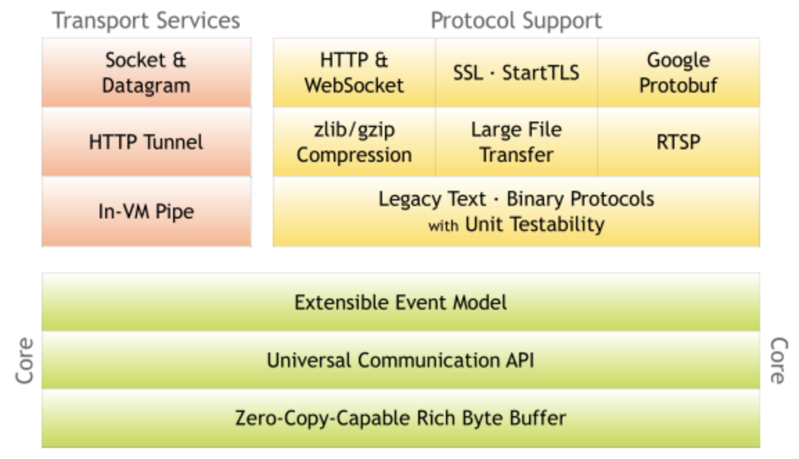
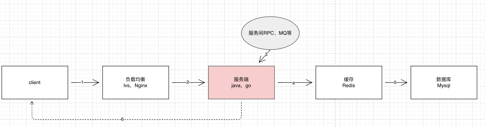
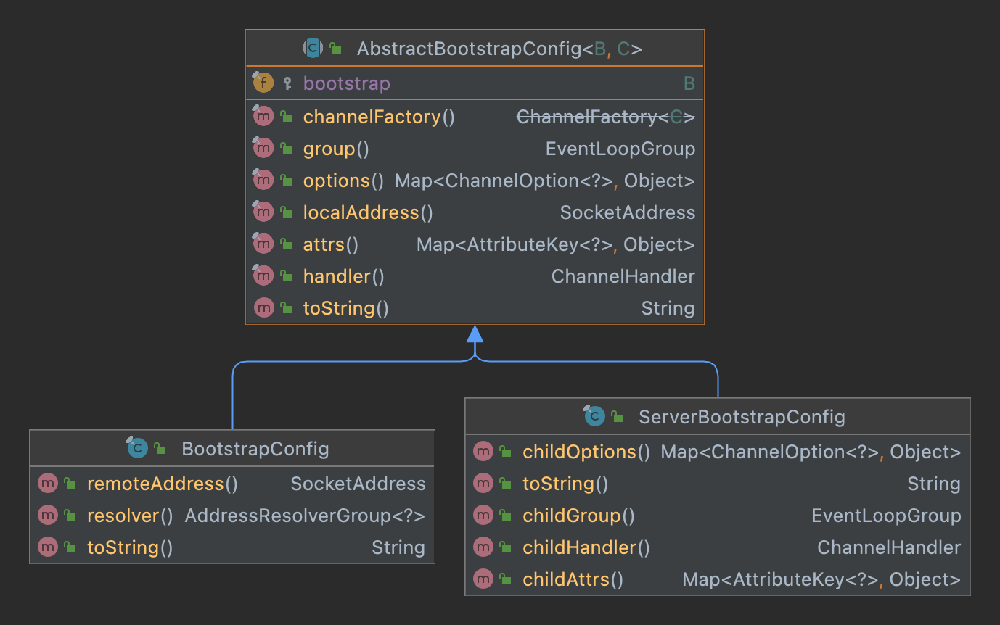
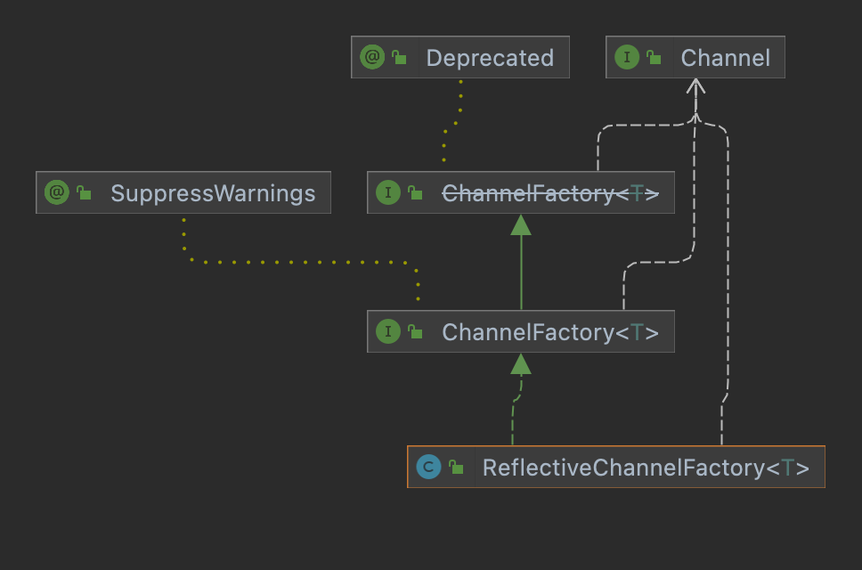

# Netty In Action



# 第1章 Netty 和 Java NIO APIs

### 几个面试题

#### 1. 高并发核心问题是什么？

1） 高并发的基本表现为单位时间系统能够同时处理的请求数。

2）高并发的核心是对 CPU 资源的有效压榨。

#### 2.通过控制变量法来看各个环节的影响和优化




* 1）经过DNS服务找到服务器地址，请求达到负载均衡层。
* 2）负载均衡根据路由配置规则，将请求发送到服务端。
* 3）服务端是我们的核心业务，这里可能会有RPC、MQ的调用。
* 4）再到缓存层
* 5）再到数据库层
* 6）最后返回给客户端

要达到高并发，我们需要各个环节都是高可用、高性能的。


#### 3. 同步和异步、阻塞和非阻塞、BIO、NIO、AIO、Select、Poll、Epoll

1. 系统中断

2. 1. 软中断 程序自动触发中断，比如编程异常，系统调用就是典型的软中断 。
   2. 硬中断 由与系统相连的外部设备的产生的中断，比如网卡、磁盘、键盘、鼠标等。具有随机性和突发性。每个设备都有它自己的中断处理请求（IRQ），基于IRQ，CPU也可以将请求分发到对应的硬件驱动上（中断处理程序）。

3. 同步异步、阻塞与非阻塞

   **(1) 同步和异步**

   同步和异步是针对应用程序和内核的交互（应用程序与操作系统的处理关系是同步还是异步

   - 同步 用户触发IO操作并等待或者轮询的去查看IO操作是否就绪。

   - 异步 用户触发IO操作后开始干自己的事，等IO操作完成后会的到IO完成的通知。

   **(2) 阻塞和非阻塞**

   阻塞和非阻塞是针对与进程在访问数据时，根据IO操作的就绪状态来采取不同的方式，是一种读取或者写入的操作方法的实现方式。

   两者最大的区别：在**被调用者**收到请求，并返回数据这段时间内，**调用者**是否在一直等待。

   - **阻塞** 在读取或者写入方法时将一直阻塞。

   - **非阻塞** 在读取和写入方法时会立即返回一个状态值。

   

4. BIO、NIO、AIO

* BIO（同步阻塞）

* NIO（同步非阻塞）

* AIO （异步非阻塞）

5. Select、Poll 、Epoll

* select

* poll

* epoll

压测工具

ApacheBench （AB）

# 第2章 第一个Netty程序

```
mvn package -DskipTests -Dos.detected.classifier=osx-x86_64
```

# 第3章 Netty的基本组件

* Bootstrap  or ServerBootstrap
* EventLoopGroup
* EventLoop
* ChannelPipeline
* Channel
* Future or ChannelFuture
* ChannelInitializer
* ChannelHandler and its sub-type

# 第4章 Transports

OioTransports

NioTransports

LocalTransports

EmmbedTransports

# 第5章 Buffers

ByteBuf

​	Heap Buffers

​	Direct Buffers

ByteBufHolder

ByteBufAllocator

UnpooledByteBufAllocator

PooledByteBufAllocator

Unpooled

ByteBufUtil

# 第6章 ChannelHandler

ChannelPipeline

ChannelHandlerContext

ChannelHandler

Inbound versus OutBound

# 第7章 Codec

Codec

Decoders

​	ByteToMessageDecoder

​	ReplayingDecoder

​	MessageToMessageDecoder

Encoders

​	MessageToByteEndcoder

​	MessageToMessageEncoder

CombinedChannelDuplexHandler-Combine your handlers

# 第8章 Provided ChannelHandlers Codec

Covers :

Securing Netty application with SSL/TLS

Building Netty Http/Https applications

Handling idle connections and timeout

Decoding delimiter- and length-based protocols

Writing big data

Serializing data

# 第9章 Bootstrapping Netty applications

Covers:

Bootstrapping clients and server

Bootstrapping clients from within a channel

Adding ChannelHandlers

Using ChannelOptions and attributes


#### 9.1 Different  types of bootstrap

#### 9.2 Bootstrapping clients and connectionless protocols

#### 9.3 Bootstrapping Netty servers with ServerBootstrap

看一个例子

```
public final class HttpHelloWorldServer {

    static final boolean SSL = System.getProperty("ssl") != null;
    static final int PORT = Integer.parseInt(System.getProperty("port", SSL? "8443" : "8080"));

    public static void main(String[] args) throws Exception {
        // Configure SSL.
        final SslContext sslCtx;
        if (SSL) {
            SelfSignedCertificate ssc = new SelfSignedCertificate();
            sslCtx = SslContextBuilder.forServer(ssc.certificate(), ssc.privateKey()).build();
        } else {
            sslCtx = null;
        }

        // Configure the server.
        EventLoopGroup bossGroup = new NioEventLoopGroup(1);
        EventLoopGroup workerGroup = new NioEventLoopGroup();
        try {
            ServerBootstrap b = new ServerBootstrap();
            b.option(ChannelOption.SO_BACKLOG, 1024);
            b.group(bossGroup, workerGroup)
             .channel(NioServerSocketChannel.class)
             .handler(new LoggingHandler(LogLevel.INFO))
             .childHandler(new HttpHelloWorldServerInitializer(sslCtx));

            // 1. ServerBootstrap will create a new channel when calling bind(...). This channel will accept child
            // handlers once the bind is successful.
            // 2. Accept new connections and create child channels that will server an accepted connection
            // 3. Channel for an accepted connection.
            Channel ch = b.bind(PORT).sync().channel();

            System.err.println("Open your web browser and navigate to " +
                    (SSL? "https" : "http") + "://127.0.0.1:" + PORT + '/');

            ch.closeFuture().sync();
        } finally {
            bossGroup.shutdownGracefully();
            workerGroup.shutdownGracefully();
        }
    }
}
```


**Exposes the configuration of an AbstractBootstrap.**



io.netty.bootstrap.AbstractBootstrapConfig 

io.netty.bootstrap.ServerBootstrap#config

```java
ServerBootstrapConfig(group: NioEventLoopGroup, channelFactory: ReflectiveChannelFactory(NioServerSocketChannel.class), options: {SO_BACKLOG=1024}, handler: io.netty.handler.logging.LoggingHandler@23529fee, childGroup: NioEventLoopGroup, childHandler: io.netty.example.http.helloworld.HttpHelloWorldServerInitializer@4fe767f3)
```


**io.netty.channel.ChannelFactory 通过反射调用默认构造函数实例化一个新的 Channel**




#### 9.4 Bootstraping clients from within a channel

#### 9.5 Adding multiple ChannelHandlers during a bootstrap

#### 9.6 Using Netty ChannelOptions and attributes


# 第10章 Unit-test your code

# 第11章 WebSockets

# 第12章 SPDY

# 第13章 Broadcasting events via UDP

# 第14章 implement Custom Codec

# 第15章 Choose your rigth thread mode

# 第16章  从EventLoop注册和撤销


