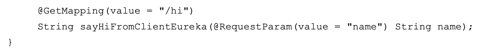
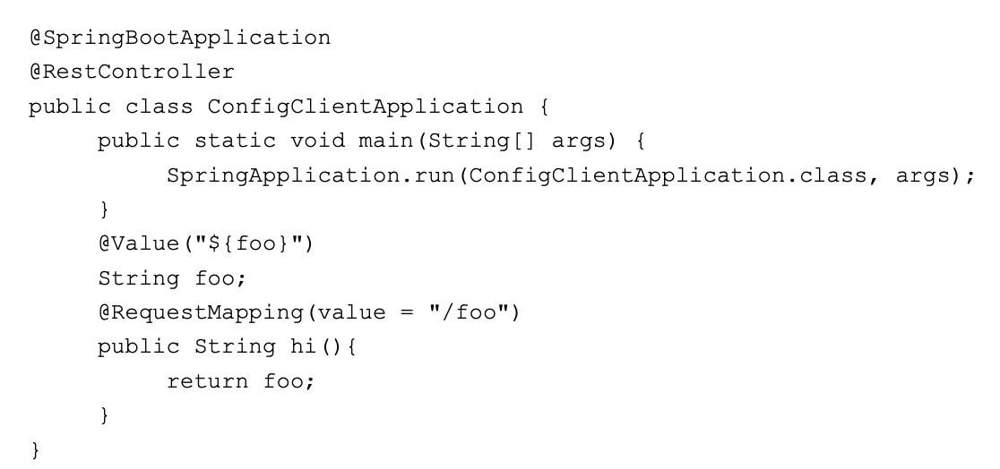
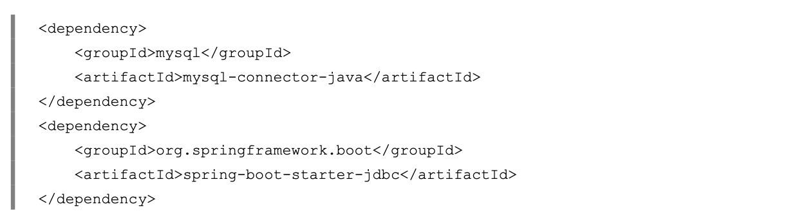

# 1、微服务简介

## 1.1 单体架构及其不足

### 1.1.1单体架构

* 表示层 ：交互层、UI、H5、移动、Web
* 业务逻辑层 ：Controller、Service、SpringMVC
* 数据访问层 ：Dao、 Hibernate、MyBatis、JPA
* 部署： Tomcate、Jetty或其他的Serverlet容器

### 1.1.2 单体架构的优势和不足

**优点**

* 开发速度
* 运维上
* 服务器成本

**缺点**

* 业务愈加复杂
* 扩展性差
* 并非能力不足
* 代码可读性差
* 测试难度

### 1.1.3 单体应用集群化


* 一定程度上处理高并发业务，也能应对一定复杂业务场景。
* 可读性和维护性
* 数据库瓶颈（解决方法，分布式数据库、分库、分表）
* 持续交付能力差，开发周期长（开发、测试）
* 新人上手门槛比较高

## 1.2 微服务

### **概念**

**微服务（Microservice）** 是一种软件架构风格，专注单一责任与功能的小型功能区块（Small Building Blocks）为基础，利用模块快的方式组合出复杂的大型应用程序，各功能区块使用与语言无关（Language-Indepent/Language agnostic）的API集相互通信。

2014年，[Matin Fowler和 James Lewis](https://martinfowler.com/articles/microservices.html#CharacteristicsOfAMicroserviceArchitecture )共同提出了微服务的概念，定义了微服务是由单一应用程序构成的小服务，每一个服务都有自主运行业务功能，对外开放不受语言限制的API（通常是HTTP），应用程序则是由一个或多个微服务组成。

### 特性

一个微服务应该有一下特点

* 易取代
* 服务是以功能来组织的，比如用户界面、推荐系统、账单、物流、订单等
* 由于功能被拆成多个服务，因此可以由不同的编程语言、数据库实现
* 架构是对称而非分层（生产者与消费者的关系）
* 持续交付（Continuous Delivery）的软件开发流程
* 与SOA不同，SOA是集成各种业务的应用程序，但微服务只属于一个服务。

### 技术

微服务可以采用不同的编程语言实现，也可以使用不同的基础设施。因此，最重要的技术是微服务之间的**通信方式**（同步、异步、UI集成）以及**通信协议**（RESTful HTTP、消息、GraphQL等）。而传统系统中，大多数技术选择，如编程语言，都会影响整个系统。因此技术选择的方法是完全不同的。

#### **Service Mesh**

在[服务网格](https://philcalcado.com/2017/08/03/pattern_service_mesh.html)中，每个服务实例都与一个反响代理器实例（称为**服务代理**，sidecar代理）配对。服务实例和sidecar代理共享一个容器，容器由一个编排工具（kubernate、Nomad、Doker Swarm、DC/OS）管理。服务代理负责与其他服务实例的通信，并支持**服务（实例）发现，负载均衡、身份验证和授权、安全通信**等功能

在服务网格中，服务实例及其sidecar代理被称为构成**数据平面**，其中不仅包括数据管理，还包括请求处理和响应。服务网格还包括一个应用管理服务之间的**控制平面**，这些交互由它们的代理调节。

包括Istio、Linkerd、Consul等、服务网格管理平面 Meshery 提供跨服务网格部署的生命周期、配置和性能管理。

#### 平台比较

实现**微服务体系**结果非常困难。如何微服务体系结构都需要解决许多问题（见下表）。Netflix开发了一个微服务框架来支持他们内部应用程序，已经开放了许多部分。下表显示了kubernetes生态系统中的实现功能与SpringCloud世界中的等效功能比较。SpringCloud生态系统值得注意的是，它们都是基于Java技术，而[Kubernetes](https://kubernetes.io/)是一个多语言运行平台。

| 微服务                                                       | SpringCloud 和 Netflix OSS                                   | Kubernetes                                                   |
| ------------------------------------------------------------ | ------------------------------------------------------------ | ------------------------------------------------------------ |
| **配置管理**：微服务应用程序的配置需要从代码中进行外部化，并可以通过简单的服务调用进行检索。 | Spring Cloud Config支持基于git存储库的配置位置 。            | [Kubernetes ConfigMaps](https://kubernetes.io/docs/tasks/configure-pod-container/configure-pod-configmap/) 通过服务公开存储在etcd中的配置。Kubernetes Secrets 支持基于服务的安全部署和敏感配置信息（例如密码、证书等）的使用。 |
| **服务发现**：维护微服务域中可用于工作的服务实例列表。       | Spring Cloud Eureka 允许客户端向其注册，与注册的客户端保持心跳。并将服务名称映射到按服务名称查找服务的客户端主机名。 | [kubernetes Ingress](https://kubernetes.io/docs/concepts/services-networking/ingress/) 提供集群内部可以的服务实例可用的服务实例部署时注册。通过Ingress机制，服务可以向集群之外的客户端公开。 |
| **负载平衡**：扩展分布式系统的关键是能够运行一个组件的多个实例。然后通过负载均衡将负载分配到这些实例上。 | Spring Cloud Ribbon 为客户端提供跨服务实例负载均衡衡的能力。 | [Kubernetes Service](https://kubernetes.io/docs/concepts/services-networking/service/) 提供了阔服务实例对服务进行负载均衡的能力。这与Ribbon不同。 |
| **API网关**：微服务提供的API的粒度通常服务端需要的粒度不同。API网关实现表层，并提供其他服务，如代理、协议转换和其他管理功能。 | Spring Cloud Zuul提供基于配置的API表层                       | Kubernetes Service 和 Ingress resources、Istio、Ambassador提供南北（进出数据中心）和东西（跨数据中心或云或地区的通信）API网关的解决方案。 |
| **安全问题**： 许多安全问题推给API网关来实现。对于分布式微服务应用程序，不重复造安全方面的轮子，允许在所有服务共享组件中进行策略定义和实现是有意义的。 | Spring Cloud Security通过Spring Cloud Zuul解决了许多安全问题。 | Kuberntes生态系统提供了像Istio这样的服务网站，该网站能够通过其API网关机制提供安全性。 |
| **集中化日志记录**：拥有一个集中化的日志收集和分析基础设施来管理大量的服务非常重要——其中许多服务以分布式方式运行的。 | ELK技术（Elasticsearch、LogStash、 Kibana）                  | EFK（Elacticsearch、[Fluentd](https://github.com/fluent/fluentd)、Kibana） |
| **集中的度量**： 一个可以监控单个服务和整个系统健康和性能的集中区域对于正确的操作是必不可少的。 | Spring Spectator & Atlas                                     | Heapster，Premetheus                                         |
| **分布式跟踪**： 每个进程的日志记录和度量件事都有其存在的地方，但它们都不重构事务在扩分布式系统传播时采用的复杂路径。分布式跟踪是微服务平台必不可少的工具。 | Spring Cloud Sleuth                                          |                                                              |
| **弹性和容错**：分布式系统必须能够围绕故障进行自动路由，并且能够将请求路由提供到最佳响应的服务实例。 | Spring Hystrix、Turbine ，& Ribbon                           | Health check, servicemeshes（Istio）                         |
| **自动收缩和自我修复**：分布式系统提供水平伸缩需要更高的负载：平台必须检查并自动响应这些条件。此外，系统需要检测故障，并尝试自动重启，无需操作员输入。 | ——                                                           | 将康检查、自我修复和自动缩放。                               |
| **打包、部署和调度**： 大规模系统需要健壮的包管理和部署系统来管理滚动部署或蓝绿色部署 | Springboot、Apache Maven、Spring Cloud系统中没有真正的调度程序。 | Docker、Kubernetes Schedule&Deployment                       |
| **作业管理**：控制无人值守的后台程序执行。                   | Spring Batch                                                 | Kubernetes Jobs与Scheduled Jobs                              |
| **单例应用程序**：限制特点服务作为该服务在整个系统中的唯一实例运行 | Spring Cloud Cluster                                         | Kubernetes Pods                                              |

## 1.3 微服务优势和不足

### **优势**

### 不足

* 微服务的复杂度
* 分布式事务
* 服务的划分
* 服务的部署

## 1.4 微服务设计原则

### **微服务的设计应该是渐进式的**

如果LAMP单体架构够用的情况下，就应该用LAMP，因为它开发速度快，性价比高。

微服务的设计一定是渐进式的，且随着业务的发展而发展。

### **三大难题**

* 服务故障的传播性

* 服务的划分

  一般根据业务划分**，领域驱动具有指导作用**。

* 分布式事务

# 2、SpringCloud简介

# 3、构建微服务的准备

# 4、开发框架SpringBoot

# 5、服务注册和发现Eureka

## 5.4 源码解析

### 5.4.1 Eureka的一些概念

* Register 服务注册
* Renew 服务续约
* Fetch Registries 获取服务注册列表信息
* Cancel 服务下线
* Eviction 服务剔除

### 5.4.2 Eureka的高可用架构


### 5.4.3 Register服务注册


* 服务端 com.netflix.eureka.registry.PeerAwareInstanceRegistryImpl#register这个方法提供了服务注册，并且将服务注册后的信息同步到其他Eureka服务中。

* `PeerAwareInstanceRegistryImpl` 类的register()方法实现了服务的注册，并且像其他Eureka Server的Peer节点同步了该注册信息。

### 5.4.4 Renew服务续约

### 5.4.5 为什么Eureka Client获取服务实例这么慢？

### 5.4.6 Eureka的自我保护模式


# 6、负载均衡 Ribbon

## 6.1 RestTemplate简介

## 6.2 Ribbon介绍

## 6.3 使用RestTmepate 和 Ribbon来消费服务

## 6.4 LoadBalanceClient简介

## 6.5 源码解析Ribbon

### 6.4.1 LoadBalancerClient 负载均衡客户端

* choose
* execute
* reconstructURI


从上面的choose方法追踪，发现最后会由 ILoadBalancer 类的实例去执行。

### 6.4.2 ILoadBalancer 


`DynamicServerListLoadBalancer`类需要配置 `IClientConfig` 、 `IRule` 、`IPing` 、 `ServerList` 、`ServerListFilter` 、`ILoadBalancer`。

**`IRule`** 有很多默认的实现类：

* BestAvailableRule

* ClientConfigEnabledRoundRobinRule

* RandomRule

* RetryRule

* WeightResponseTimeRule

* ZoneAvoidanceRule

  

* 负载均衡是从Eureka Client获取服务里表信息，并根据IRule规则路由，根据IPing去判断服务的可用性。

* 那么还有一个问题，负载均衡器每隔多长时间从Eureka Client获取注册信息？

  BaseLoadBalancer的构造方法开启了一个PingTask任务，每隔10秒像EurekaClient发送一次心跳，判断服务的可用性。

  

# 7、声明式调用Feign

Feign如何实现负载均衡？


总结：

* 首先通过@EnableFeignClients注解开启FeignClient的功能。只有这个注解存在，才会在程序启动时开启对@FeignClient注解的包扫描。
* 根据Feign的规则实现接口，并在接口上面加上注解@FeignClient。
* 程序启动后，会进行包扫描，扫描所有的@FeignClient的注解的类，并将这些信息注入IoC容器中。
* 当接口的方法被调用时，通过JDK的代理来生成具体的ReqeustTemplate模版对象。
* 当RestTemplate在生成Http请求的Request对象。
* Request对象交给Client去处理，其中Client网络请求框架可以时HttpURLConnection、HttpClient和OKHttp。
* 最后Client被封装到LoadBalanceClient类中，这个类结合了Ribbon做到了负载均衡。

# 8、熔断器Hystrix

前面两章主要介绍了如何使用RestTemplate和Feign去消费服务，并详细讲述了Ribbon负载均衡的原理和Feign的工作原理。

## 8.1 什么是Hystrix

提供了熔断功能，能够阻止分布式系统出现联动故障，Hystrix是通过隔离服务的访问点阻止联动故障的，并提供了故障的解决方案，提高了分布式系统的弹性。

## 8.2 Hystrix解决了什么问题


防止因为一个应用出现故障导致出现客户端请求处于阻塞状态，最终导致Serverlet线程耗尽导致这个服务不可用（即雪崩效应）。

## 8.3 Hystrix的设计原则

* 防止Servlet资源耗尽
* 快速失败机制
* 提供回退（fallBack）机制
* 使用熔断机制，防止故障扩散到其他服务
* 提供熔断器的监控组件Hystrix DashBoard，可以实时监控熔断器的状态。

## 8.4 Hystrix的工作机制

## 8.5  在RestTemplate 和Ribbon上使用熔断器


## 8.6 在Feign上使用熔断器


## 


## 8.7使用Hystrix Dashboard监控熔断器的状态。


## 8.8 使用Turbine聚合监控

# 9、路由网管Spring Cloud Zuul

Zuul作为微服务系统的网关组件，用于构建边界服务（Edge Service），致力于动态路由、过滤、监控、弹性伸缩和安全。

@EnableZuulProxy用于启用Zuul。

## 9.1 为什么需要Zuul

* Zuul 、Ribbon、Eureka相结合，可以实现智能路由与负载均衡的功能，Zuul能够将请求流量按照某种策略分发到集群状态的的多个服务实例。
* 统一暴露接口，避免敏感信息泄漏
* 做用户身份认证和权限认证
* 监控功能，实时日志输出，对请求进行记录。
* 流量监控，在高流量的情况下，对服务进行降级等。
* API接口从内部服务分离出来，方便做测试。

## 9.2 Zuul的工作原理

Zuul 使用Servlet来实现的，Zuul通过自定义的ZuulServlet（类似于SpringMVC的DispatchServlet）来对请求进行控制的。Zuul的核心思想是一系列的过滤器，可以在Http请求的发起和响应返回之间执行一系列的过滤器，包括4种过滤器：

* pre ，安全验证、身份验证、参数验证

* routing， 请求路由到具体的微服务实力。默认请情况下使用HttpClient进行网络请求。
* post，请求已被路由到微服务后执行的，一般情况下，用于收集统计信息、指标，以及将响应传输到客户端。
* error 在其他过滤器发生错误时执行

Zuul采取了动态读取、编译和运行这些过滤器，过滤器之间不能相互通信，而是通过RequestContext对象共享对象。每个请求都会创建一个RequestContext对象。 Zuul过滤器具有一下关键特性：

* Type 决定了过滤器在请求那个阶段起作用，例如Pre、Post
* Execution Order 执行顺序，越小越先执行
* Criteria 定义了Filter执行所需条件
* Action 如果符合执行条件，则执行Action


## 9.3 案例实战

### 9.3.1 搭建Zuul服务

```java
@SpringBootApplication(exclude = DataSourceAutoConfiguration.class)
@EnableZuulProxy
@EnableEurekaClient
public class GatewayApplication  implements CommandLineRunner{
   
   @Value("${spring.profiles.active}")
   private String active;
   
   public static void main(String[] args) {
      SpringApplication.run(GatewayApplication.class, args);
   }

   @Bean
   MultipartConfigElement multipartConfigElement() {
      MultipartConfigFactory factory = new MultipartConfigFactory();
      if("pro".equals(active) || "test".equals(active)){
         factory.setLocation("/tmp");
      }else{
         factory.setLocation("E:/tmp");
      }
      return factory.createMultipartConfig();
   }
   @Override
   public void run(String... args) throws Exception {
        System.out.println("petrochina-gateway 启动成功，启动的类型是"+active);
      
   }
}
```

### 9.3.2 在Zuul上配置API接口的版本号

### 9.3.3 在Zuul上配置熔断器

### 9.3.4 Zuul常见使用方法


# 10、配 置中心 Spring Cloud Config

Spring Cloud Config主要包括下面4个方面

* Config Server从本地读取配置文件
* Config Server从远处Git仓库读取配置文件
* 搭建高可用的Config Server集群
* 使用Spring Cloud Bus 刷新配置

## 10.1 Config Server从本地读取配置文件

### 10.1.1 构建Config Server

```
@EnableConfigServer
```


### 10.1.2 构建 Config Client



## 10.2 Config Server 从远程Git仓库读取配置文件

```
spring.cloud.config.server.git.uri= file:/Users/mayanwei/workspace/microservice/cloud-native-java/config
```

## 10.3 构建高可用的Config Server

### 10.3.1构建Eureka Server


### 10.3.2 改造Config Server

### 10.3.3 改造Config Client

## 10.4 使用Spring Cloud Bus 刷新配置


* 问题： 为什么Spring Cloud Bus去刷新配置？

  

* 在pom文件中引入RabbitMQ实现的Spring Cloud Bus的起步依赖 Spring-cloud-bus-amqp

  

* @RefreshScope


# 11、服务链路追踪SpringCloud Sleuth 

主要功能是在分布式系统中提供服务链路追踪的解决方案

## 11.1 为什么需要

《Dapper，a Large-Scale Distributed Systems Tracing Infrastructure》

## 11.2 基本术语

* **Span**: 基本工作单元，发送一个远程调度任务就会产生一个Span，Span用以个64 位的ID唯一标示，Trace是用一个64 位的ID唯一标示的。Span还包含了其他的信息，例如摘要、时间戳时间、Span的ID以及进程ID
* **Trace**：有一系列的Span组成，呈树状结构。请求一个微服务系统的API接口，这个API接口会调用许多个微服务单元，调用每个微服务单元都会产生一个新的Span，所有由这些请求产生的Span组成了这个Trace
* **Annotation**： 用于记录一个事件，一些核心注解用于定义一个请求的开始和结束，这些注解如下
  * cs-Client Sent ： 发送一个请求，这个注解描述了Span的开始。
  * sr-Client Received ： 服务端获的请求并准备开始处理它，sr-cs 就是网络传输时间
  * ss-Server Sent ： 服务端发送响应，该注解表明请求处理的完成（当请求返回客户端）， ss - sr 表示服务器请求的时间。
  * cr-Client Received ：客户端接受响应，此时Span结束， cr - cs 便得到整个请求所消耗的时间。

## 11.3 案例讲解

## 11.4 在链路数据中添加自定义数据


## 11.5  使用 RabbitMQ传输链路数据

spring-cloud-sleuth-zipkin-stream

spring-cloud-starter-stream-rabbit

## 11.6 在Mysql数据库中存储链路数据

Zipkin支持将链路数据存储在MySQL、Elasticsearch和Cassandra数据库中。

### 11.6.1使用Http传输链路数据，并存储在Mysql数据库中


### 11.6.1使用RabbitMQ传输链路数据，并存储在Mysql数据库中




## 11.7 在ElasticSearch中存储链路数据


## 11.8 使用Kibana展示链路数据

# 12、服务器监控 SpringCloud Admin

## 12.1使用Spring Boot Admin 监控Spring Cloud微服务

## 12.2 在Springboot Admin中集成Turbine

## 12.3 在Spring Boot Admin添加安全登陆界面

# 13、Springboot Security详解

## 13.1 Spring Security简介

### 13.1.1 什么是Spring Security

### 13.1.2 为什么选择Spring Security

### 13.1.3 Spring Security提供的安全模块

## 13.2 Spring Boot Security与Spring Security的关系

## 13.3 Spring Boot Security案例详解

### 13.3.1 构建Sprint Boot Secuity工程

### 13.3.2 配置Spring Security

1. implements WebMvcConfigurer
2. 配置HttpSecurity


## 13.4  总结

# 14、使用SpringCloud OAuth2保护微服务系统

## 14.1 什么是Oauth2

[RFC6749 The OAuth 2.0 Authorization Framework](https://tools.ietf.org/html/rfc6749)


## 14.2 如何使用Spring Oauth2

OAuth2 协议在 Spring Resources中的实现位Spring OAuth2.

* Spring OAuth2 Provider
* Sprint OAuth2 Client

### 14.2.1 OAuthor2 Provider

1. Authorization Server配置
2. Resource Server的配置

### 14.2.2 OAuthor2 Client

# 15、使用Spring Security OAuth2 和JWT保护微服务系统


# 16、使用Spring Cloud 构建微服务综合案例