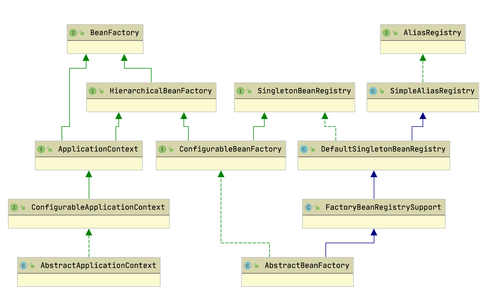
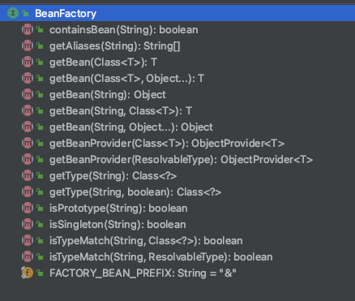

# Spring 面试题

2020年11月4日 星期三 21:27

1. Spring bean的生命周期有哪些步骤？

2. 什么是BeanDefinition？为什么它非常重要？

3. 什么是Bean的后置处理器BeanPostProcessor？

4. 什么是BeanFactoryPostProcessor？

5. 什么是BeanFactory？它与ApplicationContext的区别？

6. 什么是FactoryBean？它与BeanFactory的区别是什么？

7. @Import，@Component，@Bean的区别是什么？

8. 什么是ImportBeanDefinitionRegistrar？

9. Spring Bean 注册过程

10. Spring IOC的底层原理

11. Spring AOP的底层原理

12. ApplicationContext通常的实现是什么？

13. BeanFactory 和 ApplicationContext的区别？

14. cglib和jdk代理的机制？

15. spring bean初始化过程中的循环依赖问题？

      

# SpringFrameWork Core

特点：

* 核心功能：依赖注入、事件、资源、i18n国际化、校验、数据绑定、类型转化、SpEL、AOP。

* 数据获取：事务、DAO支持、JDBC、ORM。

* Spring MVC 和Spring WebFlux web框架。
* 整合了remoting、JMS、JCA、JMX、email、tasks、scheduling、cache
* 支持语言：Kotlin、Groovy、dynamic languages。

# 1. The IOC Container

## 1.1 Intorduction to the Spring IoC Container and Beans



`org.springframework.beans` 和 `org.springframework.context` 两个包提供了Spring 框架的IOC容器的基本功能。其中 ```org.springframework.beans.factory.BeanFactory``` 提供了先进的配置机制，能够管理任何内容的对象。`org.springframework.context.ApplicationContext` 是`BeanFactory`的子接口，增加了如下的功能：

* 





## 1.2 Container Overview

## 1.3 Bean Overview

## 1.4 Dependencies

## 1.5 Bean Scopes

## 1.6 Cunstomizing the Nature of a Bean

## 1.7 Bean Definitioon Inheritance

## 1.8 Container Extension Points

## 1.9 Annotaion-based Container Configuration

## 1.10 Classpath Scanning and Managed Components

## 1.11 Using JSR 330 Standard Annotations

## 1.12 Java-based Container Configuration

## 1.13 Environment Abstraction 

## 1.14 Registering a LoadTimeWeaver

## 1.15 Additional Capbilities of the ApplicationContext

## 1.16 The BeanFactory

# 2.Resources

## 2.1 Introduction

## 2.2 Resource 接口

## 2.3  内置的Resource 实现类

* UrlResornce
* ClassPathResource
* FIleSystemResource
* ServletContextResource
* InputStreamResource
* ByteArrayResource

## 2.4 ResourceLoader

WebApplicationContext -> ServletContextResource

FileSystemXmlApplicationContext -> FileSystemResource

## 2.5 ResourcesLoaderAware 接口

## 2.6 Resources as dependencies

## 2.7 Application context and Resource paths

```
ApplicationContext ctx = new ClassPathXmlApplicationContext("conf/appContext.xml");
```

```
ApplicationContext ctx =
    new FileSystemXmlApplicationContext("conf/appContext.xml");
```

```
ApplicationContext ctx =
    new FileSystemXmlApplicationContext("classpath:conf/appContext.xml");
```

##  

# 3. Validation,DataBinding and TypeConversion

## 3.1 Introduction

## 3.2 Validation using Sprint Validator interface

## 3.3 Resolving codes to error messages

## 3.4 Bean manipulation and Bean Wrapper

## 3.5 Spring Type Conversion

## 3.6 Spring Field Formatting

## 3.7 Configuring a  global date & time format

## 3.8 Spring Validation


# 4. Spring Experession Language(SpEL)

## 4.1 Evaluation

### 4.1.1 EvaluationContext 

* SimpleEvaluationContext
* StandardEvaluationContext

### TypeConversion

### 4.1.2 Parser Configuration(SpelParserConfiguration)

## 4.2 Expression in Bean Definitions

* XML Configuration

  ​    <property name="randomNumber" value="#{ T(java.lang.Math).random() * 100.0 }"/> 

* Annotation Configuration

  ​    @Value("#{ systemProperties['user.region'] }")

## 4.3 Language Reference

- [Literal Expressions](https://docs.spring.io/spring-framework/docs/current/reference/html/core.html#expressions-ref-literal)
- [Properties, Arrays, Lists, Maps, and Indexers](https://docs.spring.io/spring-framework/docs/current/reference/html/core.html#expressions-properties-arrays)
- [Inline Lists](https://docs.spring.io/spring-framework/docs/current/reference/html/core.html#expressions-inline-lists)
- [Inline Maps](https://docs.spring.io/spring-framework/docs/current/reference/html/core.html#expressions-inline-maps)
- [Array Construction](https://docs.spring.io/spring-framework/docs/current/reference/html/core.html#expressions-array-construction)
- [Methods](https://docs.spring.io/spring-framework/docs/current/reference/html/core.html#expressions-methods)
- [Operators](https://docs.spring.io/spring-framework/docs/current/reference/html/core.html#expressions-operators)
- [Types](https://docs.spring.io/spring-framework/docs/current/reference/html/core.html#expressions-types)
- [Constructors](https://docs.spring.io/spring-framework/docs/current/reference/html/core.html#expressions-constructors)
- [Variables](https://docs.spring.io/spring-framework/docs/current/reference/html/core.html#expressions-ref-variables)
- [Functions](https://docs.spring.io/spring-framework/docs/current/reference/html/core.html#expressions-ref-functions)
- [Bean References](https://docs.spring.io/spring-framework/docs/current/reference/html/core.html#expressions-bean-references)
- [Ternary Operator (If-Then-Else)](https://docs.spring.io/spring-framework/docs/current/reference/html/core.html#expressions-operator-ternary)
- [The Elvis Operator](https://docs.spring.io/spring-framework/docs/current/reference/html/core.html#expressions-operator-elvis)
- [Safe Navigation Operator](https://docs.spring.io/spring-framework/docs/current/reference/html/core.html#expressions-operator-safe-navigation)

## 4.4 Classes Used in the Examples

# 5. Aspect Oriented Programing with Spring

## 5.1 AOP Concepts

## 5.2 Spring AOP Capabilites and Goals

## 5.3 AOP Proxies

## 5.4  @AspectJ Support

## 5.5 Schema-based AOP Support

## 5.6 Choosing which AOP Declaration Style to Use

## 5.7 Mixing Aspect Types

## 5.8 Proxying Mechanisms

## 5.9 Programmatic Creation of @AspectJ Proxies

## 5.10 Using AspectJ with Spring Applications

## 5.11 Futher Resources


# 6. Spring AOP APIs

## 6.1 Pointcut API in Spring 


## 6.2 Advice API in Spring 

## 6.3 The Advisor API in Spring

## 6.4 Using the ProxyFactoryBean to Create AOP Proxies

## 6.5 Concise Proxy Definition

## 6.6 Creating APO Proxies Prgramatically with ProxyFactory

## 6.7 Manipulating Advised Objects

## 6.8 Using the "auto-proxy" facility

## 6.9  Using TargetSource Implementations

## 6.10 Defining New Advice Types

# 7. Null-safety

# 8. Data Buffer and Codecs

## 8.1 DataBufferFactory

## 8.2 DataBuffer

## 8.3 PooledDataBuffer

## 8.4  DataBufferUtils

## 8.5 Codecs

## 8.6 Using DataBuffer

# 9. Logging

# 10.Appendix