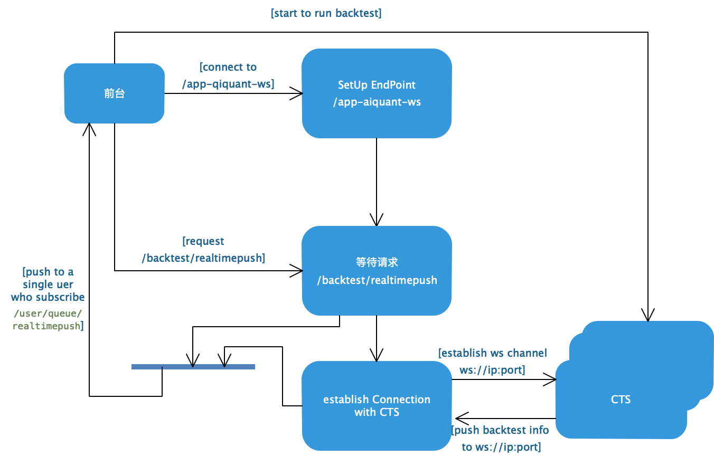

# 基于WebSocket的面向多端的实时通信

## 一、背景介绍

量化平台策略回测时运行时间较长，每次交易后当天的策略收益、基准收益及超额收益等绩效指标需要实时返回至终端供研究员参考。如何将每次策略运行产生的结果推送至终端显示成为了一个炙待解决的问题。一种可行的方案时由CTS（C++实现，用于运行策略回测）直接将结果通过面向长连接的双向通道推送至前端，每次回测时CTS监听的端口为动态的，通过开始回测时将端口号传输至前端，然后由前台打开连接CTS。这种情况下，在将服务暴露至公网时，代理服务器可以对协议根据IP进行转发，但是由于资源限制，各个服务均在同一台服务器上，这时通过IP进行过滤无法仅根据IP区分服务，但是CTS分配的端口是动态的，这就增加了代理服务的转发配置难度。因此这种情况下如果能存在唯一的 “IP+端口” 提供WebSocket服务，就可以解决现存的问题。

## 二、理论基础

### 1. WebSocket技术的发展提供一种长连接的全双工应用层通信协议
### 2. STOMP（Simple(or Stream) Text Orientated Message Protocal）

STOMP提供一种互操作的协议，旨在通过中介服务器在各个客户端之间异步信息传递，它为这些客户端和服务段信息传递定义了一种基于文本的有线格式。

## 三、技术方案

### 1. 基于SpringBoot的web服务
### 2. 基于STOMP消息协议的WebSocket通信机制
### 3. 技术架构



## 四、使用案例

### AIQUANT 多终端策略回测数据实时推送至前台技术方案- Muti-PorfolioBacktestInfosRTPush[^1]

[^1]: Muti-PorfolioBacktestInfosRTPush(Mutiple Clients's Portfolio Backtest real-time Info Push To Front Web)

### show me the code

#### 1. 依赖包pom.xml 

```xml

        <dependency>
            <groupId>org.springframework.boot</groupId>
            <artifactId>spring-boot-starter-websocket</artifactId>
            <version>2.2.2.RELEASE</version>
        </dependency>
        <dependency>
            <groupId>org.springframework.boot</groupId>
            <artifactId>spring-boot-starter-websocket</artifactId>
        </dependency>
        <dependency>
            <groupId>org.webjars</groupId>
            <artifactId>webjars-locator-core</artifactId>
            <version>0.43</version>
        </dependency>
        <dependency>
            <groupId>org.webjars</groupId>
            <artifactId>sockjs-client</artifactId>
            <version>1.0.2</version>
        </dependency>
        <dependency>
            <groupId>org.webjars</groupId>
            <artifactId>stomp-websocket</artifactId>
            <version>2.3.3</version>
        </dependency>
        <dependency>
            <groupId>org.webjars</groupId>
            <artifactId>bootstrap</artifactId>
            <version>3.3.7</version>
        </dependency>
        <dependency>
            <groupId>org.webjars</groupId>
            <artifactId>jquery</artifactId>
            <version>3.1.1</version>
        </dependency>

        <dependency>
            <groupId>org.projectlombok</groupId>
            <artifactId>lombok</artifactId>
        </dependency>
        
```


#### 2. WebSocketConfig

```java
package com.zetyun.aiquant.config;

import com.zetyun.aiquant.interceptor.StompSessionInceptor;
import org.springframework.context.annotation.Configuration;
import org.springframework.http.server.ServerHttpRequest;
import org.springframework.messaging.converter.MessageConverter;
import org.springframework.messaging.handler.invocation.HandlerMethodArgumentResolver;
import org.springframework.messaging.handler.invocation.HandlerMethodReturnValueHandler;
import org.springframework.messaging.simp.config.ChannelRegistration;
import org.springframework.messaging.simp.config.MessageBrokerRegistry;
import org.springframework.web.socket.WebSocketHandler;
import org.springframework.web.socket.config.annotation.EnableWebSocketMessageBroker;
import org.springframework.web.socket.config.annotation.StompEndpointRegistry;
import org.springframework.web.socket.config.annotation.WebSocketMessageBrokerConfigurer;
import org.springframework.web.socket.config.annotation.WebSocketTransportRegistration;
import org.springframework.web.socket.server.support.DefaultHandshakeHandler;

import java.security.Principal;
import java.util.List;
import java.util.Map;
import java.util.UUID;

/**
 * @author mayanwei
 */
@Configuration
@EnableWebSocketMessageBroker
public class WebSocketConfig implements WebSocketMessageBrokerConfigurer{
    @Override
    public void registerStompEndpoints(StompEndpointRegistry stompEndpointRegistry) {
        stompEndpointRegistry.addEndpoint("/app-aiquant-websocket")
                .setHandshakeHandler(new CustomHandshakeHandler())
                .withSockJS()
                .setInterceptors(new StompSessionInceptor());
    }

    @Override
    public void configureWebSocketTransport(WebSocketTransportRegistration registry) {

    }

    @Override
    public void configureClientInboundChannel(ChannelRegistration registration) {

    }

    @Override
    public void configureClientOutboundChannel(ChannelRegistration registration) {

    }

    @Override
    public void addArgumentResolvers(List<HandlerMethodArgumentResolver> argumentResolvers) {

    }

    @Override
    public void addReturnValueHandlers(List<HandlerMethodReturnValueHandler> returnValueHandlers) {

    }

    @Override
    public boolean configureMessageConverters(List<MessageConverter> messageConverters) {
        return false;
    }


    @Override
    public void configureMessageBroker(MessageBrokerRegistry messageBrokerRegistry) {
        messageBrokerRegistry.enableSimpleBroker("/topic","/queue");
        messageBrokerRegistry.setApplicationDestinationPrefixes("/wsapi");

    }
    class StompPrincipal implements Principal {
        String name;

        StompPrincipal(String name) {
            this.name = name;
        }

        @Override
        public String getName() {
            return name;
        }
    }
    class CustomHandshakeHandler extends DefaultHandshakeHandler {
        // Custom class for storing principal
        @Override
        protected Principal determineUser(ServerHttpRequest request,
                                          WebSocketHandler wsHandler,
                                          Map<String, Object> attributes) {
            // Generate principal with UUID as name
            return new StompPrincipal(UUID.randomUUID().toString());
        }
    }
}

```

#### 3. 回测实时推送接收数据WebSocket处理句柄

```java
package com.zetyun.aiquant.handler;

import com.alibaba.fastjson.JSON;
import com.zetyun.aiquant.entity.PortfolioOutlineRealTimeEntity;
import lombok.Data;
import lombok.extern.slf4j.Slf4j;
import org.apache.commons.lang.StringUtils;
import org.springframework.beans.factory.annotation.Autowired;
import org.springframework.context.ApplicationContext;
import org.springframework.web.socket.CloseStatus;
import org.springframework.web.socket.WebSocketHandler;
import org.springframework.web.socket.WebSocketMessage;
import org.springframework.web.socket.WebSocketSession;
import java.util.concurrent.ConcurrentLinkedQueue;
import java.util.concurrent.CountDownLatch;

/**
 * 回测实时推送接收数据WebSocket处理句柄
 * @author mayanwei
 */
@Slf4j
@Data
public class BacktestRealTimeWSHandler implements WebSocketHandler {


    private static final String END_FLAG = "EndOfWebServer";

    private String currentSessionId;


    private String currentSubscribePath;
    private ConcurrentLinkedQueue<PortfolioOutlineRealTimeEntity> realTimeEntityQueue = null;

    private final CountDownLatch latch;
    private boolean receivedMsg = false;
    @Autowired
    private ApplicationContext applicationContext;

    public BacktestRealTimeWSHandler(final CountDownLatch latch) {
        this.latch = latch;
    }


    @Override
    public void afterConnectionEstablished(WebSocketSession session) throws Exception {
        log.info("afterConnectionEstablished");


    }

    @Override
    public void handleMessage(WebSocketSession session, WebSocketMessage<?> message) throws Exception {

        if(!receivedMsg){
            try {
                log.info("receivedMsg");
            } finally {
                receivedMsg = true;
                latch.countDown();
            }
        }

        String payload = (String)message.getPayload();
        log.info("BacktestRealTimeWSHandler接送数据：[{}]",payload);
        if(!StringUtils.equals(payload, END_FLAG)){
            PortfolioOutlineRealTimeEntity obj = JSON.parseObject( payload,PortfolioOutlineRealTimeEntity.class);
            obj.setLastItemFlag(false);
            obj.setCurrentSessionId(currentSessionId);
            obj.setCurrentSubscribePath(currentSubscribePath);
            if(realTimeEntityQueue!=null){
                realTimeEntityQueue.add(obj);
            }
        }else{
            PortfolioOutlineRealTimeEntity obj = new PortfolioOutlineRealTimeEntity();
            obj.setLastItemFlag(true);
            if(realTimeEntityQueue!=null){
                realTimeEntityQueue.add(obj);
            }
        }

    }

    @Override
    public void handleTransportError(WebSocketSession session, Throwable exception) throws Exception {
        log.error("handleTransportError:{}",exception);
    }

    @Override
    public void afterConnectionClosed(WebSocketSession session, CloseStatus closeStatus) throws Exception {
        log.info("afterConnectionClosed:{}",closeStatus);

    }

    @Override
    public boolean supportsPartialMessages() {
        return false;
    }
}

```


#### 4. PortfolioBacktestController

```java
package com.zetyun.aiquant.api;

import com.alibaba.fastjson.JSON;
import com.google.common.collect.Queues;
import com.zetyun.aiquant.entity.PortfolioOutlineRealTimeEntity;
import com.zetyun.aiquant.handler.BacktestRealTimeWSHandler;
import com.zetyun.aiquant.service.PortfolioBacktestService;
import lombok.extern.slf4j.Slf4j;
import org.apache.commons.lang.StringUtils;
import org.springframework.beans.factory.annotation.Autowired;
import org.springframework.context.event.EventListener;
import org.springframework.messaging.handler.annotation.Header;
import org.springframework.messaging.handler.annotation.MessageMapping;
import org.springframework.messaging.handler.annotation.Payload;
import org.springframework.messaging.simp.SimpMessageHeaderAccessor;
import org.springframework.messaging.simp.annotation.SendToUser;
import org.springframework.messaging.simp.stomp.StompHeaderAccessor;
import org.springframework.stereotype.Controller;
import org.springframework.messaging.simp.SimpMessagingTemplate;
import org.springframework.web.socket.WebSocketSession;
import org.springframework.web.socket.messaging.SessionConnectedEvent;

import javax.servlet.http.HttpServletRequest;
import java.security.Principal;
import java.util.Map;
import java.util.concurrent.ConcurrentLinkedQueue;
import java.util.concurrent.CountDownLatch;
import java.util.concurrent.TimeUnit;

/**
 * @author mayanwei
 */

@Slf4j
@Controller
public class PortfolioBacktestController {

    private SimpMessagingTemplate template;
    private HttpServletRequest request;
    private PortfolioBacktestService portfolioBacktestService;
    @Autowired
    public void seHttpServletRequest(HttpServletRequest request){
        this.request = request;
    }

    @Autowired
    public void setSimpMessagingTemplate(SimpMessagingTemplate template){
        this.template = template;
    }

    @Autowired
    public void setPortfolioBacktestService(PortfolioBacktestService portfolioBacktestService) {
        this.portfolioBacktestService = portfolioBacktestService;
    }

    @MessageMapping("/backtest/realtimepush")
    public void sendPortFolioToUser(@Header String port,
                                    @Header(value = "subscribePath") String  subscribePath,
                                    @Payload String message,
                                    Principal principal,
                                    SimpMessageHeaderAccessor headerAccessor) throws InterruptedException {
        log.info("sendPortFolioToUser传入参数：[principal = {},port={}, message={},headerAccessor={}]",
                principal, port, message, headerAccessor);
        String sessionId = headerAccessor.getSessionId();
        headerAccessor.setSessionId(sessionId);
        Map<String, Object> sessionAttributes = headerAccessor.getSessionAttributes();
        sessionAttributes.put("port",port);
        if(StringUtils.isBlank(sessionId) || StringUtils.isBlank(port)){
            log.error("访问参数异常[sessionId={};port={}]",sessionId,port);
            return;
        }

        ConcurrentLinkedQueue<PortfolioOutlineRealTimeEntity> queues = Queues.newConcurrentLinkedQueue();

        CountDownLatch latch = new CountDownLatch(1);
        BacktestRealTimeWSHandler wsHandler = new BacktestRealTimeWSHandler(latch);

        WebSocketSession webSocketSession = portfolioBacktestService.connectToCTSWebsocket(queues, principal, headerAccessor,wsHandler);
        latch.await(7, TimeUnit.SECONDS);
        if(webSocketSession == null){
            log.error("连接CTS实时推送 websocket 失败！");
            return;
        }

        boolean lastItemFlag = false;
        int i = 1;
        while (!lastItemFlag || !webSocketSession.isOpen()) {
            PortfolioOutlineRealTimeEntity entity =  queues.poll();
            if(entity !=null){
                log.info("实时推送数据第{}条[{}]",i++, JSON.toJSONString(entity));
                lastItemFlag = entity.getLastItemFlag();
                template.convertAndSendToUser(principal.getName(), subscribePath, JSON.toJSONString(entity));
            }
        }
        log.info("实时推送完毕！");

    }


    @EventListener
    void handleSessionConnectedEvent(SessionConnectedEvent event) {
        // Get Accessor
        StompHeaderAccessor sha = StompHeaderAccessor.wrap(event.getMessage());
    }
    @MessageMapping("/backtest/test")
    @SendToUser("/queue/test")
    public void sendPortFolioToTest(@Header(value = "port") String port, @Header(value = "subscribePath") String  subscribePath,
                                    @Payload String message, SimpMessageHeaderAccessor headerAccessor,
                                    Principal principal){
        log.info("sendPortFolioToUser传入参数：[port={}, message={},headerAccessor={}]", port, message, headerAccessor);
//        String sessionId = headerAccessor.getSessionAttributes().get("sessionId").toString();
        String sessionId = headerAccessor.getSessionId();
        int i = 5;
        while (i-->0){
            template.convertAndSendToUser(principal.getName(),"/queue/test",message);

        }
    }
}

```

#### 5. PortfolioBacktestService

```java
package com.zetyun.aiquant.service;

import com.alibaba.fastjson.JSON;
import com.google.common.collect.ImmutableMap;
import com.zetyun.aiquant.entity.PortfolioOutlineRealTimeEntity;
import com.zetyun.aiquant.event.PortfolioOutlineRealTimePushEvent;
import com.zetyun.aiquant.handler.BacktestRealTimeWSHandler;
import lombok.extern.slf4j.Slf4j;
import org.apache.commons.lang.StringUtils;
import org.springframework.beans.factory.annotation.Autowired;
import org.springframework.beans.factory.annotation.Value;
import org.springframework.context.event.EventListener;
import org.springframework.messaging.simp.SimpMessageHeaderAccessor;
import org.springframework.messaging.simp.SimpMessagingTemplate;
import org.springframework.stereotype.Service;
import org.springframework.util.concurrent.ListenableFuture;
import org.springframework.web.socket.WebSocketSession;
import org.springframework.web.socket.client.standard.StandardWebSocketClient;

import java.security.Principal;
import java.util.Map;
import java.util.concurrent.ConcurrentLinkedQueue;
import java.util.concurrent.ExecutionException;

/**
 * 量化回测实时推送服务
 * @author mayanwei
 */
@Slf4j
@Service
public class PortfolioBacktestService {
    @Value("${server.mgws.host}")
    private String WSURI_IP ="172.20.40.218";

    private static final String END_FLAG = "EndOfWebServer";


    private String currentSessionId;
    private String currentSubscribePath;


    /**
     * 用户和前端进行通信的消息模版
     */
    private final SimpMessagingTemplate messagingTemplate;
    @Autowired
    public PortfolioBacktestService(SimpMessagingTemplate messagingTemplate) {
        this.messagingTemplate = messagingTemplate;
    }

    public String getCurrentSessionId() {
        return currentSessionId;
    }

    public void setCurrentSessionId(String currentSessionId) {
        this.currentSessionId = currentSessionId;
    }

    public String getCurrentSubscribePath() {
        return currentSubscribePath;
    }

    public void setCurrentSubscribePath(String currentSubscribePath) {
        this.currentSubscribePath = currentSubscribePath;
    }

    /**
     * 获取CTS的实时推送的 webSocket URI
     * @return
     */
    public String getWs_uri(String ws_ip, String ws_port) {
        return new StringBuffer().append("ws://").append(ws_ip).append(":").append(ws_port).toString();
    }

  
    public WebSocketSession connectToCTSWebsocket(ConcurrentLinkedQueue<PortfolioOutlineRealTimeEntity> queues,
                                                         Principal principal, SimpMessageHeaderAccessor headerAccessor,BacktestRealTimeWSHandler wsHandler){
        String port = headerAccessor.getSessionAttributes().get("port").toString();
        if(StringUtils.isBlank(port)){
            log.error("connectToCTSWebsocket port 不能为空");
            return null;
        }
        currentSessionId = principal.getName();
        Map<String, Object> nativeHeaders = (Map<String, Object>) headerAccessor.getHeader("nativeHeaders");
        currentSubscribePath = nativeHeaders.get("subscribePath").toString();
        log.info("请求参数：user=[{}],port=[{}],subscribePath=[{}]",principal.getName(),port,currentSubscribePath);

        String ws_uri = this.getWs_uri(WSURI_IP,port);


        return connectToCTS(queues, ws_uri,wsHandler);
    }

    public WebSocketSession connectToCTS(ConcurrentLinkedQueue<PortfolioOutlineRealTimeEntity> queues,String ws_uri,BacktestRealTimeWSHandler wsHandler) {
        StandardWebSocketClient client = new StandardWebSocketClient();
        wsHandler.setRealTimeEntityQueue(queues);
        wsHandler.setCurrentSessionId(currentSessionId);
        wsHandler.setCurrentSubscribePath(this.currentSubscribePath);
        client.setUserProperties(ImmutableMap.of("org.apache.tomcat.websocket.IO_TIMEOUT_MS","5000"));
        WebSocketSession webSocketSession = null;
        long startConnectTime = System.currentTimeMillis();
        long timeout = Long.valueOf("20000");
        int i = 1;
        while (System.currentTimeMillis()-startConnectTime < timeout){
            try {
                log.info("第[{}]次连接...",i++);
                ListenableFuture<WebSocketSession> future = client.doHandshake(wsHandler, ws_uri);
                webSocketSession = future.get();
                while (webSocketSession.isOpen()){
                    return webSocketSession;
                }
                Thread.sleep(2000);
            } catch (InterruptedException e) {
                e.printStackTrace();
            } catch (ExecutionException e) {
                e.printStackTrace();
            }
        }
        return webSocketSession;
    }


}

```

#### 6. 前端

##### （A）app.js

```javascript
var stompClient = null;

function setConnected(connected) {
    $("#connect").prop("disabled", connected);
    $("#disconnect").prop("disabled", !connected);
    if (connected) {
        $("#conversation").show();
    }
    else {
        $("#conversation").hide();
    }
    $("#greetings").html("");
}

function connect() {
    var socket = new SockJS('/app-aiquant-websocket');
    stompClient = Stomp.over(socket);
    stompClient.connect({}, function (frame) {
        setConnected(true);
        console.log('Connected: ' + frame);
        stompClient.subscribe('/user/queue/realtimepush', function (message) {
            var server_message = message.body;
            console.log(server_message);
            showGreeting(server_message);

        });
        stompClient.subscribe('/user/queue/test', function (greeting) {
            // showGreeting(JSON.parse(greeting.body).content);

            showGreeting(greeting);
        });
    });
}

function disconnect() {
    if (stompClient !== null) {
        stompClient.disconnect();
    }
    setConnected(false);
    console.log("Disconnected");
}

function sendName() {
    stompClient.send("/wsapi/backtest/realtimepush", {"port":"52535","subscribePath":"/queue/realtimepush"}, JSON.stringify({'name': $("#name").val()}));
    // stompClient.send("/wsapi/backtest/test", {"port":"52535","subscribePath":"/queue/test"}, JSON.stringify({'name': $("#name").val()}));

}

function showGreeting(message) {
    $("#greetings").append("<tr><td>" + message + "</td></tr>");
}

$(function () {
    $("form").on('submit', function (e) {
        e.preventDefault();
    });
    $( "#connect" ).click(function() { connect(); });
    $( "#disconnect" ).click(function() { disconnect(); });
    $( "#send" ).click(function() { sendName(); });
});
```

##### （B）index.html、main.css 

```html
<!DOCTYPE html>
<html>
<head>
    <title>Hello WebSocket</title>
    <link href="/webjars/bootstrap/css/bootstrap.min.css" rel="stylesheet">
    <link href="/main.css" rel="stylesheet">
    <script src="/webjars/jquery//3.1.1/jquery.min.js"></script>
    <script src="/webjars/sockjs-client/sockjs.min.js"></script>
    <script src="/webjars/stomp-websocket/stomp.min.js"></script>
    <script src="/app.js"></script>
</head>
<body>
<noscript><h2 style="color: #ff0000">Seems your browser doesn't support Javascript! Websocket relies on Javascript being
    enabled. Please enable
    Javascript and reload this page!</h2></noscript>
<div id="main-content" class="container">
    <div class="row">
        <div class="col-md-6">
            <form class="form-inline">
                <div class="form-group">
                    <label for="connect">WebSocket connection:</label>
                    <button id="connect" class="btn btn-default" type="submit">Connect</button>
                    <button id="disconnect" class="btn btn-default" type="submit" disabled="disabled">Disconnect
                    </button>
                </div>
            </form>
        </div>
        <div class="col-md-6">
            <form class="form-inline">
                <div class="form-group">
                    <label for="name">What is your name?</label>
                    <input type="text" id="name" class="form-control" placeholder="Your name here...">
                </div>
                <button id="send" class="btn btn-default" type="submit">Send</button>
            </form>
        </div>
    </div>
    <div class="row">
        <div class="col-md-12">
            <table id="conversation" class="table table-striped">
                <thead>
                <tr>
                    <th>Greetings</th>
                </tr>
                </thead>
                <tbody id="greetings">
                </tbody>
            </table>
        </div>
    </div>
</div>
</body>
</html>
```

```css
body {
    background-color: #f5f5f5;
}
#main-content {
    max-width: 940px;
    padding: 2em 3em;
    margin: 0 auto 20px;
    background-color: #fff;
    border: 1px solid #e5e5e5;
    -webkit-border-radius: 5px;
    -moz-border-radius: 5px;
    border-radius: 5px;
}
```


##  webSocket状态


 WebSocketSession[

0 current WS(0)-HttpStream(0)-HttpPoll(0),

> Current 表明当前有多少客户端session通过代理器的方式 WebSocket VS Http流和SockJS session长轮询

 17 total, 

> 目前建立了多少session

0 closed abnormally (0 connect failure, 0 send limit, 0 transport error)], 

> 不正常关闭：
>
> * connect failure 一个session已经建立,但在60秒内没有收到消息会被关闭.通常是网络或网络代理问题.
> * send limit 发送消息超过配置的时间或缓存数量导致session关闭,一般可能是客户端网速过慢
> * transport error 当发生传输错误时,seesion关闭.比如读写WebSocket连接或Http请求/相应失败.

stompSubProtocol[processed CONNECT(17)-CONNECTED(17)-DISCONNECT(10)], 

> CONNECT,CONNECTED,DISCONNECT框架周期的数量表明有多少客户端通过STOMP层次连接.记住连接关闭的数量要小于session非正常关闭的数量,或未通过发送DISCONNECT框架关闭的数量.
>
> 从代理器接受或发送的代表客户端的CONENCT,CONNECTED,DISCONNECT框架的总数.记住一个DISCONECT是发送到代理器的,而与客户端WebSocket sessoin是否关闭无关.所以更少DISCONNECT框架的数量表明代理器挣积极关闭连接,可能是因为心跳为及时到达,一个无效的输入框架,或其他.

stompBrokerRelay[null], 

> stomp 代理器中介

inboundChannel[pool size = 12, active threads = 12, queued tasks = 0, completed tasks = 222], 

> 来自支持"clientInboundChannel"端的线程池统计提供了入库消息进程的健康状态的审视.任务队列上升表明应用处理消息太慢了.如果这里有I/O方面的任务(例如降低数据库查询,第三方的REST API的http请求),则需要考虑增加线程池容量.

outboundChannelpool size = 0, active threads = 0, queued tasks = 0, completed tasks = 5515],

> 从支持"clientOutboundChannel"的线程池得到的统计提供了想客户端广播消息相关的健康状况.排队数量变大,则说明客户端接受消息太慢.一种解决办法是增加线程池的数量来适应当前缓慢客户端的数量.另一种方法是降低发送时间间隔和发送缓冲限制.(查看上节内容)

sockJsScheduler[pool size = 20, active threads = 1, queued tasks = 1, completed tasks = 2417]

> 这个是用来发送心跳的SockJS任务调度器的线程池数量的统计.记住当心跳协商为STOMP层次时,SockJS心跳会失效.


