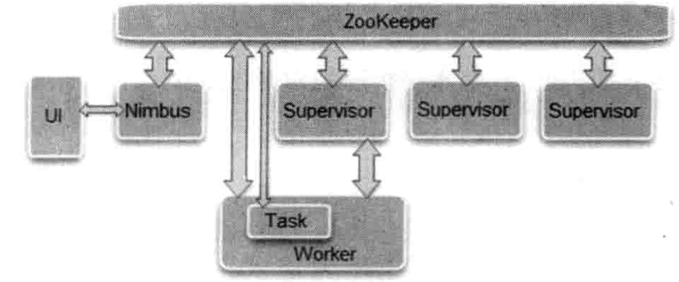

# 一、 分布式系统的特征

>  分布式系统是其组件分布在联网的计算机上，组件之间通过传递消息进行通信和动作协调的系统。
>
> 分布性、对等性、并发性、缺乏全局时钟、故障总会发生。

## 1.1 分布式环境的各种问题

* 通信异常。稳定性、时延。
* 网络分区。部分节点正常通信、脑裂。
* 三态。失败、成功、超时。
* 节点故障。节点宕机、僵死。

## 1.2 从ACID到CAP/BASE

本节重点介绍分布式事务处理与数据一致性上遇到的挑战。事务和并发控制在服务管理共享对象时的应用。


### 1.2.1 服务器事务

事务定义了一个服务器操作序列，由服务器保证这些操作序列在多个客户并发访问和服务器出现故障情况下的原子性。

#### ACID

* Atomicity

* Consistency

* Isolation

  * Read Uncommitted

  * Read Committed

  * Repeatedly Read

    |                            事务A                             |                            事务B                             |
    | :----------------------------------------------------------: | :----------------------------------------------------------: |
    |       SET TRANSACTION ISOLATION LEVEL REPEATABLE READ;       |       SET TRANSACTION ISOLATION LEVEL REPEATABLE READ;       |
    |                           BEGIN；                            |                            BEGIN;                            |
    |                                                              |              SELECT * FROM `user` WHERE id = 7;              |
    | INSERT INTO `fund`.`user`(`id`, `address_id`, `age`, `gender`, `name`, `password`) VALUES (7, NULL, NULL, NULL, 'zeyun', '123456'); |                                                              |
    |                           COMMIT;                            |                                                              |
    |                                                              |              SELECT * FROM `user` WHERE id = 7;              |
    |                                                              | UPDATE `fund`.`user` SET `address_id` = NULL, `age` = NULL, `gender` = NULL, `name` = 'alice', `password` = '123456' WHERE `id` = 7; |
    |                                                              |              SELECT * FROM `user` WHERE id = 7;              |
    |                                                              |                           COMMIT;                            |

    幻读就是没有读到记录以为不存在，但其实是可以更新成功的，并且更新成功以后，再次读取就可以读取到数据了。

  * Serialization

    |      隔离级别      | 脏读 | 不可重复读 | 幻读 |
    | :----------------: | :--: | :--------: | :--: |
    |  Read uncommitted  |  ✔️   |     ✔️      |  ✔️   |
    |   Read committed   |  ❌   |     ✔️      |  ✔️   |
    | **Repetable Read** |  ❌   |     ❌      |  ✔️   |
    |   Serialization    |  ❌   |     ❌      |  ❌   |

    * 脏读:指读到了其他事务未提交的数据.

    * 不可重复读: 读到了其他事务已提交的数据(update)。一个事务对同一行数据读取两次，但是却得到了不同的结果，比如当事务1读取到一行数据后，事务2对其进行修改，然后事务1再次读取了该行数据，发现读取到不一样的结果。也称之为虚读。

    * 幻读（Phantom）:delete,insert。事务在操作的过程中进行了前后两次查询，第二次查询包含了第一次查询未查询到的数据或者缺少了第一次查询到的结果。这是因为另外一个事务的操作（delete、insert）的影响的结果。

      不可重复读与幻读都是读到其他事务已提交的数据,但是它们针对点不同**。不可重复读的重点是修改某个记录字段，幻读的重点在于新增或者删除记录。**

      对于前者, 只需要锁住满足条件的记录。对于后者, 要锁住满足条件及其相近的记录。

* Durability

### 1.2.2 分布式事务

本节介绍分布式事务，即涉及多个服务器的事务。分布式事务可以是**平行事务**，也可以是**嵌套事务**。

**分布式事务**是指事物的参与者、支持事物的服务器、资源服务器以及事物管理器分别位于分布式不同节点上。通常一个分布式事务中会涉及多个数据源或者业务系统的操作。

一个分布式事务事务由多个分布式操作序列组成。通常把这一些列操作序列称为事务。

#### 1.2.2.1 Seata

##### Seata AT模式

###### 前提

* 基于支持本地ACID事务的关系型数据库
* JAVA应用，通过JDBC访问数据库

###### 整体机制

二阶段提交协议的演变：

* 一阶段：**业务数据**和**回滚日志**记录在**同一本地事务**中**提交**，释放**本地锁**和连接资源。
* 二阶段：
  * 提交异步化，非常快速地完成
  * 回滚：通过一阶段的**回滚日志**进行**反向补偿**

###### 写隔离


> tx1先开始，开启本地事务，拿到本地锁，更新操作m = 1000-100 = 900。本地事务提交前，先从该记录拿到全局锁，本地提交释放本地锁。tx2后开始，开启本地事务，更新操作m=900-100=800。本地事务提交前，尝试那该记录的全局锁，tx1全局提交前，该记录的全局锁被tx1持有，tx2需要重试等待全局锁


> 如果tx1二阶段全局回滚，则tx1需要重新获取该数据的本地锁，进行**反向补偿**的更新操作，实现分支的回滚。
>
> 此时，如果tx2仍等待该数据的全局锁，同时持有本地锁，则tx1的分支回滚会失败，分支的回滚会一致重试，直到tx2的全局锁等锁超时，放开**全局锁**并回滚本地事务，tx1的分支回滚最终成功。
>
> 因为整个过程全局锁tx1结束前一直是被tx1持有的，所哦一不会发生脏读的问题。

###### 读隔离


> 在数据库本地事务隔离级别 **读已提交（Read Committed）** 或以上的基础上，Seata（AT 模式）的默认全局隔离级别是 **读未提交（Read Uncommitted）** 。
>
> 如果应用在特定场景下，必需要求全局的 **读已提交** ，目前 Seata 的方式是通过 SELECT FOR UPDATE 语句的代理。

##### Seata TCC模式


##### Seata Saga模式

Saga模式是Seata模式的长事务解决方案，在Saga模式中，业务流程中每个参与者都提交本地事务，当出现某一个参与者失败，则补偿前面已经成功的参与者，一阶段正向服务和二阶段补偿服务都是由业务开发实现。

理论基础：Hector & Kenneth 发表论⽂ Sagas （1987）


**适用场景：**

* 业务流程长，业务流程多
* 参与者包含其他公司或遗留系统服务，无法提供TCC模式要求的三个接口。

**优势：**

* 一阶段提交本地事务，无锁，高性能
* 事件驱动架构，参与者可异步执行，高吞吐
* 补偿服务易于实现

**缺点：**

* 不保证隔离性（应对方案后面文档）

**实现：**

基于状态引擎的Saga实现


##### Seata XA模式

**前提：**

* 支持XA事务

> 
>
> 以下的函数事务管理器可以对资源管理器进行的操作：
>
> 1. **xa_open,xa_close**:建立和关闭与资源管理器的连接
> 2. **xa_start,xa_end**: 开始和结束一个本地事务。
> 3. **xa_prepare，xa_commit，xa_rollback**：预提交、提交和回滚一个本地事务
> 4. **xa_recover**：回滚一个已经预提交的事务。
> 5. ax_开头的函数使资源管理器可以动态地在事务管理器中进行注册，并可以对XID（Transaction IDS）进行操作。
> 6. ax_reg,ax_unreg；允许一个资源管理器在一个TMS(TRANSACTION MANAGER SERVER)中动态注册或撤消注册。

* JAVA应用，通过JDBC访问数据库

**整体机制：**

 


### 1.2.3 CAP和BASE理论

#### 1.2.3.1 CAP定理

* Consistency
* Available
* Partition tolerance

**一致性**

**可用性**

**分区容错性**


分布式系统在遇到任务网络分区故障的时候，仍然需要能够对外提供给满足一致性和可用性的服务，除非整个网络都发生了故障。

**CAP的应用**

| 放弃CAP定理 | 说明                                                         |
| :---------- | :----------------------------------------------------------- |
| 放弃P       | 如果希望能够避免系统系统出现分区容错性，简单的做法是将所有的数据或者（仅与那些事务相关的数据）都放在一个分布式节点上。这样的做法虽然无法100%保证系统不会出错，但至少不会碰到由于网络分区带来的负面影响。⚠️如果放弃P，意味着放弃系统的可扩展性。 |
| 放弃A       | 相对于“分区容错性”来说，放弃可用性则刚好相反，其做法是一旦系统遇到网络分区或者其他故障时，那么受到影响的系统则需要等待一定的时间，因此在等待期间系统无法对外提供正常的服务，即不可用。 |
| 放弃C       | 这里所说的放弃一致性并不是完全不需要数据一致性，如果真的是这样的话，系统的数据是没有意义的，整个系统也将没有价值。<br />事实上放弃一致性是指放弃一数据的强一致性，而保留数据的最终一致性。这样系统无法保证数据的实时一致性，但是能够承诺的是，数据最终会到达一个一致的状态。<br />这里引入了一个时间窗口的概念，具体多久能够达到数据最终一致性，这取决于系统的设计，主要包括数据副本在不同节点之间的复制时间长短。 |

#### 1.2.3.2 BASE理论

* Basically Available
* Soft State
* Eventually Consistent

BASE 理论[^1] 的核心思想是即使无法做到强一致性，但每个应用都可以根据自身的业务特点，采用适当的方法来使系统达到最终一致性。

**基本可用**

基本可用是指在分布式系统在不可预知的故障时，允许损失部分可用性——⚠️这绝不等于不可用。以下就是两个基本可用的列子：

* **响应时间上的损失**：正常情况下，搜索引擎要在0.5s内响应给用户，但是由于网络故障（比如系统部分机房发生断电或断网故障），查询结果增加到了1～2s。
* **功能上的损失**：正常情况下，在一个电子商务网站上进行购物时，消费者几乎能够顺利完成每一笔订单，但是在一些节日大促购物高峰的时候，由于消费者的购物行为激增，为了保护购物系统的稳定性，部分消费者可能会被引导到一个降级页面。

**弱状态**

弱状态也成为软状态，和硬状态相对，是指系统的数据存在中间状态，并认为该中间状态的存在不会影响到系统整体的可用性，即允许系统在不同的节点的数据副本之间进行数据同步的过程存在延时。

**最终一致性**

最终一致性强调数据的所有数据副本，在经过一段时间的同步后，最终能够达到一个一致的状态。因此，最终一致性的本质是需要系统保障最终数据能够达到一致，而不需要实时保证数据的强一致性。

[Eventually Consistent-Revisited](https://www.allthingsdistributed.com/2008/12/eventually_consistent.html) 一文中对最终一致性进行了非常详细的介绍。他认为最终一致性是一种特殊的弱一致性：系统能够保障在没有发生故障的前提下，数据最终能够达到一致状态，因此，在没有发生故障的前提下，数据达到一致状态的时间延迟，取决于网络延迟、系统负载和数据复制的设计因素。

在实际的工作实践中，最终一致性存在以下5类变种。

* Causal Consistency
* Read your writes
* Session consistency
* Monotonic read consistency
* Monotonic write consistency

总的来说，BASE理论面向的是大型高可用可扩展的分布式系统，和传统的ACID特性是相反的，它完全不同于ACID的强一致性模型，而是提出通过牺牲强一致性来获得可用性，并允许数据在一段时间内是不一致的，但最终达到一致状态。但同时，在实际的分布式场景中，不同业务单元和组件对数据一致性的要求是不同的，因此在具体分布式系统架构设计中，ACID特性和BASE理论往往又会结合在一起使用。

## 1.3 小结


# 二、一致性协议

上面提到，对于一个分布式系统进行架构设计的过程中，往往会在**系统的可用性**和**数据一致性**之间进行反复的权衡，于是就产生了一系列的一致性协议。

* 2PC
* 3PC
* Paxos
* Raft

## 2.1 2PC 与 3 PC

* 问题：在分布式系统中，每个机器节点虽然能够明确地知道自己在进行事务操作过程中的结果是成功或失败，但却无法直接获取到其他分布式节点的操作结果。

* 解决方法：

  Coordinator 协调者

  Participant 参与者

  协调者（Coordinator）组件来统一调度所有分布式节点的执行逻辑，这些被调度的分布式节点则被称为参与者（Participant）。协调者负责调度参与者的行为，并最终决定这些参与者是否要把事务真正进行提交。基于这个思想衍生出了二阶段提交和三阶段提交两种协议。本节重点对这两种分布式事务中涉及的一致性协议进行说明。

### 2.2.1 2PC

**使用场景：**大部分关系型数据库采用。

**协议说明：**

* **阶段一：提交事务请求**（投票）
  * 查询事务
  * 执行事务
  * 各参与者向协调者反馈事务查询响应

* **阶段二：执行事务提交**

  阶段二中，可能出现两种可能：执行事务提交、中断事务

  * 执行事务提交
  * 中断事务

**优缺点：**

* 优点：原理简单，实现方便。
* 缺点：同步阻塞、单点问题、脑裂、数据不一致、太过保守

### 2.2.2 3PC

CanCommit、PreCommit、DoCommit

**协议说明：**

* **阶段一：CanCommit**

  * 事务询问

    协调者向所有参与者发出一个包含事务内容的canCommit请求，询问是否可以执行事务提交操作，并开始等待各参与者的响应。

  * 各参与者向协调者反馈事务询问的响应 

    参与者在接收到来自协调者的canCommi请求后，正常情况下，如果其自身认为可以顺利执行事务，那么会反馈Yes响应，并进入预备状态，否则反馈No响应。

* **阶段二：PreCommit**

  协调者会根据各参与者的反馈情况来决定是否可以进行事务的PreCommit操作，正常情况下，包含两种可能。

  * 执行事务预提交

    假如协调者从所有的参与者获得的反馈都是Yes响应，那么就会执行事务预提交。

    * 发送预提交请求

      协调者向所有参与者发出preCommit的请求，进入Prepared阶段。

    * 事务预提交

      参与者接收到preCommit请求后，会执行事务操作，并将Undo和Redo信息记录到事务日志中。

    * 各参与者向协调者反馈事务执行的响应。

      如果参与者成功执行了事务操作，那么就会反馈给协调者Ack响应，同时等待最终指令，提交（commit）或中止（abort）。

  * 中断事务

    若任何一个参与者向协调者反馈了No响应，或者等待超时了之后，协调者尚未收到所有参与者的反馈响应，那么就会中止事务。

    * 发送中断请求

      协调者向所有参与者发送abort请求。

    * 中断事务

      无论收到来自协调者的abort请求，或者是在等待协调者请求过程中出现超时，参与者都会中断事务。

* **阶段三：doCommit**

  该阶段进行真正的事务提交，会存在以下两种可能的情况。

  * 执行提交

    * 发送提交请求

      进入该阶段，假设协调者处于正常工作状态，并且它接收到来自所有参与者的Ack响应，那么它就成“预提交”状体转换到“提交”状态，并向所有参与者发送doCommit请求。

    * 事务提交

      参与者接收到doCommit请求后，会正式执行事务提交操作，并在完成提交之后释放整个事务执行期间占用的事务资源。

    * 反馈事务提交结果

      参与者在完成事务提交之后，向协调者发送Ack消息。

    * 完成事务

      协调者接收到所有参与者反馈的Ack消息后，完成事务。

  * 中断事务

    进入这一阶段后，假设协调者处于正常工作状态，并且有任意一个参与者反馈了No响应，或者在等待超时之后，协调者尚无法接收到所有参与者的反馈响应，那么就会中断事务。

    * 发送中断请求

      协调者向参与者发送abort请求。

    * 事务回滚

      参与者接收到abort请求后，会利用其在阶段二中Undo信息来执行事务回滚操作，并在完成回滚之后释放整个事务执行期间占用的资源。

    * 反馈事务回滚结果

      参与者完成事务回滚之后，向协调者发送Ack消息。

    * 中断事务

      协调者接收到参与者反馈的Ack消息后，中断事务。

⚠️一旦进入阶段三，可能存在以下两种故障。

* 协调者出现问题
* 协调者和参与者之间网络出现故障

无论哪种出现哪种情况，最终都会导致参与者无法及时收奥来自协调者的doCommit或者是abort请求，正对这样的异常请求，参与者会在等待超时时间之后，继续进行事务提交。

**优缺点：**

* 优点：
  * 向较于二阶段提交协议，三阶段提交协议最大的优点就是降低了参与者的阻塞范围，并且能够在出现单点故障后继续达成一致。
* 缺点：
  * 三阶段提交协议在去除阻塞的同时引入了新的问题，那就是在参与者无法接收到preCommit消息后，如果网络出现了分区，此时协调者所在的节点和参与者无法进行正常的网络通信，在这种情况下，该参与者依然会进行事务的提交，这必然会出现数据的不一致。


## 2.2 Paxos算法

### 2.2.1 引入

[拜占庭将军问题](https://zh.wikipedia.org/zh-cn/拜占庭将军问题)[^2]

> 拜占庭帝国有许多国家军队，不同军队之间的将军之间必须制定一个统一的行动计划，从而做出进攻或者撤退的决定，同时，各个将军在地理位置上都是被分隔开来的，只能依靠军队的通讯员进行通讯。然而，在所有的通讯员中，可能会存在叛徒，这些叛徒可以任意篡改信息，从而达到欺骗将军的目的。

Lamport 在1990年提出了一个理论上的一致性解决方案。

> 在古希腊有一个叫做Paxos的小岛，岛上采用一会的形式来通过法令，议会中的议员通过信使进行消息的传递。值得注意的是，议员和信使都是兼职的，他们随时有可能会离开会议厅，并且信使可能会重复的传递消息，也可能一去不复返。因此议会协议要保证在这个情况下仍然能够正常的产生，并且不会出现冲突。

## 2.2.2 Paxos理论的产生

* [Lamport-paxos](https://www.microsoft.com/en-us/research/uploads/prod/2016/12/The-Part-Time-Parliament.pdf)

* [Paxos Made simple](https://lamport.azurewebsites.net/pubs/paxos-simple.pdf)


## 2.2.3 Paxos算法详解

###### **问题描述：**

假设有一组可以提出提案的进程集合，那么对于一个一致性算法来说需要保证以下几点：

* 在这些提案中，只有一个会被选定。
* 如果没有提案提出，那么就不会有被选定的提案。
* 当一个提案被选定后，进程应该可以获取被选定的提案信息。

对于一致性来说，**安全性（Safety）**需求如下：

> 注：一个分布式算法有两个重要的属性：安全性（Safety）和活性（Liveness）。简单来说，Safety是指那些需要保证永远不会发生的事情。Liveness则是指那些最终一定会发生的事情。

* 只有被提出的议案才能被选定（Chosen）
* 只能有一个值被选定
* 如果某个进程认为某个提案被选定了，那么提案这个提案必须是整的被选定的那个。

**活性（Liveness）** ，总体来说，Paxos算法的目的就是要保证最终有一个提案会被选定，当提案被选定后，进程最终也能能够获取到被选中的提案。


在该一致性算法中，有三种参与角色，我们用 **Proposer、Acceptor、Learner** 表示。在具体的实现中，一个进程可能充当不止一种角色，在这里我们并不关心进程如何映射到各种角色。假设不同参与者之间可以通过接受和发送信息进行通讯，那么：

* 每个参与者一任意的速度执行，可能会因为出错而停止，也可能会重启。同时，即使一个提案被选定后，所有参与者也都有可能失败或重启，因此除非那些失败或者重启的参与者可以记录某些信息，否则将无法去定最终的值。
* 消息在传递的过程中可能会出现不可预知的延迟，也可能会重复或丢失，但是消息不会被损坏，即消息内容不回被篡改。

###### **提案的选定**

* 要选定一个提案最简单的方式是只允许一个Acceptor存在，这样的话，Proposer只能发提给Acceptor，Acceptor会选择它接收到的第一个提案作为被选定的提案。这种方式尽管实现起来非常简单。但是却存在很大问题，因为这个Acceptor出现问题，那么整个系统就无法工作了。

  因此，应该寻找一种更好的解决方式，例如可以使用多个Acceptor来避免Acceptor的单点问题。现在我们就来看看，存在多个Acceptor的情况下，如何进行提案的选择：Proposer向一个Acceptor集合发送提案，同样，集合中的每个Acceptor都可能会批准（Accept）该提案，当有足够多的Acceptor批准这个提案的时候，我们就认为该提案被选定了。那么什么时候是足够多呢？我们假定足够多的Acceptor是整个Acceptor集合的一个子集，并且让这个集合大的可以包含Acceptor集合中的大多数成员，因为任意两个包含大多数Acceptor的子集至少有一个公共成员。另外我们再规定，每一个Acceptor最多只能批准一个提案，那么就保证只有一个提案被选定了。

* 推导过程
  * 在没有失败和消息丢失的情况下，如果我们希望即使在只有一个提案被提出的情况下，仍然可以选出一个提案，这就暗示了如下的需求。

    * ***P1: 一个Acceptor 必须批准它收到的第一个提案。***

    上面这个需求引入一个问题：如果多个提案被不同的Proposer同时提出，这可能会导致虽然每个Acceptor都批准了它收到的第一个提案，但是没有一个提案是由多数人批准的。下图就是这种情况，这种情况无法选定一个提案的。

    

  * 另外，即使只有两个提案被提出，如果每个提案都被差不多一半的Acceptor批准了，此时即使只有一个Acceptor出错，都有可能导致无法确定选定哪个提案，如下图所示就是这种情况。图中共有5个Accepter，其中两个批准了V1，另外3个批准了V2，此时如果V2的3个Acceptor中过有一个出错了，那么V1和V2的批准者都变成了2个，此时无法选定最终的提案了。

    

  * 因此在P1 的基础上，再加上一个提案被选定需要由半数以上的Acceptor批准的需求暗示着一个Acceptor必须能够批准不止一个提案。在这里，我们使用一个全局的编号（这种全局的编号的生成不是Paxos算法需要关注的地方，就算法本身而言，其假设当前已经具备了这样的外部组件能够一个全局唯一的编号）来唯一标识每一个被Acceptor批准的提案，当一个具有某Value值的提案被半数以上的Acceptor批准后，我们就认为该Value被选定了，此时我们也认为该提案被选定了。需要注意的是，此处讲到的提案已经和Value不是同一个概念了，提案变成了一个由编号和Value组成的组合体，因此我们以“**[编号，value]**” 来表示一个提案。

    根据上面讲到的内容，我们虽然允许多个提案被选定，但同时必须要保证所有被选的提案都具有相同的Value值——这是一个关于提案Value的约定，结合提案的编号，该约定可以定义如下：

    * ***P2：如果编号为  $M_{0}$ ，Value值为 $V_{0}$ 的提案(即 [$M_{0}, V_{0}$])被选定了，那么所有比编号 $M_{0}$ 更高的，且被Acceptor批准的提案，其Value值必须是 $V_{0}$***  

    因为提案的编号是全序的，条件P2就保证了一个Value值被选定这一关键安全性属性。同时，一个提案要被选定，其首先必须被至少一个Acceptor批准，因此我们可以通过满足如下条件来满足P2。

    * ***P2a: 如果编号$M_{0}$，Value值为$V_{0}$的提案 [$M_{0}, V_{0}$]被选定了，那么所有比编号M0更高的，且被Acceptor批准的议案，其Value值必须也是$V_{0}$***

    如下图所示，在Acceptor1没有收到任务提案的情况下，其他4个Acceptor已经批准了来自Proposer2的提案[$M_{0}, V_{1}$]，而此时，Proposer2产生了一个具有其他Value值的编号更高的提案 [$M_{1}, V_{2}$] , 并发送给了Acceptor1。根据P1，就需要Acceptor1批准该提案，但是这与P2a矛盾，因此如果要同时满足P1 和P2a，需要对P2a进行如下强化：

    

    * ***P2b：如果一个提案$[M_{0},V_{0}]$ 被选定后，那么之后任何Proposer产生的编号更高的提案，其value值都是$V_{0}$。***

    因为一个提案必须 在被Proposer提出后才能被Acceptor批准，因此P2b包含了P2a，进而包含了P2。于是，接下来重点就是论证P2b成立即可：

    * ***假设某个提案 $[M_{0}，V_{0}]$ 已经被选定了，证明任何编号$M_{n} > M_{0}$ 的提案，其Value 值都是$V_{0}$  。***

    **数据归纳法证明**

    我们对$M_{n}$ 进行第二类数学归纳法证明，也就是要证明如下结论：

    * ***假设编号在 $M_{0}$ 到  $M_{n-1}$ 之间的提案，其Value值都是 $V_{0}$ ,证明编号为$M_{n}$ 的提案的Value也为$V_{0}$ 。***

    因为编号为 $M_{0}$ 的提案已经被选定了，这就意味着肯定存在一个由半数以上的Acceptor组成的集合C，C中的每个Acceptor都批准了该提案。再结合归纳假设，“编号为$M_{0}$ 的提案被选中”意味着:

    * ***C 中的每个Acceptor都批准了一个编号在  $M_{0}$ 到  $M_{n-1}$ 范围内的提案，并且每个编号在  $M_{0}$ 到  $M_{n-1}$ 范围内的被Acceptor批准的提案，其Value都为$V_{0}$。***

    因为任何包含半数以上Acceptor的集合S至少包含C中的一个成员，因此我们可以认为如果保持了下面P2c的不变性，那么编号为$M_{n}$ 

    * ***P2c:对于任意$M_{n}$ 和$V_{n}$ 如果提案$[M_{n},V_{n} ]$ 被提出，那么肯定存在一个由半数以上的Acceptor组成的集合S，满足下面两个条件中的任意一个。***
    * ***S中不存在任何批准过编号小于$M_{n}$ 的提案的Acceptor。***
      
    * ***选取S中所有Acceptor批准的编号小于$M_{n}$ ，其中编号最大的那个提案其Value值是$V_{n}$***

    至此，只需要通过保持P2c，我们就能满足P2b了。

    从上面的内容中，我们可以看到，从P1到P2b的过程其实是一系列条件的逐渐加强，如果需要证明这些条件可以保证一致性，那么就需要反向推倒：**P2c => P2b => P2a => P2** ,然后通过P2和P1来保证一致性。

    我们再看P2c，实际上P2c规定了每个Proposer如何产生一个提案：对于产生的每个提案$[M_n,V_n]$ ,需要满足如下条件：

    *  ***存在一个由超过半数的Acceptor组成集合S：***
      * ***要么S中没有Acceptor批准过编号小于$M_n$的任何提案。***
      * ***要么S中的所有Acceptor批准的所有编号小于$M_n$ 的提案中，编号最大的那个提案的Value值为$V_n$,***

    当每个Proposer都按照这个规则来产生提案时，就可以保证满足P2b了，接下来我们使用第二数学归纳法证明P2c。

    首先假设提案$[M_0,V_0 ]$ 被选定了，设比该提案编号大的提案为$[M_n,V_n ]$ ，我们需要证明的就是再P2c的前提下，对于所有的$[M_n,V_n ]$ ，存在 $V_n = V_0$ 。

    1. 当 $M_n=M_0+1$， 如果有这样一个编号为$M_n$的提案，首先我们知道$[M_0,V_0]$ 已经被定了，那么就一定存在一个Acceptor的子集S，且S中的Acceptor已经批准了小于 $M_n$ 的提案，于是，$V_n$ 只能是多数集合S中编号小于 $M_n$ 但为最大编号的那个提案的值。而此时 $M_n=M_0+1$ ，因此理论上编号小于 $M_n$ 但为最大编号的那个提案肯定是$[M_0,V_0]$ ，同时由于S和通过$[M_0,V_0]$ 的Acceptor集合都是多数集，也就是说二者肯定有交集——这样Proposer在确定 $V_n$ 的取值时，一定会选择 $V_0$。

       ⚠️Paxos算法的证明过程使用的第二数据归纳法，上面实际上是数学归纳法的第一步，验证了某个初始值成立。接下来，就需要假设编号在 $M_0+1$ 到 $M_n-1$区间内时成立，并在此基础上推导出编号$M_n$时也成立。

    2. 根据假设，编号在  $M_0+1$ 到  $M_n-1$ 区间内的所有提案的Value值为$V_0$ , 需要证明的是编号为 $M_n$ 的提案的Value值也是$V_0$。

       根据P2c，首先同样一定存在一个Acceptor的子集S，且S中Acceptor已经批准了小于$M_n$ 的提案，那么编号为$M_n$ 的提案的Value值只能是这个多数集S中编号小于 $M_n$ 但为最大编号的那个提案的值。

       如果这个编号落在 $M_0+1$ 到  $M_n-1$ 区间内，那么Value值肯定是 $V_0$, 如果不落在 $M_0+1$ 到  $M_n-1$ 区间内，那么它的编号不可能比 $M_0$ 小了，那肯定就是 $M_0$ ，因为S也肯定会与批准 $[M_0,V_0 ]$ 这个提案的Acceptor集合S由交集，而如果$M_0$编号是，那么它的Value值也是 $V_0$，由此得证。

  


###### Proposer生成提案

在P2c的基础上如何进行提案的生成。对于一个Proposer来说，获取那些已经被通过的提案远比预测未来可能会被通过的提案来的简单。因此，Proposer在产生一个编号为$M_n$的提案时，必须要知道当前一个将要或已被半数以上Acceptor批准的编号小于 $M_n$ 的但为最大编号的提案。并且，Proposer会要求所有的Acceptor都不要在批准任何编号小于$M_n$ 的提案——这就引出了如下的提案生成算法。

1. Proposer选择一个新的提案编号$M_n$ ，然后向某个Acceptor集合的成员发送请求，要求该集合中的Acceptor做出如下回应：

   * 向Proposer承诺，保证不在批准任何编号小于$M_n$的提案。

   * 如果Acceptor已经批准过任何提案，那么其就向Proposer反馈当前该Acceptor已经批准的编号小于$M_n$ 但为最大编号的那个提案的值。

     我么将该请求成为编号$M_n$ 的提案的Prepare请求。

2. 如果Proposer收到了来自半数以上以上的Acceptor的响应结果。那么它就可以产生编号为$M_n$ ,Value值为 $V_n$的提案，这里$V_n$是所有响应中编号最大的提案的Value值。当然还存在另一种情况，就是半数以上的Acceptor都没有批准过任何提案，即响应中不包含任何的提案，那么此时$V_n$值就是Proposer任意选择。

当去定提案后，Proposer就会将该提案再次发送给某个Acceptor集合，并期望获得它们的批准，我们称此请求为Accept请求。需要注意的一点是，此时接受Accept请求的Acceptor集合并一定是之前响应Prepare请求的Acceptor集合——任意两个半熟以上的Acceptor集合，必定包含至少一个公共的Acceptor。

###### Acceptor批准提案

根据上面的内容，一个Acceptor可能会收到来自Proposer的两种请求，分别是Prepare请求和Accept请求，对于这两类请求作出响应的条分别如下：

* Prepare请求：Acceptor可以在任何时候响应一个Prepare请求。
* Accept请求：在不违背Accept现有的承诺下，可以任意响应Accept请求。

因此，对Acceptor逻辑处理的约束条件，大体可以定义如下：

***P1a:一个Acceptor只要尚未响应过任何编号大于$M_n$ 的Prepare请求，那么它就可以接受这个编号为$M_n$的提案。***

从上面这个约束条件中，我们可以看出，P1a包含了P1。同时，值得一提的是，Paxos算法允许Acceptor忽略任何请求而不用担心破坏其算法的安全性。

**算法优化**

尽可能忽略Prepare请求

假设一个Acceptor收到了一个编号为$M_n$的 Prepare请求，但此时该Acceptor已经对编号大于$M_n$ 的Prepare请求作出了响应，因此它肯定不会在批准任何新的编号为$M_n$ 的提案，那么很显然，Acceptor就没有必要作出响应，于是Acceptor可以选择忽略这样Prepare请求。同时，Acceptor也可以忽略那些它掉那些它已经批准过的提案的Prepare请求。

通过这个优化，每个Acceptor只需记住它批准的提案的最大编号以及它已经作出Prepare请求响应的提案的最大编号，以便在出现故障或结点重启的情况下，也能保证P2c的不变性。而对于Proposer来说，只要它可以保证不会产生具有相同编号的提案，那么就可以丢弃任意的提案以及它所有的运行时状态。

###### **算法陈述**

阶段一

1. Proposer选择一个提案编号$M_n$ ，然后向Acceptor的某个超过半数的自己成员发送编号$M_n$的Prepare请求。
2. 如果一个Acceptor收到一个编号为$M_n$ 的Prepare请求，且编号$M_n$ 大于该Acceptor已经响应的所有Prepare请求的编号，那么它就会将它已经批准过的最大编号的提案作为响应反馈给Proposer，同时该Acceptor会承诺不会再批准任何编号小于$M_n$的提案。

阶段二

1. 如果一个Proposer收到来自半数以上的Acceptor对其发出的编号为$M_n$ 的Prepare请求的响应，那么它就会发送一个针对 $[M_n,V_n]$ 提案的Accept请求给Acceptor。⚠️ $V_n$  的值就是收到响应中编号最大的提案的值，如果响应中不包含任何提案，那么它就是任意值。
2. 如果Acceptor收到这个针对 $[M_n,V_n]$ 提案的Accept请求，只要该Acceptor尚未对编号大于$M_n$ 的Prepare请求作出响应，它就可以通过这个提案。

在实际过程中，每一个Proposer都有可能会产生多个提案，但只要每个Proposer都遵循上述算法运行，就一定能保证算法执行的正确性。⚠️每个Proposer都可以在任意时刻丢弃一个提案，哪怕对该提案的请求和响应在提案被丢弃后会到达，但根据Paxos算法的一些列规约，依然可以保证其在提案选择上的正确性。事实上，如果某个Proposer已经在试图生成编号更大的提案，那么丢弃一些就的提案未尝不是一个好的选择。因此，如果一个Acceptor因为已经收到过更大编号的Prepare请求而忽略某个编号较小的Prepare或者Accept请求，那么它也应该通知其对应的Proposer，以便该Proposer也能够将该提案进行丢弃——这是上面“算法优化”部分提到的提案丢弃是一致的。

**提案的获取**

下面说明让Learner获取提案，大体有如下几种方案：

1. Learner获取一个已经被选定的提案的前提是，该提案已经被半数以上的Acceptor批准。因此，最简单的方法是一旦Acceptor批准了一个提案，就将该提案发送给所有的Learner。

   很显然，这种做法虽然可以让Learner尽快地获取被选定的提案，但是却需要让每个Acceptor与所有的Learner逐个进行一次通信，通信的次数至少为二者个数之积。

2. 让所有的Acceptor将他们对提案的批准情况，统一发送给一个特定的Learner（主Learner），在不考虑拜占庭将军问题的前提下，假定Learner之间可以通过消息通信来互相感知提案的选定情况。基于这样的前提，当主Learner被通知一个提案已经被选定时，它会负责通知其他Learner。

   很显然，解决了1出现的问题，但引入了一个不稳定因素：主Learner随时可能出现故障。

3. 在2的基础上，可以将主Learner的范围扩大，即Acceptor都可以在一个提案批准后通知所有其他的Learner。这个Learner集合中的Learner个数越多，可靠性就越好，但同时网络停下的复杂度也就越高。但同时网络通信的复杂度也就越高。

**通过选取主Proposer保证算法的活性**

假设存在一种极端情况，有两个Proposer一次提出了一系列编号递增的议案，但是最终都无法被选定，具体流程如下：

***Proposer P1 提出了一个编号为 $M_1$ 的提案，并完成了上述阶段1的流程。但与此同时，另外一个Proposer P2 提出了一个编号为 $M_2（M_1<M_2）$ 的提案，同样也完成了阶段1 的流程，于是Acceptor已经承诺不在批准编号小于$M_2$ 的提案了。因此，当P1 进入阶段二的时候，其发出的Accept请求将被Acceptor忽略，于是P1再次进入阶段一并提出编号为 $M_3 （M_3 > M_2）$  的提案，而这又导致P2 在第二阶段的Accept 请求被忽略，依次类推，提案的选定过程将陷入死循环。*** 

解决方法：选择一个主Proposer，并规定只有主Proposer才能提出议案。这样以来，只要主Proposer 和 过半的Acceptor能够正常进行网络通信，那么但凡主Proposer提出一个编号更大的提案被提出或正在接受批准，那么它会丢弃当前这个编号较小的提案，并最终能够选出一个编号足够大的提案。因此，如果系统中有足够多的组件（包括Proposer，Acceptor和其他网络通信组件）能够正常工作，那么通过选择一个主Proposer，整个Paxos算法流程就能够保证活性。

[^1]: https://queue.acm.org/detail.cfm?id=1394128
[^2]: https://people.eecs.berkeley.edu/~luca/cs174/byzantine.pdf

# 三、Paxos的工程实践

## 3.1Chubby

* [The Chubby lock service for loosely-coupled distributed systems](https://static.googleusercontent.com/media/research.google.com/zh-CN//archive/chubby-osdi06.pdf)

分布式锁服务，GFS和BigTable等用它解决分布式协作、元数据存储、Master选举等于分布式锁服务相关的问题。

它的实现以Paxos为基础

### 3.1.1 概述

### 3.1.2 应用场景

### 3.1.3 设计目标

* 为什么设计成了一个需要访问中心化节点的分布式锁服务。
  * 对上层应用程序的侵入更小
  * 便于提供数据的发布和订阅
  * 开发人员对基于锁的接口更为熟悉
  * 更便捷地构建更可靠的服务
* 设计目标
  * 提供完整的独立的分布式锁服务，而非仅仅是一个一致性协议的客户端哭
  * 提供粗力度的锁服务
  * 在提供锁服务的同时提供对小文件的读写功能
  * 高可用、靠可靠
  * 提供事件通知机制

### 3.1.4 Chubby技术架构


### 3.1.5 Paxos协议实现

Chubby服务端的基本架构大致分为下面三层：

* 最次层是容错日志系统（Fault-Tolerant Log），通过Paxos算法能够保证集群中的所有机器上的日志完全一致，同时具备比较高的容错性。
* 日志层之上是Key-Value层类型的容错数据库（Fault-Tolerant DB），其通过下层的日志来保证一致性和容错性。
* 存储层之上就是Chubby对外提供的分布式锁服务和小文件存储服务。


Paxos算法的主要作用在保证集群类各个副本及诶单的日志能够保持一致。

## 3.2 Hypertable

使用C++语言开发的开源、高性能、可伸缩的数据库。

以Google的BigTable相关论文为指导，采用于HBase非常相似的分布式模型，其目的是要构建一个正对分布式海量数据的高并发数据库。

### 3.2.1 概述


Hypertable的核心组件

* Hyperspace
* Master
* RangeServer
* FS Broker
* ThriftBroker

**Hyperspace**

### 3.2.2 算法实现

**Active Server**

**事务请求处理**

**Active Hyperspace 选举**

## 3.2 小结

# 四、Zookeeper与Paxos

## 4.1 Zookeeper是什么

Zookeeper是为分布式应用的提供的一个分布式协调服务，是一个典型的分布式数据一致性的解决方案。

### 4.1.1 Zookeeper介绍

Zookeeper 为分布式应用提供了高效且可靠的分布式协调服务，分布式应用程序可以基于它实现诸如数据发布/订阅、负载均衡、命名服务、分布式协调/通知、集群管理、Master选举、分布式锁和分布式队列等功能。

**Zookeeper可以保证如下分布式一致性特性。**

* **顺序一致性（Sequential Consistency）**

指从客户端发器的事务请求，最终会按序（发起顺序）应用到Zookeeper中。

* **原子性（Atomicity）**

指更新操作要么失败，要么成功，不存在部分成功。

* **单一视图（Single System Image）**

无论客户端连接哪个Zookeeper服务器，其看到的服务端数据模型都是一致的。比如，客户端机是在一个Session中发生了故障转移，连接到另外一台Zookeeper服务器，也不会看到旧版本的视图。

* **可靠性（Reliability）**

一旦一个更新操作被应用到服务器端，那么该操作引起的服务器状态变更会一直保留，知道客户端对它发生变更操作。

* **实时性（Timeliness）**

 保证在一定时间短内，客户端一定能够从服务器上读取到最新的数据状态。

**zookeeper 组成部件**


* 上图展示了Zookeeper高层的架构组成，除了Request Processor外，组成ZooKeeper服务的每台服务器都复制自己的每个组件的副本。
* Replicated Database 是一个内存数据库包含了整个Zookeeper的整个data tree。更新操作被记录到硬盘上以备恢复，写操作会在记录到内存数据库前被序列化到硬盘上。
* 每个Zookeeper的Server都服务客户端。客户端连接上Zookeeper的一台Server提交请求。读取请求从每个服务器数据库的本地副本提供服务。更改服务状态的请求（写请求）由一致性协议处理。
* 根据分布式一致性要求，来自客户端的所有写请求都转发到Zookeeper中称为`Leader`的Server。其余的Server叫做 `Followers` ，从Leader 接受 proposals 并同意消息传递。消息层负责替换出现问题的`Leader` 并同步 `Followers` 和 `Leader`。
* Zookeeper使用自定义的**原子消息传递协议** 。因为消息层是原子的，所以Zookeeper能够保证本地副本不会发散。当 `leader` 接受到一个写请求的时候，它计算当写操作被应用后应该达到一个什么样的状态，然后以事务的方式更新到新的状态。

**Zookeeper的设计目标**

1. **简单的数据模型**

   Zookeeper使得分布式程序能够通过一个**共享的**、**树型结构**的**名字空间 **来和进行相互协调

   树型结构的名字空间，是指Zookeeper服务器内存中的一个数据模型，其由一系列的ZNode的数据节点组成，总的来说，其数据模型类似于一个文件系统，而Znode之间的层级关系，就像文件系统之间的目录结构一样。不过和传统的磁盘文件系统不同的是，Zookeeper将全量数据存储在内存中，依此来实现提高服务器吞吐、减少延迟的目的。

2. **可以构建集群**

   

   一个Zookeeper集群通常有一组机器组成，一般由3～5台计算机就可以组成一个可用的Zookeeper集群了。组成Zookeeper集群的每台机器都会在内存中维护当前的服务器状态。并且每台机器之间都保持着相互通信。⚠️，只要集群中存在超过一半的机器能正常工作，那么整个集群就能够正常对外提供服务了。

   Zookeeper的客户端程序会选择和集群中任意一台机器共同创建一个TCP连接，而一旦客户端和某台Zookeeper 服务器之间的连接断开后，客户端会自动连接到集群中的其他机器。

3. **顺序访问**

   对于例来自客户端的每个更新操作，Zookeeper都会分配一个奇迹唯一的递增编号，这个编号反映了所有事务操作的先后顺序，应用程序可以使用Zookeeper的这个特性来实现更高层的同步原语。

4. **高性能**

   由于Zookeeper将全量数据存储在内存中，并直接服务于客户端的所有非事务请求，因此它尤其是用与以读为主的应用场景。

### 4.1.2 Zookeeper从何而来

雅虎内部很多大型系统内部基本都需要一个类似的系统来进行协调，但这些系统往往都存在分布式淡点问题，所以雅虎的开发人员试图开发一套通用的无单点问题的分布式协调系统，以便开发人员将精力集中在业务处理上。

### 4.1.3 Zookeeper的基本概念

**集群角色**

通常在分布式系统中，构成一个集群的每一台机器都有自己角色，最经典的集群模式就是Master/Slave模式（主备模式）。在这种模式中，我们把能够处理锁哦有写操作的机器称为Master机器，把所有通过异步复制方式获取最新数据，不提供读服务的机器称为Slave机器。

但是在Zookeeper中有下面3中：

* Leader

* Follower

* Observer

**会话（Session）**

* 客户端和服务器之间有一个TCP长连接。（服务器默认对外提供的端口2181）
* 客户端利用上述TCP长连接通过检测心跳保持会话有效性，还可以接受来自服务器的Watch事件通知。
* SessionTimeout

**数据节点（Znode）**

* Zookeeper将所有数据存储在内存中，数据模型是一棵树（Znode Tree），例如**/foo/path1**
* 持久节点和临时节点
  * 持久节点之一旦创建，除非Zookeeper主动删除操作，否则将一致保存在Zookeeper上
  * 临时节点 生命周期与Session绑定

**版本**

* 每个Znode都会为其维护一个Stat
  * version 当前节点版本
  * cversion 当前Znode子节点的版本
  * aversion 当前Znode的ACL版本

**Watcher**

* 时间监听器
* 服务器通知到客户端

**ACL（Access Control Lists）**

* CREATE
* READ
* WRITE
* DELTE
* ADMIN

### 4.1.4 为什么选择Zookeeper

* 性能、易用性、可用性、稳定性
* 免费
* 已获取的了广泛应用（Hadoop、Hbase、Storm、Solor）

## 4.2 Zookeeper 的ZAB协议

Zookeeper使用单一的主进程来处理客户端的所有事务请求，并采用ZAB的原子广播协议，将服务器数据状态的变更以事务Proposal的形式广播到所有副本进程上去。

ZAB协议的主备模型架构保证了同一时刻集群中只有一个主进程来广播服务器的状态变更，因此能够能好地处理客户单大量的并发请求。

考虑到分布式环境中，顺序执行的一些状态变更必须依赖比它早的状态变更，例如变更C需要依赖变更A和变更B，这样的依赖关系要求ZAB协议能够保证一个全局的变更序列被顺序应用。也就是说ZAB协议需要保证如果一个状态变更已经被处理了，那么所有其依赖的状态变更也应该被提起处理掉了。

考虑的主进程在任何时候都有可能出现崩溃退出或重启现象，因此ZAB协议还要做到当前主进程出现上述异常情况的时候，依旧能够正常工作。

### 4.2.1 ZAB协议

***ZAB协议的核心是定义那些会改变Zookeeper服务器数据状态的事务请求处理方式，即***

* ***Leader服务器和Follower服务器***

  ***所有事务请求必须由一个全局唯一的服务器来协调处理，这样的服务器被称为Leader服务器。其余的服务器被称为Follower服务器。*** 

* ***事务Proposal提案***

  ***Leader服务器负责将一个客户端事务请求转发成一个事务Proposal，并将该Proposal分发给集群中所有的Follower服务器。***

* ***Commit消息***

  ***Leader服务器需要等待所有Follower服务器的反馈，一旦超过半数的Follower服务器进行了正确的反馈后，那么Leader就会再次向所有Follower服务器分发Commit消息，要求器将前一个Proposal进行提交。***

### 4.2.2 协议介绍

两种模式：崩溃恢复、消息广播

* **消息广播**
  
* 基于具有FIFO特性的TCP协议来进行网络通信的，因此能够很容易地保证消息广播过程中消息接受与发送的顺序性。
  
* **崩溃恢复**

  一旦①Leader服务器出现奔溃，②由于网络原因导致Leader服务器失去了与过半Follower的联系，那么就进入奔溃恢复模式。

  * 基本特性

    * ZAB需要确保那些已经在Leader服务器上提交的事务最终被所有服务器都提交。
    * ZAB协议要确保丢弃那些只在Leader服务器上被被提出（还没有得到过半Follower服务器的ACK反馈）的事务。

    能够确保提交已经被Leader提交的事务Proposal，同时丢弃已经跳过的事务的Proposal。针对这个要求，**如果让Leader选举算法能够保证新选举出来的Leader服务器拥有集群中所有机器最高编号（即*ZXID*最大）的事务Proposal，那么就可以保证这个新选举出来的Leader一定具有所有已经提交的提案。更为重要的是，如果具有最高编号事务Proposal的机器成为Leader，就可以省去Leader服务器检查Proposal的提交和丢弃工作这一步操作了。**

  * 数据同步

    * 完成Leader选举之后，在正式开始工作（即接受客户端的事务请求，如何提出新的提案）之前，Leader服务器首先会确认事务日志中的所有Proposal是否都已经被集群中过半的机器提交了，即是否完成了数据同步。
    * 正常情况下，Leader服务器会为每一个Follower服务器准备一个队列，并将那些没有被各Follower同步的事务以Proposal消息的形式逐个发送给Follower服务器，并在每一个Proposal消息后面紧接着再发送一个Commit消息，已表示该事务已经被提交。等到Follower 服务器将所有器尚未同步的事务Proposal都从Leader服务器上同步过来并成功应用到本地内存数据库中后，Leader服务器就会将该Follower服务器假如到真正可用的Follower列表中，并开始之后的其他流程。
    * 当有需要被丢弃的事务Proposal时，
      * 在ZAB协议的事务编号ZXID设计中，ZXID是一个64位的数字，其中低32位可以看作是一个简单的单调递增的计数器，针对客户端的每一个事务请求，Leader服务器在产生一个新的事务Proposal的时候，都会对该计数器进行加1操作；而高32位则代表了Leader周期**epoch**的编号，每当选举产生一个新的ZXID，并从该ZXID中解析出对应的**epoch值**然后在对其进行加1操作，之后就会一次编号作为新的epoch，并将低32位置0来开始生成新的ZXID。ZAB协议中的这一通过epoch编号来区分Leader周期变化的策略，能够有效避免不同的Leader服务器错误地使用相同的ZXID编号提出不一样的事务Proposal的异常情况，这对于识别在Leader崩溃恢复前后生成的Proposal非常有帮助，大大简化了数据恢复流程。
      * 基于这样的策略当一个包含了上一个Leader周期中尚未提交过的事务Proposal的服务器启动时，其肯定无法成为Leader。**因为当前集合中一定包含一个Quorum集合，该集合中的机器一定包含了更高epoch的事务Proposal**，因此这台机器的事务Proposal肯定不是最高，也就无法成为Leader了。当这台机器加入到集群中，以Follower角色连接上Leader服务器之后，Leader服务器会根据自己服务器上最后被提交的Proposal和Follower服务器上的Proposal进行比对，比对的结果当然是Leader会要求进Follower进行一个回退操作——回退到一个确实已经被集群中过半机器提交的最新的事务proposal。

### 4.2.3 深入ZAB协议

1. **系统模型**

   一组由进程  $\prod =\{P_1,P_2,...P_{n}\}$ 组成的分布式系统中，

   * 每个进程都有自己独立的存储设备，各个进程之间通过相互通信实现消息传递。
   * UP状态
   * DOWN状态

   当集群中存在过半的处于UP状态的进程组成一个进程子集之后，就可以进行正常的消息广播了。我们将这样的进程集合称为Quorum(下文用Q表示)，并假设这样的Q已经存在，其满足：
   $$
   \forall Q ,Q \subseteq \prod  \\ \forall Q_1 和 Q_2, Q_1 \cap Q2 \neq \empty
   $$
   上面的集合关系表示，存在进程自己Q，其必定是进程组 $\prod$ 的子集，同时存在任意两个子集 $Q_1$ 和 $Q_2$ ,其交集必定非空。

   使用$P_i$ 和 $P_j$ 来分别表示进程组 $\prod$ 的两个不同进程 ，使用$C_{ij}$ 来表示进程$P_i$ 和 $P_j$ 之间的网络通信通道，其满足如下两个基本特征。

   * 完整性(Integrity)

   进程 $P_j$ 如果收到来自进程 $P_i$ 的消息 $m$ ，那么进程  $P_i$ 一定发送了消息 $m$。

   * 前置性(Prefix)
     * 如果进程 $P_j$ 收到了消息$m$ ，那么如果存在这样的消息 ${m}'$ :如果消息  ${m}'$ 是消息 $m$ 的前置消息，那么 $P_j$ 务必先收到  ${m}'$ ， 再收到 $m$。
     * 我们将存在这种前置关系的两个消息表示为：${m}' \prec m$ 。
     * 前置性是整个协议设计中最关键的一点，由于每个消息都有可能是基于之前的消息来进程的，因此所有消息都必须按照严格的先后顺序进行处理。

2. **问题描述**

   Zookeeper是一个高可用的分布式协调服务，在很多系统上得到应用，这些应用有着共同的特点，即通常存在大量的客户端进程，并且都依赖Zookeeper来完成一些列诸如可靠的配置信息存储和运行时状态记录等分布式协调工作。因此，Zookeeper必须具备**高吞吐**和**低时延**的特性，并且能够很好地在高并发情况下完**成分布式数据的一致性处理**，同时能够**优雅地处理运行时故障**，并具备**快速从故障中恢复**过来的能力。

   **主进程周期**

   ZAB协议规定了任何时候都保证只有一个主进程负责进行广播，而如果主进程奔溃了，就需要选择一个新的主进程。主进程的选举机制和广播机制时紧密相关的。

   随着时间推移，会出现无限多的进程并构成一个主进程序列：$P_1,P_2,..., P_{e-1},p_e$ ，其中$P_e \in \prod$，$e$ 表示主进程序列号（主进程周进程周期）。 如果 $e<{e}'$ ，称为 $P_e$ 是 ${P_{{e}'}}$ 之前的主进程，通常用 $P_e  \prec P_{{e}'}$ 表示。

   由于各个进程都会发生奔溃然后再次恢复，因此会出现这样的情况：存在这样的$P_e$ 和 $P_{{e}'}$ ，它们本质上是同一个进程，只是处于不同的周期中而已。

   为了确保主进程每次广播出来的事务消息都是一致的，我们必须确保ZAB协议只有在充分完成崩溃恢复阶段后，新的主进程才能生成新的事务消息广播。为了实现这个目的，我们假设各个进程都实现了类似于 ready(e) 这样的一个函数调用，在运行过程中，ZAB协议能够非常明确地告知上层系统（指主进程和其他副本进程）是否可以开始事务消息广播，同时，在调用ready(e) 函数后还需要为当前主进程设置一个实例值。实例值用于唯一表示当前主进程的周期 ，当主进程进行广播时，用它设置事务标示epoch——当然，ZAB需要保证实例值在不同主进程周期中是全局唯一的。如果一个主进程周期 $e$ 早于另一个主进程周期 ${e}'$ ，则将其表示为 $e \prec {e}'$ 。

   **事务**

   假设各个进程都存在一个类似于 `translations(v, z)` 这样的函数

   * `v` 事务内容
   * `z` 事务标志
   * `z = <e,c>` 每个事务标志包含两部分内容
     * `e` 主进程周期， 用`epoch(z)` 来表示一个事务标示中的主进程周期`epoch`。
     * `c` 主进程周期内的事务计数器，用`counter(z)` 表示事务标示中的事务计数。

   针对每一个新的事务，主进程都会首先将计数器 c 递增。在实际的运行过程中，如果一个事务标示 $z$ 优先于另一个事务标示 $z'$ ，那么有如下两种情况。

   ① $epoch(z) \prec epoch({z}')$  

   ② $epoch(z) = epoch({z}')$ 且 $counter(z) < counter({z}')$

   均使用 $z \prec _{z}z'$ 表示。

3. **算法描述**

   表4.1 ZAB协议算法表述术语介绍

   |    名称     | 说明                                                         |
   | :---------: | :----------------------------------------------------------- |
   |  $F_{.P}$   | Follower f处理过的最后一个事务Proposal                       |
   | $F_{.ZXID}$ | Follower f处理过的历史事务Proposal中最后一个事务Proposal的事务表示 $ZXID$ |
   |    $h_f$    | 每一个Follower f 通常都已经处理（接受）了不少事务Proposal，并且会有一个针对已经处理过的事务的集合，将其表示为 $h_f$ ，表示Follower已经处理过的事务序列。 |
   |    $I_e$    | 初始化历史记录，在某有一个主进程周期epoch e 中，当准Leader完成阶段一后，此时它的$h_f$ 就被标示为 $I_e$ 。 |

   **阶段一：发现Discovery**  

   阶段一主要就是**Leader选举过程**，用于在多个分布式进程中选举出主进程，准Leader L和Follower F的工作流程分别如下：

   * F.1.1 Follower F 将自己最后接受的事务Proposal的epoch值`CEPOCH(F.p)` 发送给准Leader L。

   * L.1.1 当接收到来自过半的Follower的 `CEPOCH(F.p)` 消息后，准Leader L会生成 `NEWEPOCH(e')` 消息给这些过半的Follower。

     关于这个epoch的值`e‘` ，准Leader L会从所有接收到  `CEPOCH(F.p)` 消息中选取出最大的epoch值，然后对其进行加1操作，即为 `e'`。

   * F.1.2 当Follower接收到来自准Leader L的 `NEWEPOCH(e')` 消息后，如果其检测到当前 `CEPOCH(F.p)` 值小于 `e'` ，那么就会将`CEPOCH(F.p)` 赋值为  `e'` ，同时向这个准Leader L反馈Ack消息。在这个反馈消息中（`ACK-E(F.p,hf )`）中，包含了当前该Follower的epoch `CEPOCH(F.p)` 以及该Follower的历史任务Proposal集合：`hf`。

   * 当Leader L接收到来自过半Follower的确认消息Ack之后，Leader就会从这个过半服务器中选取一个Follower F，并使用其作为初始化事务集合 $I_e$。

     关于这个Follower F的选取，对于Quorum中其他任意一个Follower F'，F需要满足一下两个条件中的一个

     * $CEPOCH(F'.p) < CEPOCH(F.p)$
     * ($CEPOCH(F'.p) = CEPOCH(F.p)$) & ($F'.zxid \prec z F.zxid$ 或 $F'.zxid = F.zxid$)

   **阶段二：同步Synchronization**

   在完成发现流程后，就进入了同步阶段。在这一阶段中，Leader L和Follower F的工作流程分别如下：

   * L.2.1 Leader L会将 `e'` 和 `Ie'` 以 `NEWLEADER(e', Ie')` 消息的形式发送给所有Quorum中的Follower。
   * F.2.1 当Follower接收到来自Leader L 的  `NEWLEADER(e', Ie')`  消息后
     * 如果 $CEPOCH(F.p) \neq e'$ ，那么直接进入下一轮循环，因为此时Follower发现自己还在上一轮，或者更上轮，无法参与本轮的同步。
     * 如果 $CEPOCH(F.p) = e'$ ，那么Follower就会执行事务应用操作。具体的，对于每一个事务Proposal：$<v,z> \in Ie'$ ,Follower都会接受$<e',<v,z>>$。
     * 最后，Follower会反馈给Leader，表明自己已经接受并处理了所有 `Ie'` 中的事务Proposal。
   * L.2.2 当Leader接收到来自过半Follower针对   `NEWLEADER(e', Ie')`   的反馈消息后，就会想所有的Follower发送Commit消息。至此Leader完成阶段二。
   * F.2.2 当Follower收到来自Leader的Commit消息后，就会依次处理并提交所有在 `Ie''`中为处理的饿事务。至此Follower完成阶段二。

   **阶段三：广播Broadcast**

   完成同步阶段后，ZAB协议就可以正式接受客户端新的事务请求，并进行消息广播流程。

   * L.3.1 Leader L 接收到客户端新的事务请求后，会生成对应的事务Proposal，并更具ZXID的顺序向所有Follower发送提案 $<e',<v,z>>$ ,其中， `epoch(z) = e'`。

   * F.3.1 Follower根据消息接受的先后次序来处理这些来自Leader的事务Proposal，并将它们追加到 $h_f$ 中去，之后再反馈给Leader。

   * L.3.1 当Leader接收到来自过半Follower这对事务 Proposal$<e',<v,z>>$ 的Ack消息后，就会发送Commit$<e',<v,z>>$  消息给所有的Follower，要求它们进行事务的提交。

     * F.3.2 当Follower F接收到来自Leader的Commit$<e',<v,z>>$ 消息后，就会开始提交事务Proposal$<e',<v,z>>$ 。需要注意的是，此时该Follower F必定已经提交了事务Proposal$<v',z’>$ ，其中 $<v',z’> \in h_f, z' \prec z$ 。

     

   ```sequence
   title: ZAB 协议算法描述示意图
   participant Follower1 
   participant Leader 
   participant Follower2
   Note left of Follower1:阶段1 发现
   Follower1 -> Leader : CEPOCH
   Follower2 -> Leader : CEPOCH
   Leader -> Follower1 : NEWEPOCH
   Leader -> Follower2 : NEWEPOCH
   Follower1 -> Leader : ACK-E
   Follower2 -> Leader : ACK-E
   Note left of Follower1:阶段2 同步
   Leader -> Follower1 : NEWLEADER
   Leader -> Follower2 : NEWLEADER 
   Follower1 -> Leader : ACK-LD
   Follower2 -> Leader : ACK-LD
   Note left of Follower1: 阶段3 广播
   Leader -> Follower1 : PROPOSAL 
   Leader -> Follower2 : PROPOSAL 
   Follower1 -> Leader : ACK 
   Follower2 -> Leader : ACK
   Leader -> Follower1 : COMMIT 
   Leader -> Follower2 : COMMIT
   ```

   **CEPOCH**: Follower进程向准Leader发送自己处理过的最后一个事务Proposal的epoch值。

   **NEWEPOCH**：准Leader进程根据接收到的各进程epoch，来生成新一轮周期的epoch值。

   **ACK-E**：Follower进程反馈准Leader 进程发来的NEWEPOCH消息。

   **NEWLEADER**：准leader进程确立自己的领导地位，并发送NEWLEADER消息给各进程。

   **ACK-LD**：Follower进程反馈leader进程发来的NEWLEADER消息。

   **COMMIT-LD**：要求Follower进程提交相应的历史事务Proposal。

   **PROPOSE**：Leader进程生成一个针对客户端事务请求的Proposal。

   **ACK**： Follower进程反馈Leader进程发来的PROPOSAL消息。

   **COMMIT**：Leader发送COMMIT消息，要求所有进程提交事务PROPOSE。

   在正常运行的情况下，ZAB协议会一致运行于阶段三来反复地进行消息广播流程。如果出现Leader崩溃或者其他原因导致Leader确实，那么此时ZAB协议会再次进入阶段一，重新选举新的Leader。

4. **运行分析**

   在ZAB协议中，每个进程可能处于的状态

   * **LOOKING**： Leader选举阶段
   * **FOLLOWING**： Follower服务器和Leader保持同步状态
   * **LEADING**： Leader服务器作为主进程领导状态

   组成ZAB协议的所有进程启动的时候，其初始化状态都是LOOKING状态，此时进程中不存在Leader。所有处于这种状态的进程，都会视图选举出一个新的Leader。

   随后，如果进程发现已经选举出新的Leader了，那么它就会马上切换到FOLLOWING状态，并开始和LEADER保持同步。这里，我们将处于FOLLOWING状态的进程称为Follower，将处于LEADING状态的进程称为Leader。

   考虑到Leader进程随时挂掉，当检测出Leader已经崩溃或者是放弃了领导地位时，其余Follower进程就会转换到LOOKING状态，并开始进行新一轮的Leader选举。

   因此，在ZAB协议运行过程中，每个进程都会在LEADING、FOLLOWING和LOOKING状态之间不断地转换。

   

### 4.2.4 ZAB与Paxos算法之间的联系和区别

**联系：**

* 两者都存在一个类似于Leader进程的角色，由其负责协调多个Follower进程的运行。
* Leader进程都会等待超过半数的Follower作出正确的反馈后，才会将一个提案进行提交。
* 在ZAB协议中过，每个Proposal都包含了一个epoch值，用来代表当前Leader周期，在Paxos算法中，同样存在这样的表示，只是名字变成了Ballot。

**区别：**

* 在Paxos算法中，一个新选举产生的主进程会进行两个阶段的工作。①第一阶段被称为读阶段，在这个阶段中，这个新的主进程会通过和所有进程进行通信的方式来收集上一个主进程提出的提案，并将它提交。②第二个阶段称为写阶段，在这个阶段，当前主进程开始提出它自己的提案。
* 在Paxos算法设计的基础之上，ZAB协议额外添加了一个同步阶段。在同步阶段之前，ZAB协议也存在一个和Paxos算法中的读阶段类似的过程，被称为发现（Discovery）阶段。在同步阶段中，新的Leader会确保在过半的Follower已经提交了之前Leader周期中的所有事务Proposal。这一同步阶段的引入，有效地保证Leader在新的周期中提出事务Proposal之前，所有的进程都已经完成了对之前所有事务Proposal的提交。一旦完成同步阶段，那么ZAB就会执行和Paxos算法类似的写阶段。
* 本质区别在于，两者设计的目标不太一样，ZAB协议主要用于构建一个高可用的分布式数据主备系统，例如Zookeeper，而Paxos算法则是用于构建一个分布式的一致性状态机系统。

## 4.3小结

# 五、使用Zookeeper

## 5.1 部署和运行

### 5.1.1 系统环境

### 5.1.2 集群于单机

#### 5.1.2.1 单机模式

#### 5.1.2.1 伪集群模式

### 5.1.3 运行服务

## 5.2 客户端脚本

### 5.2.1 创建

create

### 5.2.2 读取

ls

get

### 5.2.3 更新

set

### 5.2.4 删除

delete

## 5.3 java客户端API使用

### 5.3.1 创建会话

```java
package chaptor5;

import org.apache.zookeeper.WatchedEvent;
import org.apache.zookeeper.Watcher;
import org.apache.zookeeper.ZooKeeper;

import java.io.IOException;
import java.util.concurrent.CountDownLatch;

public class Zookeeper_Constructor_Usage_Simple implements Watcher {
    private static CountDownLatch connectedSemaphore = new CountDownLatch(1);

    @Override
    public void process(WatchedEvent event) {
        System.out.println("Receive Watch event:"+event);
        if(Event.KeeperState.SyncConnected == event.getState()){
            connectedSemaphore.countDown();
        }
    }

    public static void main(String[] args) throws IOException {
        ZooKeeper zooKeeper = new ZooKeeper("127.0.0.1:2181", 5000, new Zookeeper_Constructor_Usage_Simple());
        System.out.println(zooKeeper.getState());
        try {
            connectedSemaphore.await();
        } catch (InterruptedException e) {
            e.printStackTrace();
        }
        System.out.println("Zookeeper session established.");
    }
}

```


### 5.3.2 创建节点

```java
public String create(
    final String path,
    byte[] data,
    List<ACL> acl,
    CreateMode createMode)
 
 //异步创建
 public void create(
     final String path,
     byte[] data,
     List<ACL> acl,
     CreateMode createMode,
     StringCallback cb,
     Object ctx)
    
//回调函数接口
// rc result code 
    //0 (ok): 接口调用成功
    //-4 (ConnectionLoss):客户端和服务端连接已断开
    //-110 (NodeExists): 指定节点已存在
    //-112 (SessionExpired):会话过期
void processResult(int rc, String path, Object ctx, String name);
```

* path
* data[]
* acl
* createMode
  * 持久（PERSISTENT）
  * 持久顺序（PERSISTENT_SEQUENTIAL）
  * 临时（EPHEMERAL）
  * 临时顺序（EPHEMERAL_SEQUENTIAL）
* cb
* ctx

⚠️ 不支持递归创建、如果存在再创建，会抛出NodeExistsException


### 5.3.3 删除节点

```
public void delete(final String path, int version)
public void delete(final String path, int version, VoidCallback cb, Object ctx) 
```

### 5.3.4 读取数据

#### 5.3.4.1 getChildren()

有下面8个api（同步和异步）

```java
public List<String> getChildren(
    final String path,
    Watcher watcher,
    Stat stat)
    
public void getChildren(String path, boolean watch, Children2Callback cb, Object ctx) 

public void getChildren(String path, boolean watch, ChildrenCallback cb, Object ctx)

public List<String> getChildren(
        String path,
        boolean watch,
        Stat stat) 
    
public List<String> getChildren(final String path, Watcher watcher)
    
public void getChildren(final String path, Watcher watcher, Children2Callback cb, Object ctx)
   
public void getChildren(final String path, Watcher watcher, ChildrenCallback cb, Object ctx)
    
public List<String> getChildren(
        final String path,
        Watcher watcher,
        Stat stat)
```

| 参数名  | 说明                                                         |
| :-----: | :----------------------------------------------------------- |
|  path   | 指定数据节点的几点路径，即API调用的目的是获取该节点的子节点列表 |
| watcher | 注册的Watcher。一旦在本次自己点获取之后，子节点列表发生变更的话，那么就会向客户端发送通知。该参数允许传入null |
|  watch  | 表明是否需要注册一个Watcher。如果这个参数为null，那么Zookeeper客户端会自动使用默认`Watcher`,如果为false，表明不需要注册Watcher。 |
|   cb    | 注册一个一步回调函数                                         |
|   ctx   | 用于传递上下文信息对象。                                     |
|  stat   | 指定数据节点的节点状态信息。用法是在接口中传入一个旧的stat变量，该stat变量会在方法执行的过程中，被来自服务器端响应的新stat对象替换。 |


#### 5.3.4.2 getData()

```java
public byte[] getData(final String path, Watcher watcher, Stat stat)
public byte[] getData(String path, boolean watch, Stat stat)
public void getData(final String path, Watcher watcher, DataCallback cb, Object ctx)
public void getData(String path, boolean watch, DataCallback cb, Object ctx)
```

参数说明

| 参数名  | 说明                                                         |
| ------- | ------------------------------------------------------------ |
| path    | 指定数据节点的几点路径，即API调用的目的是获取该节点的数据内容 |
| watcher | 注册的Watcher。一旦之后节点内容有变更，就会像客户端发送通知。该参数允许传入null |
| stat    | 指定数据节点的节点状态信息。用法是在接口中传入一个旧的stat变量，该stat变量会在方法执行过程中，被来自服务端响应的新stat对象替换。 |
| watch   | 表明是否需要注册一个Watcher。如果这个参数设置为true，那么Zookeeper客户端回自动使用上文中提及到的那个默认Watcher；如果是false，表明不需要注册Watcher |
| cb      | 这测一个异步回调函数                                         |
| ctx     | 用于传递上下文信息                                           |


### 5.3.5 更新数据

#### 5.3.5.1 使用同步API更新节点数据内容

#### 5.3.5.2 使用异步API更新节点数据内容

### 5.3.6 检测节点是否存在

`exists`

### 5.3.7 权限控制

`addAuthInfo(String scheme, byte[] auth)`

| 参数名 | 说明                                                |
| ------ | --------------------------------------------------- |
| scheme | 权限控制模式，分别为world、auth、digest、ip和 super |
| auth   | 具体的权限信息                                      |


## 5.4 开源客户端

### 5.4.1 ZkClient

#### 5.4.1.1 创建会话

#### 5.4.1.2 创建节点

#### 5.4.1.3 删除节点

#### 5.4.1.4 读取数据

#### 5.4.1.5 更新数据

### 5.4.2 Curator

#### 5.4.2.1 创建会话

#### 5.4.2.2 使用Fluent风格的API接口来创建会话

#### 5.4.2.3 使用Curator创建隔离命名空间的会话

#### 5.4.2.4 创建节点

#### 5.4.2.5 删除节点

#### 5.4.2.6 读取数据

#### 5.4.2.7 更新数据

#### 5.4.2.8 异步接口

#### 5.4.2.9 事件类型（CuratorEventType）

#### 5.4.2.10 响应码（int）

#### 5.4.2.11 典型使用场景

1. **事件监听**
2. **PathChildrenCache**
3. **Master选举**
4. **分布式锁**
5. **分布式计数器**
6. **分布式Barrier**

#### 5.4.2.12 工具

1. **ZKPaths**
2. **EnsurePath**
3. **TestingServer**
4. **TestingCluster**

## 5.4 小结


# 六、Zookeeper的典型应用场景

本章重点围绕数据**发布/订阅、负载均衡、命名服务、分布式协调/通知、集群管理、Master选举、分布式锁、分布式队列** 等方面来说明Zookeeper的典型应用场景及实现。

## 6.1 典型应用场景及实现

### 6.1.1 数据发布/订阅

在我们平常应用开发中，经常会碰到这样的需求：系统中需要使用一些通用的配置信息，例如机器列表信息、运行时的开关配置、数据库配置信息等。这些全局配置信息通常具备一下3个特性

* 数据量小。
* 数据内容在运行时发生动态变化。
* 集群中各机器共享，配置一致。

下面采用“数据库切换”的应用场景展开，看看如何使用Zookeeper来实现配置管理。

**配置存储**

**配置获取**

**配置变更**

### 6.1.2 负载均衡

#### 6.1.2.1 一种动态的DNS服务


* Register 集群负责域名的动态配置
* Dispatcher 集群负责域名解析
* Scanner集群负责检测以及维护服务状态（太测服务的可用性、屏蔽异常服务节点等）
* SDK 提供各种语言的系统接入协议，提供服务注册以及查询接口
* Monitor负责收集服务信息以及对DDNS自身状态的监控。
* Controller 时一个后台管理的Console，负责授权管理、流量控制、静态配置和手动屏蔽服务等功能，另外系统哦运维人员也可以在上面管理Register、Dispatcher、Scanner等集群
* Zookeeper时整个系统的核心，负责数据的存储以及一系列分布式协调。

**域名注册**

**域名解析**

**域名探测**

#### 6.1.2.2 域名配置

1. **域名解析**
2. **域名变更**
3. **自动化的DNS服务**
4. **域名注册**
5. **域名解析**
6. **域名探测**

### 6.1.3 命名服务

Name Services 是分布式比较常见的一类场景。在分布式系统中，被命名的实体通常可以是集群中的机器、提供的服务地址或远程对象等——这些我们都可以统称它们为名字（Name），其中较为常见的是分布式服务框架（如 RPC、RMI）中的服务地址列表，通过使用命名服务，客户端应用能够根据指定名字来获取资源的实体、服务地址和提供者的信息等。

### 6.1.4 分布式协调/通知

Zookeeper中特有的Watcher注册于异步通知机制，能够很好地实现不同机器甚至是不同系统之间的协调和通知，从而实现对数据的变更实时处理。

基于Zookeeper实现分布式协调与通知功能，通常的做法是不同的客户端对Zookeeper上too弄个一个数据节点进行Watcher注册，监听数据变化（包括数据节点本身以及子节点），如果数据发生变化，那么所有订阅的客户端都能够接收到相应的Watcher通知，并作出相应的处理。

#### 6.1.4.1 MySQL数据复制总线：Mysql_Replicator

**任务注册**

**任务热备份**

**热备切换**

**记录执行状态**

**控制台协调**

**冷备切换**

**冷热备份对比**

#### 6.1.4.2一种通用的分布式系统机器间通信方式

1. **心跳检测**

   Zookeeper临时节点的特性，可以让不同的机器都在Zookeeper的一个指定节点下创建临时子节点，不同的机器之间可以根据这个临时节点来判断对应的客户端机器是否存活。

   通过这种方式，检测系统和被检测系统之间并不需要直接相关联，而是通过Zookeeper上的某个节点进行关联，大大减少了系统耦合。

2. **工作进度汇报**

3. **系统调度**

### 6.1.5 集群管理

* 集群监控，侧重对集群运行时状态的收集。
* 集群控制，侧重对集群进行操作与控制。

传统给予Agent方案

* 大规模升级难
* 统一的Agent无法满足多样性的需求
* 编程语言多样性

Zookeeper具有以下两大特性

* 客户端如果对Zookeeper的一个数据节点注册Watcher监听，那么当数据节点的内容或者其子节点列表发生变更时，Zookeeper服务器就会向订阅的客户端发送变更通知。
* 对在Zookeeper上创建的临时结点，一旦客户端与服务器端之间会话失效，那么该临时结点就会被自动清除。

#### 6.1.5.1 分布式日志收集系统

典型的日志系统的架构设计分为日志源机器、收集器机器，存在下面两个问题：

* 变化的日志源机器
* 变化的收集器机器

上面两个问题，归结为一点：如何快速、合理、动态地为每个收集器分配对应的日志源机器，这也成为了整个日志系统正确稳定运转的前提，也是日志收集过程中的最大技术挑战之一。

1. 注册收集器机器

2. 任务分发

3. 状态汇报

4. 动态分配

   **全局动态分配**
   **局部动态分配**

5. 注意事项

   **节点类型**
   **日志系统节点监听**

#### 6.1.5.2 在线云主机管理

一般出现在虚拟主机提供商的应用中。

* 如何快速统计出当前生产环境一共有多少台机器
* 如何快速地获取到机器上/下线的情况
* 如何实时监控集群中每台主机的运行时状态

**机器上/下线**

 **机器监控**

### 6.1.6 Master选举

如果仅仅只是想实现Master选举的话，那么其实只要有一个能够保证数据唯一性的组件即可，例如关系型数据库的主键模型是非常不错的选择。但是，如果希望能够快速地进行集群Master动态选举，那么基于Zookeeper来实现是一个不错的新思路。

### 6.1.7 分布式锁

#### 6.1.7.1 排他锁

**排他锁**（Exclusive Locks，X锁）核心是如何保证当前有且仅有一个事务获得锁，并且锁被释放后，所有正在等待的事务都能够被通知到。

1. 定义锁

   

2. 获取锁

   `create()` 临时结点， 未创建成功的在 `/exclusive_lock` 结点上注册一个子节点变更的 Watcher监听。

3. 释放锁

   * 当前获取锁的客户端发生宕机，那么Zookeeper上的这个临时结点就会被移除。
   * 正常执行完业务逻辑后，客户端就会主动将自己创建的临时结点删除。

   

#### 6.1.7.2 共享锁

共享锁（Shared Locks，简称S锁），又称为读锁，同样是一种基本的锁类型。如果事务T1对数据O1加上了共享锁，那么当前事务只能对 O1进行读取操作，其他事务也只能对这个数据对象加共享锁——直到该对象上的所有共享锁都被释放。

共享锁和排他锁的最根本的区别在于，加上排他锁后，数据对象只对一个事务可见，而加上共享锁后，数据对所有事务都可见。

1. 定义锁

   **临时顺序结点**

   

2. 获取锁

   在需要获取共享锁是，所有客户端都会到`/share_lock` 这个节点下面创建一个临时顺序节点。

3. 判断读写顺序

   根据共享锁的定义，不同事务都可以同时对一数据对象进行读取操作，而更新操作必须在当前没有任何事务进行读写操作的情况下进行。

4. 释放锁

   

5. 羊群效应

   同一时间内由多个结点对应的客户端完成事务或是事务中断引起结点消失，短时间内Zookeeper服务器向其余客户端发送大量的时间通知 ——羊群效应。

#### 6.1.7.3 改进后的分布式锁实现


### 6.1.8 分布式队列

#### 6.1.8.1 FIFO：先入先出


#### 6.1.8.2 Barrier：分布式屏障

指系统之间的一个协调条件，规定了一个队列的元素必须都集聚后才能统一进行安排，否则一致等待。比如在大规模分布式并行计算的应用上：最终合并计算需要基于很多并行计算的子结果进行。


`/queue_barrier` 节点是一个已经存在的默认节点，并且其节点的数据内容赋值为一个数字n来表示Barrier值，例如n=10表示只有当`/queue_barrier`   节点下的子节点个数达到10后，才会打开Barrier。之后，所有的客户端都会到 `/queue_barrier` 节点下创建一个临时节点，例如 `/queue_barrier/192.168.0.1`。


### 6.1.9 小结

数据发布/订阅、负载均衡、命名服务、分布式协调/通知、Master选举、锁机制（排他锁、共享锁）等一些列典型应用场景。

## 6.2 Zookeeper在大型分布式系统中的应用

### 6.2.1 Hadoop

#### YARN介绍


从图中我们可以看到，Yarn主要由 ResourceManager（RM）、NodeManager（NM）、ApplicationMaster（AM）和Container四个部分组成。其中最核心的是RM，它为全局的资源管理器，负责整个系统的资源管理和分配。

RM包含两个主要组件 ：Scheduler 和 ApplicationManager

* Scheduler 
* ApplicationManager

#### ResourceManager

#### ResourceManager HA

#### 主备切换

1. 创建锁结点
2. 注册Watcher监听
3. 主备切换

#### Fencing（隔离）

#### ResourceManager状态存储

### 6.2.2 HBase

#### 系统容错 

#### RootRegion 管理

#### Region 状态管理

#### 分布式SplitLog任务管理

#### Replication管理

#### Zookeeper部署

### 6.2.3 KafKa

#### Broker注册

#### Topic注册

#### 生产者负载均衡

#### 四层负载均衡

#### 使用ZooKeeper进行负载均衡

#### 消费者负载均衡

#### 消息分区与消费者关系

#### 消息消费进度Offset记录

#### 消费者注册

#### 负载均衡

kafka借助Zookeeper上记录的Broker和消费者信息，采用了一套特殊的消费者负载均衡算法。陈述如下：

我们将消费者分组的每个消费者记为 $C_1,C_2, \cdots,C_i, \cdots,C_G$ ，那么对于一个消费者$G_i$ ，其对应的消费分区分配策略如下：

1. 设置 $P_T$ 为指定Topic所有的消息分区。
2. 设置$C_G$ 为同一消费者分组的中过的所有消费者。
3. 对$P_T$ 进行排序，是分布在同一Broker服务器上的分区尽量靠在一起。
4. 对$C_G$ 进行排序。
5. 设置i为$C_i$ 在$C_G$ 中的索引值，同时设置 N=size($P_T$)/size($C_G$)。
6. 将编号为 i  * N ~ (i+1)*N - 1的消息分区分配给消费者 $C_i$。
7. 重新更新Zookeeper上消息分区与消费者$C_i$ 的关系。

#### 小结

kafka从设计之初就是大规模分布式消息中间件，其服务端存在多个Broker，同时为了达到负载均衡，将每个Topic的消息分成了多个分区，比分布在不同的Broker上，多个生产者和消费者能够哦同时发送和接受消息。Kafka使用Zookeeper作为其分布式协调框架，很好地将消息生产、消息存储和消息消费的过程有机地结合起来。同时借助于Zookeeper，Kafka能够在保持包括生产者、消费者和Broker在内的所有组件无状态的情况下，建立起生产者和消费者之间的订阅关系，并实现了生产者和消费者的负载均衡。

## 6.3 Zookeeper在阿里巴巴的实践与应用

### 6.3.1 案例一 消息中间件：Metamorphosis

### 6.3.2 案例二 RPC服务框架：Dubbo


Dubbo的核心包含三个部分：

* **远程通信**：提供对多种给予长连接的NIO框架抽象封装，包括多种线程模型、序列化，以及“请求-响应”模式的信息交换方式。
* **集群容错**：提供基于接口方法的原创过程透明调用，包括对多种协议的支持，以及对软负载均衡、失败容错、地址路由和动态配置等集群特性的支持。
* **自动发现**：提供基于注册中心的目录服务，使服务消费方能动态地查找服务提供方，使地址透明，使服务提供方可以平滑地增加或减少机器。

注册中心是RPC框架最核心模块之一，用于服务注册和订阅。

* 服务提供者
* 服务消费者
* 监控中心

### 6.3.3 案例三 基于MySQL BinLog的增量订阅和消费组件：Canal


**Canel Server主备切换设计**

在Cannel的设计中，基于对容灾的考虑，往往会配置两个或更多个Canal Server来负责一个My SQL数据库实例的数据增量复制。另一方面，为了减少Canal Server的Dump请求对MySQL Master所带来的性能影响，就要求不同的Canal Server上的instance在同一时刻只能有一个处于Running状态，其他的instance都处于Standby状态，这使得Canal必须具备主动切换的能力。在Canal中，整个主备切换过过程控制主要是依赖于Zookeeper来完成的。

1. 尝试启动

2. 启动instance

3. 主备切换
   * 防止假死

**Canal Client 的HA设计**

1. 从Zookeeper中读取出当前处于Running状态的Server。
2. 注册Running节点数据变化的监听。
3. 连接对应的Running Server进行数据消费。

**数据消费位点记录**

### 6.3.4 案例四 分布式数据库同步系统：Otter


#### 分布式SEDA（Staged Event-Driven Architecture）模型调度

在Otter中将整个数据同步流程抽象为类似于ETL的处理模型，具体分为四个阶段（Stage）

* Select：数据接入，解决数据来源的差异性

* Extract：数据提取

* Transform：数据转换

* Load：数据载入

  


整个模型分为Stage和Schedule调度两部分

**Stage管理**

Stage管理的主要工作就是**维护一组工作线程**，在接收到Schedule的Event任务信息后，分配一个工作线程来进行任务处理，并在任务处理完成后，反馈信息到Schedule。

**Schedule调度**

Schedule调度主要是指基于Zookeeper来管理Stage之间的任务消息传递，其实现逻辑如下：

1. 创建节点

   Otter首先会在每个Stage在Zookeeper上创建一个节点，例如`/seda/stage/s1`, 其具体实现逻辑如下。每个任务事件都会对应于该节点下的一个子节点，例如 `/seda/stage/s1/RequestA` 。

2. 任务分配

   当 s1 的上一级Stage完成RequestA任务后，就会通知“Schedule”调度器器完成了该请求。根据预先定义的Stage流程，Schedule调度器便会在Stage s1 的目录下创建一个RequestA的子节点，告知s1有一个新的请求需要其处理——以此完成一次任务的分配。

3. 任务通知

   每一个Stage都会有一个Schedule监听线程，利用Zookeeper的Watcher机制关注Zookeeper中对应Stage节点变化，比如关注s1就是关注`/seda/stage/s1` 的子节点的变化情况。此时，如果步骤2中调度器在 s1的节点下创建了一个RequestA，那么Zookeeper就会通知Watcher机制通知到该Schedule线程，然后Schedule就会通知Stage进行任务处理——以此完成一次任务的通知。

4. 任务完成

   当s1完成了RequestA任务后，会删除s1目录下的RequestA任务，代表处理完成，然后继续步骤2，分配下一个Stage的任务。

#### 中美夸机房Zookeeper集群的部署

由于Otter主要用于异地双A机房的数据库同步，致力于解决长距离机房的数据同步及双A机房架构下的数据一致性问题。希望可以部署一个面向全球机房服务的Zookeeper集群，保证读写数据一致性。

需要使用Zookeeper的Observer功能，从3.3.0开始，Zookeeper新增了Observer模式，该角色提供只读服务，且不参与事务请求的投票，主要用来提升整个集群对非事务请求的处理能力。


当美国机房的客户端发起一个非事务请求时，就直接从部署在美国机房的Observer Zookeeper读取数据即可，这将大大提高中美机房之间网络延迟对Zookeeper操作的影响。而如果是事务请求，那么美国机房的Observer就会将该事务请求转发到杭州机房的Leader/Follower集群上进行投票处理，然后在通知美国机房的Observer，最后再由美国机房的Observer负责响应客户端。

上面这个部署结构，不仅大大提高了Zookeeper集群对美国机房客户端的非事务请求处理能力，同时，由于对事务请求的投票处理都是在杭州机房内完成，因此也大大提升了集群对事务请求的处理能力。


### 6.3.5 案例五 轻量级分布式通用搜索平台：终搜

终搜（TSearcher）基于Lucen、Solor、Zookeeper、Hadoop等技术构建，全方位支持各种检索需求，是一款实时性高、接入成本低、支持个性化检索定制分布式全文检索系统。


终搜系统主要由查询处理、后台索引构建、数据存储和后台管理四大部分组成。


**CenterNode**

收集和监控整个集群平台所有检索节点机器和引擎SoloCore的状态，并且根据这些状态信息来决定业务对应的引擎是否需要进行发布、变更、删除、容灾恢复和在线扩容等操作。

**CoreNode**

该节点负责从CenterNode的任务池领取任务指令，并对响应的业务引擎SolorCore进行创建、变更、删除等动作，同时在引擎对爱那个SolorCore对象正常创建后提供检索服务。

**JobNode**

该节点接受CoreNode提交的业务对应的全量指令任务，并根据TaskNode当时的空闲程度将任务分配给最空闲的TaskNode节点进行全量索引构建任务。

**TaskNode**

该节点接受来自JobNode节点分配的全量任务，根据JobNode提交的任务配置项启动全量任务，将HDFS上对应业务的全量数据源构建成Lucene的索引文件，构建索引完毕后在回流到HDFS。

**TriggerNode**

该节点根据每个业务所配置的时间表达式定时触发业务方的ClientNode客户端的增量和全量任务。

**ClientNode**

该节点是业务方发起查询请求的节点，如果本节点从Zookeeper上抢到执行导入的锁，那么该节点将会收到TriggerNode的定时触发指令，然后会根据分库分表规则将数据库的源数据通过增量和全量模式导入到HDFS。

**ManagerNode**

该节点是整个引擎平台的后台管理节点，负责所有接入业务的发布、扩容和配置变更等指令触发，并提供整个引擎平台所有业务信息的可视化查询。

**Zookeeper**

该节点负责整个引擎平台所有的CoreNode角色协调，以及ClientNode间的分布式导入锁控制。

**Hadoop**

负责整个引擎平台所有业务引擎所需要的元数据和索引数据的存储。

终搜系统大量使用Zookeeper来实现分布式协调和分布式锁功能，下面从元数据管理、中心节点架构、应用配置文件管理和全量任务执行等方面来讲解Zookeeper在终搜中的使用。

#### 元数据管理

利用CenterNode集群负责引擎状态数据收集和搜索业务实例元数据保存。CenterNode内部关于搜索业务实例持久化的工作同一交给了Zookeeper。之所以考虑Zookeeper，主要考虑一下两个因素。

* 元数据信息数据目录型轻量级数据，而Zookeeper对目录型的轻量级数据的存储具有天然的优势。
* 元数据的信息非常重要，需要副本容灾，而Zookeeper正是用来解决分布式数据多副本存储及数据一致性问题的。

如何利用Zookeeper对业务实例进行元数据信息的持久化，核心思路是：让CenterNode掌控整个搜索集群平台所有业务的客户端机器视图和机器状态等信息，同时监控各个CoreNode结点（在这里我们称承载搜索实例的节点成为CoreNode）的状态，CoreNode节点主要收集的内容如下：

* 机器状态信息收集
  * 机器操作系统版本
  * 机器磁盘使用情况
  * 机器内存使用情况
  * 机器CPU Load情况
  * JVM版本情况
  * JVM内存使用情况
* 检索服务状态收集
  * 索引构建时间和容量大小
  * 每秒响应请求次数
  * 索引数据总量
  * 请求平均响应时间

这些状态信息收集后需要和具体的CoreNode一一对应起来。

#### Leader/Follower模式的中心结点架构

#### 选主机制

#### 请求处理

#### 应用配置文件管理

schema.xml 和 solrconfig.xml两个文件，分别定义索引结构和查询入口，是串联应用和索引之间的桥梁。

1. 配置初始化

   

   其中“[Hostname]”是指该应用数据内容所在终搜机器。

2. 动态更新配置

   上述配置文件初始化完毕后，应用App1会到Zookeeper指定结点（即上述两个节点）上获取相关配置，同时注册对这两个节点的”数据变更“Watcher监听——这样，一旦配置文件发生变化，应用就可以实时获取到最新的配置了。

#### 选举机器执行全量任务

在分布式系统中，有些特别耗费资源（包括网络、CPU和内存等）的任务，通常只需要选举集群中的一台机器来执行，然后再将执行结果同步给集群中的其他机器，这样就能大大提高集群对外的整体服务能力——在终搜中，数据的定时全量DUMP就是这样一个典型的任务。

在保证全局执行导入的机器只有一台的同时，还要在该台机器出现宕机后，保证将有其他机器能够继续执行下一次增量和全量到入任务。而解决该问题的最好实现方式便是利用Zookeeper的分布式锁。

1. 注册节点

   * 如果不存在，创建临时节点，同时将自己所在机器的IP地址写入该节点
   * 如果存在，或者是在上述过程出现“被其他机器抢先创建导致节点创建失败”的现象，那么就对已经存在的节点注册“节点变更”的Watcher监听。

2. 执行任务

   在应用集群kaishi执行定时全量任务是，会首先访问Zookeeper上的Master节点，读取出该节点的IP信息，如果该IP信息和自身服务器地址一致，则说明自己有执行全量任务的权限，如果和自身服务地址不一致，则不进行全量任务。

3. Master选举

   在整个系统运行中，会出现Master节点上IP信息对应的服务出现问题导致Master节点也随之消失的情况。由于在步骤1中已经注册了对该Master节点的“节点变更”“Watcher监听”，因此所有其他机器都会收到通知，于是再次按照步骤1 的逻辑进行节点注册。

#### 服务路由

#### 索引分区


不断增常的索引容量成为了制约查询性能的瓶颈，针对这个问题约定成俗的解决方案通常是将索引进行分区——终搜基于Zookeeper配置来进行索引分区。

从图中可以看出全量索引被分成了0、1、2三个分区，同时每个分区里面分配了两台机器来存储索引副本。应用在启动的时候，会首先到Zookeeper节点获取相应的索引分区，以及每个分区索引副本的服务器地址。

#### 垂直扩展


#### 水平扩展


### 6.3.6 案例六 实时计算引擎：JStorm

Storm时Twitter开源的一个高容错的分布式实时计算系统，当JStorm是阿里巴巴集团中间件团队在Storm基础上改造和优化的一个分布式实时计算引擎，目前广泛应用于日志分析、消息转化器和同国际分析器等一系列无状态的实时计算系统上。



JStorm是一个类似于Hadoop MapReduce的分布式任务调度系统，用户按照指定的接口编写一个任务程序，然后将这个任务程序提交给JStorm系统，JStorm会负责7*24小时运行调度该任务。在运行过程中如果出现某个任务执行器（Worker）发生意外情况或其他故障，调度器会立即分配一个新的Worker替换这个失效的Worker来继续执行任务。

核心部分：

* Nimbus 任务的中央调度器
* Supervisor 作为Worker的代理角色，负责管理Worker的生命周期
* Worker是Task的容器
* Task对应没个任务的真正执行题。
* Zookeeper是在整个系统的协调者。

Zookeeper作用：同步心跳、同步任务配置和调度器选举等功能

**同步心跳**

**同步任务配置**

**提交任务**

**同步Topology状态**

**调度器选举**

## 6.4 小结

Zookeeper是一个高可用的分布式数据管理和系统协调框架。基于ZAB算法的实现，该框架保证了在分布式环境下的数据一致性。也正是基于这样的特性，使得Zookeeper成为了解决分布式一致性问题的利器。

本章从数据发布/订阅、负载均衡、命名服务、分布式通知/协调、集群管理、Master选举、分布式锁和分布式队列等这些分布式常见的应用场景展开，从理论上向读者讲解了Zookeeper的最佳实践。

# 七、Zookeeper技术内幕

## 7.1 系统模型

### 7.1.1 数据模型

#### 7.1.1.1 树

#### 7.1.1.2 事务ID

### 7.1.2 节点特性

#### 7.1.2.1 节点类型

#### 7.1.2.2 状态信息

### 7.1.3 版本——保证分布式数据原子性操作

* 悲观锁

* 乐观锁：乐观锁控制的事务分成如下三个阶段：**数据读取、写入校验和数据写入**，其中写入检验阶段时整个乐观锁控制的关键。在写入校验阶段，事务会检查数据在读取阶段后哦是否有其他事物对数据进行过更新，以确保数据更新的一致性。
  * CAS ： 对于值V，每次更新前都会对比其值是否是预期值A，只有符合预期，才会将V原子化地更新到值B。其中是否符合预期是乐观锁中的“写入检验”阶段。
  * Zookeeper setData() 根据version属性来实现乐观锁机制。一致则更新，不一致则抛出BadVersionException异常。

### 7.1.4 Watcher——数据变更通知

#### 7.1.4.1 Watcher接口

#### 7.1.4.2 Watcher事件

**工作机制**

* 客户端注册Watcher

  

  * Watcher实体会随着客户端的请求发送发送到服务器里面去木吗？

    不会，`Packet.createBB()` 方法中，Zookeeper只会将requestHeader 和 request 两个属性进行序列化，也就是说，尽管 WatchRegistration 被封装在Packet里面，但是并没有序列化到底层字节数组中去，因此也就不会进行网络传输了。

* 服务端处理Watcher

  * 

  * watcher触发

    * NodeDataChanged 事件的触发条件是“Watcher监听的对应数据节点的数据内容发生变更”

      ```java
      public Stat setData(String path, byte[] data, int version, long zxid, long time) throws KeeperException.NoNodeException {
          Stat s = new Stat();
          DataNode n = nodes.get(path);
          if (n == null) {
              throw new KeeperException.NoNodeException();
          }
          byte[] lastdata = null;
          synchronized (n) {
              lastdata = n.data;
              nodes.preChange(path, n);
              n.data = data;
              n.stat.setMtime(time);
              n.stat.setMzxid(zxid);
              n.stat.setVersion(version);
              n.copyStat(s);
              nodes.postChange(path, n);
          }
          // now update if the path is in a quota subtree.
          String lastPrefix = getMaxPrefixWithQuota(path);
          long dataBytes = data == null ? 0 : data.length;
          if (lastPrefix != null) {
              this.updateCountBytes(lastPrefix, dataBytes - (lastdata == null ? 0 : lastdata.length), 0);
          }
          nodeDataSize.addAndGet(getNodeSize(path, data) - getNodeSize(path, lastdata));
      
          updateWriteStat(path, dataBytes);
          dataWatches.triggerWatch(path, EventType.NodeDataChanged);
          return s;
      }
      ```

    * 在指定节点进行数据更新后，通过调用WatcherManager的tiggerWatch方法出发相关事件。

      ```java
      @Override
      public WatcherOrBitSet triggerWatch(String path, EventType type, WatcherOrBitSet supress) {
          WatchedEvent e = new WatchedEvent(type, KeeperState.SyncConnected, path);
          Set<Watcher> watchers = new HashSet<>();
          PathParentIterator pathParentIterator = getPathParentIterator(path);
          synchronized (this) {
              for (String localPath : pathParentIterator.asIterable()) {
                  Set<Watcher> thisWatchers = watchTable.get(localPath);
                  if (thisWatchers == null || thisWatchers.isEmpty()) {
                      continue;
                  }
                  Iterator<Watcher> iterator = thisWatchers.iterator();
                  while (iterator.hasNext()) {
                      Watcher watcher = iterator.next();
                      WatcherMode watcherMode = watcherModeManager.getWatcherMode(watcher, localPath);
                      if (watcherMode.isRecursive()) {
                          if (type != EventType.NodeChildrenChanged) {
                              watchers.add(watcher);
                          }
                      } else if (!pathParentIterator.atParentPath()) {
                          watchers.add(watcher);
                          if (!watcherMode.isPersistent()) {
                              iterator.remove();
                              Set<String> paths = watch2Paths.get(watcher);
                              if (paths != null) {
                                  paths.remove(localPath);
                              }
                          }
                      }
                  }
                  if (thisWatchers.isEmpty()) {
                      watchTable.remove(localPath);
                  }
              }
          }
          if (watchers.isEmpty()) {
              if (LOG.isTraceEnabled()) {
                  ZooTrace.logTraceMessage(LOG, ZooTrace.EVENT_DELIVERY_TRACE_MASK, "No watchers for " + path);
              }
              return null;
          }
      
          for (Watcher w : watchers) {
              if (supress != null && supress.contains(w)) {
                  continue;
              }
              w.process(e);
          }
      
          switch (type) {
              case NodeCreated:
                  ServerMetrics.getMetrics().NODE_CREATED_WATCHER.add(watchers.size());
                  break;
      
              case NodeDeleted:
                  ServerMetrics.getMetrics().NODE_DELETED_WATCHER.add(watchers.size());
                  break;
      
              case NodeDataChanged:
                  ServerMetrics.getMetrics().NODE_CHANGED_WATCHER.add(watchers.size());
                  break;
      
              case NodeChildrenChanged:
                  ServerMetrics.getMetrics().NODE_CHILDREN_WATCHER.add(watchers.size());
                  break;
              default:
                  // Other types not logged.
                  break;
          }
      
          return new WatcherOrBitSet(watchers);
      }
      ```

      * 基本步骤

        1. 封装WatcherEvent
        2. 查询Watcher
        3. 调用process方法出发Watcher

        从以上步骤可以看出，ServerCnxn 的process方法中的逻辑非常简单，本质上并不是处理客户端Watcher真正的业务逻辑，而是借助当前客户端连接的ServerCnxn对象来实现对客户端的WatchedEvent传递，真正的客户端Watcher回调与业务逻辑执行都在客户端。

* 客户端回调Watcher


* Watcher特性总结
  * 一次性
  * 客户端串行执行
  * 轻量

### 7.1.5 ACL——保障数据的安全

> 在Unix/Linux文件系统中使用最广泛的权限控制方法——UGC (User,Group和Others)。UGO就是针对一个文件或目录，对创建者（User）、创建者所在的组（Group）和其他用户（Other）分别配置了不同的权限。因此，UGO是一种粗力度的权限控制机制，利用UGO只能对三类用户进行权限控制，即文件的创建者、创建者所在的组以及其他所有用户，UGO无法解决下面这个场景：
>
> 用户U1 创建了文件F1，希望U1 所在的用户组G1拥有对F1对F1读写和执行的权限，另一个用户组G2拥有读权限，而另一个用户U3则没有任何权限。

Zookeeper提供了一套ACL（Access Control List）权限控制机制来保障数据的安全。是一种相对来说比较新颖且更细粒度的权限管理方式，可以针对任意用户和组进行细粒度的权限控制。目前绝大部分Unix系统都已经支持了ACL方式的权限控制，Linux从2.6内核开始支持这个特性。

Zookeeper的ACL权限控制和Unix/Linux操作系统中的ACL有一些区别，开始从三个方面理解，分别是:权限模式（scheme）、授权对象（ID）、权限（Permission） 通常使用“`scheme​  :id :permission`”来标识一个有效的ACL信息。

#### **权限模式：Scheme**

权限验证过程中使用测策略

* IP
* Digest
* World
* Super

#### 权限对象：ID

#### 权限：Permission

* **CREATE（C）**
* **DELETE（D）**
* **READ（R）**
* **WRITE（W）**
* **ADMIN（A）**

#### 权限扩展体系

##### 实现自定义权限控制器

```
/**
 * This interface is implemented by authentication providers to add new kinds of
 * authentication schemes to ZooKeeper.
 */
public interface AuthenticationProvider {

    /**
     * The String used to represent this provider. This will correspond to the
     * scheme field of an Id.
     *
     * @return the scheme of this provider.
     */
    String getScheme();

    /**
     * This method is called when a client passes authentication data for this
     * scheme. The authData is directly from the authentication packet. The
     * implementor may attach new ids to the authInfo field of cnxn or may use
     * cnxn to send packets back to the client.
     *
     * @param cnxn
     *                the cnxn that received the authentication information.
     * @param authData
     *                the authentication data received.
     * @return TODO
     */
    KeeperException.Code handleAuthentication(ServerCnxn cnxn, byte[] authData);

    /**
     * This method is called to see if the given id matches the given id
     * expression in the ACL. This allows schemes to use application specific
     * wild cards.
     *
     * @param id
     *                the id to check.
     * @param aclExpr
     *                the expression to match ids against.
     * @return true if the id can be matched by the expression.
     */
    boolean matches(String id, String aclExpr);

    /**
     * This method is used to check if the authentication done by this provider
     * should be used to identify the creator of a node. Some ids such as hosts
     * and ip addresses are rather transient and in general don't really
     * identify a client even though sometimes they do.
     *
     * @return true if this provider identifies creators.
     */
    boolean isAuthenticated();

    /**
     * Validates the syntax of an id.
     *
     * @param id
     *                the id to validate.
     * @return true if id is well formed.
     */
    boolean isValid(String id);

    /**
     * <param>id</param> represents the authentication info which is set in server connection.
     * id may contain both user name as well as password.
     * This method should be implemented to extract the user name.
     *
     * @param id authentication info set by client.
     * @return String user name
     */
    default String getUserName(String id) {
        // Most of the authentication providers id contains only user name.
        return id;
    }

}
```

##### 注册自定义权限控制器

#### ACL管理

##### 设置ACL

##### Super模式的用法


## 7.2 序列化和反序列化

本节围绕Zookeeper的序列化组件Jute以及通信协议的设计原理说明Zookeeper在网络通信底层的一些技术内幕。

### 7.2.1 Jute介绍

### 7.2.2 使用Jute进行序列化

### 7.2.3 深入Jute

### 7.2.4 通信协议

## 7.3 客户端

Zookeeper核心组件：

* Zookeeper实例：客户端入口
* ClientWatchManager：客户端Watcher管理器
* ClientCnxn ： 客户端核心线程，其内部又包含两个线程，即
  * SendThread ：是一个 I/O 线程，主要负责对Zookeeper客户端和服务器之间的网络I/O通信。
  * EventThread：事件线程，主要负责服务端事件进行处理。

客户端整体架构如下图：


客户端整个初始化和启动过程大致分为下面3个步骤：

1. 设置默认Watcher
2. 设置Zookeeper服务器地址列表
3. 创建ClientCnxn

如果在Zookeeper的构造方法中传入了一个Watcher对象的话，那么Zookeeper就会将这个Watcher对象保存在ZKWatchManger的defaultWatcher中，作为整个客户端会话期间的默认Watcher。

```java
public ZooKeeper(
    String connectString,
    int sessionTimeout,
    Watcher watcher,
    boolean canBeReadOnly,
    HostProvider aHostProvider,
    ZKClientConfig clientConfig) throws IOException {
    LOG.info(
        "Initiating client connection, connectString={} sessionTimeout={} watcher={}",
        connectString,
        sessionTimeout,
        watcher);

    if (clientConfig == null) {
        clientConfig = new ZKClientConfig();
    }
    this.clientConfig = clientConfig;
    watchManager = defaultWatchManager();
    watchManager.defaultWatcher = watcher;
    ConnectStringParser connectStringParser = new ConnectStringParser(connectString);
    hostProvider = aHostProvider;

    cnxn = createConnection(
        connectStringParser.getChrootPath(),
        hostProvider,
        sessionTimeout,
        this,
        watchManager,
        getClientCnxnSocket(),
        canBeReadOnly);
    cnxn.start();
}
```

### 7.3.1 一次会话的创建过程

#### 初始化阶段

1. 初始化Zookeeper对象

2. 设置会话默认Watcher

3. 构造Zookeeper服务器地址管理列表：HostProvider

4. 创建并初始化客户端网络连接器：ClientCnxn

   * 首先创建一个网络连接洗ClientCnxn，用来管理客户端和服务器段的网络交互
   * 初始化两个核心队列
     * outgoingQueue： These are the packets that need to be sent.
     * pendingQueue： These are the packets that have been sent and are waiting for a response.
   * ClientCnxn连接的底层I/O处理器是ClientCnxnSocket，因此在这一步中，客户端还会创建ClientCnxnSocket处理器。

5. 初始化SendThread 和 EventThread

   客户端会创建两个核心网络线程SendThread 和 EventThread，前者用于管理客户端和服务端之间的所有网络I/O，后者则用于进行客户端的事件处理。

   同时，客户端还会将ClientCnxnSocket分配给SendThread作为底层I/O处理器，并初始化EventThread的待处理事件队列 waitingEvents，用于存放所有待被客户端处理的事件。

#### 会话创建阶段

6. 启动`SendThread`和`EventThread`

   `SendThread` 首先会判断当前客户端的状态，进行一系列清理工作，为客户端发送“会话创建”请求做准备。

7. 获取一个服务器地址

   在开始创建TCP连接之前，`SendThread`首先需要获取一个Zookeep人服务器的目标地址，从`HostProvider`中随机获取一个地址，然后委托给`ClientCnxnSocket`去创建于Zookeeper服务器之间的TCP连接。

8. 创建TCP连接

   获取到一个服务器地址后，`ClientCnxnSocket`负责和服务器创建一个TCP长连接。

9. 构造`ConnectRequest`请求

   在TCP连接创建完毕后，是否说明已经和Zookeeper服务器完成了连接呢？其实不然，步骤8纯粹地从网络TCP层面完成了客户端与服务器之间的Socket连接，但远未完成Zookeeper客户端的会话创建。

   `SendThread`会根据当前客户段的世界设置，构造出一个`ConnectRequest`请求，该请求代表了客户端试图与服务器创建一个会话。同时，Zookeeper客户端还会进一步将该请求包装成网络I/O层的`Packet`对象，放入请求发送队列`outgoingQueue`中去。

10. 发送请求

    当客户端请求准备完毕后，就可以开始向服务器发送请求了。`ClientCnxnSocket`负责从`outgoingQueue`中取出一个待发送的`Packet`对象，将其序列化成`ByteBuffer`后，向服务器进行发送

#### 响应处理阶段

11. 接受服务的响应

    ClientCnxnSocket接收到服务端的响应后，会首先判断当前的客户状态是否是“已初始化”，如果尚未完成初始化，那么就认为该响应一定是会话创建请求的响应，直接交由`readConnectResult`方法来处理响应。

12. 处理Response

    ClientCnxnSocket会接受到服务器响应进行反序列化，得到`ConnectResponse` 对象，并从中获取到Zookeeper服务器分配的会话`sessionId` 。

13. 连接成功

    连接成功过后，一方面需要通知SendTread线程，进一步对客户端进行会话参数的设置，包括readTimeout和connectTimeout等，并更新客户端状态；另一方面，需要通知地址管理器HostProvider当前成功连接的服务器地址。

14. 生成事件：SynConnected-None

    为了能够让上层应用感知到会话的成功创建，SendThread会生成一个事件SynConnected-None，代表客户端与服务器会话创建成功，并将该事件传递给EventThread线程。

15. 查询Watcher

    EventThread线程收到事件后，会从ClientWatcherManager管理器中查询到对应的Watcher，针对SynConnected_None事件，那么就直接找出步骤2中存储的默认watcher，然后将其放到EventThread的waitingEvents队列中。

16. 处理事件

    EventThread不断从waitingEvents队列中取出待处理的Watcher对象，然后直接调用该对象process接口方法，以达到出发Watcher的目的

至此，Zookeeper客户端的一次会话创建过程已经全部完成了。上面讲解的这16个步骤虽然都是比较粗略的说明，但也能帮助我们对客户端整个会话的创建过程有一个很好的理解。另外，通过对客户端一次会话的创建过程的讲解，我们对**地址列表管理器**、**ClientCnxn** 和 **ClientCnxnSocket** 等这些Zookeeper客户端的核心组件及其之间的关系和协作有一个大体的认识。

### 7.3.2 服务器地址列表

**Chroot：客户端隔离命名空间**

* Chroot可以允许每个客户端为自己设置一个命名空间（Namespace）。如果一个Zookeeper客户端设置了Chroot，那么客户端对服务器的任何操作，都将会被限制在其自己的命名空间下。

* 172.168.0.1:2181，172.168.0.1:2182，172.168.0.1:2183/apps/x

  将这样一个`connectString` 传入客户端的`ConnectStringParser`后就能够解析出`Chroot` 并保存在`chrootPath`属性中。

**HosTProvider：地址列表管理器**

**StaticHostProvider**


* 解析服务器地址
* 获取可用的服务器地址


* 对HostProvider的几个设想
  * 配置文件方式
  * 动态变更的地址列表管理器
  * 实现同机房优先策略
    * 指服务的消费者优先消费同一机房中提供的服务。例如，一个服务F在杭州机房和北京机房都有部署，那么对于杭州机房中的服务消费者，会优先调用杭州机房中的服务，对于北京机房的客户端也是一样。

### 7.3.3 ClientCnxn ：网络I/O

ClientCnxn是Zookeeper客户端的核心工作类，负责维护客户端和服务器端之间的网络连接并进行一系列网络通信。上面我们介绍了ClientCnxn在一次会话创建过程中的工作机制，下面研究ClientCnxn的内部工作机制。

#### Packet


* 针对Packet中的这么多属性，是否都会在客户端和服务器之间进行网络传输？

  答案是否定的。createBB() 方法负责序列化最终生成用于底层网络传输的ByteBuffer对象。在这个过程中，只会将requestHeader、request 和 readOnly 三个实现进行序列化，其余属性都保存在客户端的上下文中，不会与服务器进行网络传输。

  ```java
  public void createBB() {
      try {
          ByteArrayOutputStream baos = new ByteArrayOutputStream();
          BinaryOutputArchive boa = BinaryOutputArchive.getArchive(baos);
          boa.writeInt(-1, "len"); // We'll fill this in later
          if (requestHeader != null) {
              requestHeader.serialize(boa, "header");
          }
          if (request instanceof ConnectRequest) {
              request.serialize(boa, "connect");
              // append "am-I-allowed-to-be-readonly" flag
              boa.writeBool(readOnly, "readOnly");
          } else if (request != null) {
              request.serialize(boa, "request");
          }
          baos.close();
          this.bb = ByteBuffer.wrap(baos.toByteArray());
          this.bb.putInt(this.bb.capacity() - 4);
          this.bb.rewind();
      } catch (IOException e) {
          LOG.warn("Unexpected exception", e);
      }
  }
  ```

#### outgoingQueue和pendingQueue

```
/**
 * These are the packets that have been sent and are waiting for a response.
 */
private final Queue<Packet> pendingQueue = new ArrayDeque<>();

/**
 * These are the packets that need to be sent.
 */
private final LinkedBlockingDeque<Packet> outgoingQueue = new LinkedBlockingDeque<Packet>();
```

#### ClientCnxnSocket：底层Socket通信层

ClientCnxnSocket定义了底层Socket通信接口。在Zookeeper3.4.0之前的版本，客户端的这个底层通信层并没有被独立出来。后来为了是客户端代码结构更加清新和便于扩展底层Socket（例如使用Netty来实现）。因此从3.4.0版本开始，抽取出了这个类。在使用Zookeeper客户端的时候，可以通过`ZooKeeper.ZOOKEEPER_CLIENT_CNXN_SOCKET`系统变量中配置ClientCnxnSocket实现类的全类名，以指定底层Socket通信层自定义实现，例如 `-Dzookeeper.clientCnxnSocket = org.apache.zookeeper.ClientCnxnNetty` 。在Zookeeper中，其默认的实现是ClientCnxnSocketNIO。该实现类使用Java原生的NIO接口，其核心逻辑是soIO逻辑，主要负责对请求的发送和响应接受过程。

* 请求发送


* 响应接受

客户端获取到来自服务器的完整响应数据后，根据不同的客户端请求类型，会进行不同的处理。

* 如果检查到客户端尚未进行初始化，那么说明当前客户端与服务器之间正在进行会话创建，那么就直接讲收到的ByteBuffer(incomingBuffer)序列化成ConnectResponse对象。
* 如果当前客户端已经处于正常的会话周期，并且接受的服务端响应的是一个事件，那么Zookeeper会将收到的ByteBuffer(incomingBuffer)序列化成WatchEvent 对象，并将该事件放入待处理队列中。
* 如果是一个常规的请求响应（指Create、GetData和Exist等操作请求），那么会从pendingQueue 队列中取出一个Packet进行相应处理。Zookeeper客户端首先通过检查服务器响应中包含XID值来确保请求处理的顺序性，然后在将收到的ByteBuffer(incomingBuffer) 序列化成响应的Response对象。
* 最后，会在finishPacket方法中处理Watcher注册逻辑。

#### SendThread

是客户端ClientCnxn内部一个核心I/O调度线程，由于管理客户端和服务端之间的所有网络I/O操作。在Zookeeper客户端的的实际运行过程中，

一方面，SendThread维护了客户端和服务端之间的会话周期，其通过一定的周期频率内发送PING包来实现心跳检测。同时，在会话周期内，如果客户端与服务端之间出现TCP连接断开的情况，那么就会自动且透明化地完成重连操作。

另一方面，SendThread管理客户端所有的请求发送和响应接受操作，并将上层客户端API操作转换成响应的请求协议并发送到服务器，并完成对同步调用的返回和异步调用的回调。同时，SendThread还负责来自服务端的事件传递给EventThread取处理。


#### EventThread

```java
private final LinkedBlockingQueue<Object> waitingEvents = new LinkedBlockingQueue<Object>();
```

`EventThread`是客户端`ClientCnxn`内部的一个核心过程，负责客户端的事件处理，并触发客户端注册的Watcher监听。`EventThread`中有一个`watingEvents`队列，用于临时存放那些需要出发的Object，包括那些客户端注册的Watcher和异步接口中注册的回调器`AsyncCallBack`。同时，`EventThread`会不断从`waitingEvents`这个队列中取出`Object`，识别器具体的类型（`Watcher`或者`AsyncCallback`），并分别调用`process`和`processResult`接口方法来实现对事件的触发和回调。

## 7.4 会话

会话（Session），客户端和服务器之间的任何交互操作都与会话息息相关，包括临时节点的生命周期、客户端请求的顺序执行以及Watcher通知机制等。

下面从会话状态、会话创建和会话管理等方面来讲解Zookeeper连接与会话的技术内幕。

### 7.4.1 会话状态


 在Zookeeper客户端与服务端成功创建后，就建立了一个会话。Zookeeper会话在中过运行期间的生命周期中，会在不同的会话状态之间切换，这些状态一般可以分为CONNECTING|CONNECTED |RECONNECTING | RECONNECTED| CLOSE 等。

* 客户端与服务端创建一个会话，客户端提供服务器地址列表“host1:port，host2:port，host3:port”。一旦客户端开始创建Zookeeper对象，那么客户端状态就会变成CONNECTING，同时客户端开始从上述服务器列表中逐个选取IP地址尝试进行网络连接，直到成功连上服务器，然后将客户端状态变更为CONNECTED。
* 通常情况下，伴随着网络闪退或者其他原因，客户端与服务器之间的连接会出现断开情况。一旦碰到这种情况，Zookeeper客户端会自动重新连接操作，同时客户端的状态再次变为CONNECTING，直到重新连上之后，客户端又会再次转成CONNECT。因此，通常情况下，在Zookeeper 运行期间，客户端的状态总是介于CONNECTING和CONNECTED之间。
* 如果出现超时、权限验证失败、客户单主动退出程序等情况，那么客户端的状态就会直接变成CLOSE。

### 7.4.2 会话创建

#### Session

```java
interface Session {
    long getSessionId();
    int getTimeout();
    boolean isClosing();
}
```

* sessionId
* Timeout
* TIckTime
* isClosing

#### sessionID

```java
/**
 * Generates an initial sessionId. High order 1 byte is serverId, next
 * 5 bytes are from timestamp, and low order 2 bytes are 0s.
 * Use ">>> 8", not ">> 8" to make sure that the high order 1 byte is entirely up to the server Id(@see ZOOKEEPER-1622).
 * @param id server Id
 * @return the Session Id
 */
public static long initializeNextSessionId(long id) {
    long nextSid;
    nextSid = (Time.currentElapsedTime() << 24) >>> 8;
    nextSid = nextSid | (id << 56);
    if (nextSid == EphemeralType.CONTAINER_EPHEMERAL_OWNER) {
        ++nextSid;  // this is an unlikely edge case, but check it just in case
    }
    return nextSid;
}
```

#### SessionTracker


SessionTracker 是Zookeeper服务端的会话管理，负责会话创建、管理和清理等工作。可以说，整个会话的生命周期都离不开SessionTracker的管理。

**创建过程**

1. org.apache.zookeeper.server.ZooKeeperServerMain#main

2. org.apache.zookeeper.server.ZooKeeperServerMain#initializeAndRun

3. org.apache.zookeeper.server.ZooKeeperServerMain#runFromConfig

4. org.apache.zookeeper.server.NIOServerCnxnFactory#startup

5. org.apache.zookeeper.server.ZooKeeperServer#startup

6. org.apache.zookeeper.server.ZooKeeperServer#createSessionTracker

7. org.apache.zookeeper.server.SessionTrackerImpl#SessionTrackerImpl

```java
public SessionTrackerImpl(SessionExpirer expirer, ConcurrentMap<Long, Integer> sessionsWithTimeout, int tickTime, long serverId, ZooKeeperServerListener listener) {
    super("SessionTracker", listener);
    this.expirer = expirer;
    this.sessionExpiryQueue = new ExpiryQueue<SessionImpl>(tickTime);
    this.sessionsWithTimeout = sessionsWithTimeout;
    this.nextSessionId.set(initializeNextSessionId(serverId));
    for (Entry<Long, Integer> e : sessionsWithTimeout.entrySet()) {
        trackSession(e.getKey(), e.getValue());
    }

    EphemeralType.validateServerId(serverId);
}
```

每一个会话在SessionTracker内部保留了3份，具体如下：

* sessionsById

  ```java
  protected final ConcurrentHashMap<Long, SessionImpl> sessionsById = new ConcurrentHashMap<Long, SessionImpl>();
  ```

  

* sessionsWithTimeout

  ```java
  private final ConcurrentMap<Long, Integer> sessionsWithTimeout;
  ```

  用于根据sessionID来鼓励会话的超时时间。该数据结构和Zookeeper内部数据库相连通，会被定期持久化到快照文件当中去。

* sessionSets （3.6.1的版本`ExpiryQueue<SessionImpl> sessionExpiryQueue;`）

  用户根据下次会话超时间点来归档回话，便于进行会话管理和超时检查。在再下文“分桶策略”会管理的介绍中，继续对该数据结构详解


#### 创建连接

服务端对于客户端的“会话创建”请求的处理，大致可以分为四个步骤：

1. 处理ConnectRequest请求
2. 会话创建
3. 处理器链路处理
4. 会话响应

在Zookeeper服务端，首先由NIOServerCnxn来负责接收来自客户端的“会话创建”请求，并反序列化出ConnectRequest请求，然后根据Zookeeper服务端配置完成会话超时时间协商。随后，SessionTracker将会为该会话分配一个SessionID，并将其注册到sessionsById和sessionWithTimeout中去，同时进行会话激活。之后，该“会话请求”还会在Zookeeper服务端的各个请求器之间进行顺序流转，最终完成会话创建。

### 7.4.3 会话管理

#### 分桶策略


分桶策略，是指类似的会话放在同一区块中进行管理，以便于Zookeeper对会话进行不同区块的隔离处理以及同一区块的统一处理。

```java
private long roundToNextInterval(long time) {
    return (time / expirationInterval + 1) * expirationInterval;
}
```

也就是说，横坐标ExpirationTime值总是ExpirationInterval的整数倍。例如，当前时间的毫秒表示是1370907000000，客户端会话设置的超时时间是15000毫秒，Zookeeper服务器设置的tickTime为2000毫秒，那么ExpirationInterval的值同样为2000毫秒，于是ExpirationTime的值为1370907016000，


#### 会话激活

org.apache.zookeeper.server.SessionTrackerImpl#touchSession

1. 检查该会话是否已经关闭
2. 计算该会话的超时时间 ExpirationTime_New
3. 定位该会话当前的区块
4. 迁移会话


总的来讲，大体会出现一下两种情况下的会话激活。

* 只要客户端向服务端发送请求，包括读或写请求，那么就会触发一次会话激活。
* 如过客户端发现在sessionTimeout/3时间内尚未和服务器进行任何通信，即没有向服务端发送任何请求，那么就会主动发起一个PING请求，服务器端收到该请求后，就会触发上述第一种情况下的会话激活。

#### 会话超时检查

```java
@Override
public void run() {
    try {
        while (running) {
            long waitTime = sessionExpiryQueue.getWaitTime();
            if (waitTime > 0) {
                Thread.sleep(waitTime);
                continue;
            }

            for (SessionImpl s : sessionExpiryQueue.poll()) {
                ServerMetrics.getMetrics().STALE_SESSIONS_EXPIRED.add(1);
                setSessionClosing(s.sessionId);
                expirer.expire(s);
            }
        }
    } catch (InterruptedException e) {
        handleException(this.getName(), e);
    }
    LOG.info("SessionTrackerImpl exited loop!");
}
```

### 7.4.4 会话清理

1. 标记会话状态为“已关闭”

   会话清理需要一段时间，为防止此期间不再处理来自客户端的新请求，SessionTracker会首先将该会话的isClosing 属性标记为true。

2. 发起“会话关闭请求”

3. 收集需要清理的临时节点

4. 添加“节点删除”事务变更

5. 删除临时节点

6. 移除会话

7. 关闭`NIOServerCnxn`

### 7.4.5 重连

当客户端和服务端的网络连接断开时，Zookeeper客户端会自动进行反复的重连，直到最终成功连接上Zookeeper集群中的一台机器。这种情况下，再次连接上服务端的客户端可能会处于一下两种状态之一。

* **CONNECTED**：如果在会话超时时间内重新连接上了Zookeeper集群中任意一台机器，那么视为重连成功。
* **EXPIRED**：如果是在会话超时时间以外重新连接上，那么服务端起时已经对该会话进行了会话清理，因此再次连接上的会话将被视为非法会话。

如果出现CONNECT_LOSS和SESSION_EXPIRED 如何处理？

* **连接断开（CONNECT_LOSS）**

* **会话失效（SESSION_EXPIRED）**

* **会话转移（SESSION_MOVE）**

  `SessionMovedException`	异常。

## 7.5 服务器重启

### 7.5.1 单机版的服务器重启

### 7.5.2 集群版服务器重启

## 7.6 Leader选举


### 7.6.1 Leader选举概述

#### 服务器启动时期的Leader选举

1. 每个Server会发出一个投票
2. 接收到来自各个服务器的投票
3. 处理投票
   * 优先检查ZXID。ZXID比较大的服务器优先作为Leader。
   * 如果ZXID相同的话，则比较myid。myid比较大的服务器作为Leader服务器。
4. 统计投票
5. 改变服务器状态
   * 如果是FOLLOWER => FOLLOWING 
   * 如果是LEADER => LEADING

#### 服务器运行期间的Leader选举

出现条件： Leader所在的机器挂了，那么整个集群将暂时无法对外服务，而是进入新一轮的Leader选举。而服务器运行期间的Leader选举和启动时期的Leader选举基本过程是一致的。

假设Zookeeper服务器由3台机器组成，分别是Server1，Server2和Server3，当前的Leader是Server2，假设在某一个瞬间，Leader挂了，这个时候便开始了Leader选举过程。

1. 变更状态

   Leader挂了后，剩余的非Observer服务器将自己的服务器状态变更为LOOKING，然后开始进入Leader选举流程。

2. 每个Server会发出一个投票

3. 接收到来自各个服务器的投票

4. 处理投票

5. 统计投票

6. 改变服务器状态

### 7.6.2 Leader选举算法分析

#### 术语解释

1. SID：服务器ID，用于唯一标示一台Zookeeper集群中的机器
2. ZXID
3. Vote
4. Quorum

#### 算法分析

1. **进入Leader选举**

   当Zookeeper集群中的一台服务器出现一下两种情况之一时，就会开始进入Leader选举：

   * 服务器初始化运行
   * 服务器运行期间无法和Leader保持连接

   而当一台机器进入Leader选举流程时，当前集群也可能会处于以下两种状态。

   * 集群中本来就已经存在一个Leader
   * 集群中确实不存在集群

   对于第一种情况，这种情况通常是集群中的某一台机器启动比较晚，它启动之前，集群就已经可以正常工作了，即已经存在了一台Leader服务器。针对与该机器来说，仅仅需要和Leader机器建立起连接，并进行状态同步即可。

   下面讨论集群中Leader不存在的情况下，如何进行Leader选举。

2. **开始第一次投票**

   * 整个服务初始化启动
   * 运行期间当前Leader所在的服务挂了

   这两种情况会导致集群中不存在Leader，这时候，集群中的状态称为内`LOOKING`。当一台服务器处于LOOKING状态时，那么它就会向集群中所有其他机器发送消息，称这个消息为 “投票”。投票包含了最基本信息：锁推举的服务器的SID和ZXID，分别表示了被推举服务器的唯一标示和事务ID。（SID，ZXID）

   假设Zookeeper由5台机器组成，SID分别为1，2，3，4和5，ZXID分别为9，9，9，8和8，并且此时SID为2的机器是Leader服务器，某一时刻，1和2所在的机器出现故障，因此集群开始进行Leader选举。

   在第一次投票时，由于还无法检测到群中其他机器的状态信息，因此每台机器都是将自己作为被推举的对象来进行投票。于是SID为3、4和5 的机器，投票情况分别为：**（3，9）、（4，8）和（5，8）**。

3. **变更投票**

   集群中的每台机器发出自己的投票后，也会接收到来自集群中其他机器的投票。每台机器都会根据一定的规则，来处理其他机器的投票，并以此来决定是否需要变更自己的投票。这个规则也是整个Leader选举算法的关键。

   * vote_sid
   * vote_zxid
   * self_sid
   * self_zxid

   每次对于收到的投票的处理，都是对（vote_sid，vote_zxid）和（self_sid，self_zxid）对比的过程：

   * Rule1：如果vote_zxid > self_zxid，就认可当前收到的投票，并再次将该投票发送出去。
   * Rule2 ：如果vote_zxid < self_zxid，那么就坚持自己的投票，不做任何变更。
   * Rule3：如果vote_zxid = self_zxid，那么比较两者的SID，如果vote_sid > self_sid ，那么就认可当前接收到的投票，并再次将该投票发送出去。
   * Rule4：如果vote_zxid的= self_zxid,并且vote_sid小于self_sid，同样坚持自己的投票，不做变更。

   

4. **确定Leader**

   经过这第二次投票后，集群中的每台机器都会再次收到其他机器的投票，然后开始统计投票。如果一台机器收到了超过半数相同的投票，那么这个投票对应的SID机器即为Leader。

   如上图所示的Leader选举例子中，因为Zookeeper人集群中的总机器数位5台，那么quorum = （5/2 + 1） = 3

   也就是说，只要收到3个或者3个以上（含当前服务器自身在内）一致的投票即可。在这里Server3、Server4和Server5都投票（3，9），因此确定了Server3为Leader。

**小结：**

简单地说，通常哪台服务器上的数据越新，那么越有可能成为Leader，原因在于，数据越新，那么它的ZXID也就越大，也就越能够保证数据的恢复。当然如果集群中有几个服务器具有相同的ZXID，那么SID较大的那台服务器成为Leader。

### 7.6.3 Leader选举的实现细节

#### **服务器状态**

org.apache.zookeeper.server.quorum.QuorumPeer.ServerState

```java
public enum ServerState {
    LOOKING, // 集群中没有Leader，需要进入Leader选举状态
    FOLLOWING, //跟随者状态，表明当前服务器角色是Follower
    LEADING, //领导者状态，表明当前服务器角色是Leader
    OBSERVING // 观察者状态，表明当前服务器角色是Observer
}
```

#### 投票数据结构


#### org.apache.zookeeper.server.quorum.QuorumCnxManager：网络IO

```java
/*
 * Mapping from Peer to Thread number。每个SendWorker消息发送器，都对应一台远程Zookeeper服务器，负责消息发送。按照SID进行分组。
 */
final ConcurrentHashMap<Long, SendWorker> senderWorkerMap;
/**
 *消息发送队列，用于保存那些待发送的消息。按照SID进行分组，分别为集群中的每台机器分配了一个单独队列，从而保证各台机器之间的消息发送互不影响。
 */
final ConcurrentHashMap<Long, BlockingQueue<ByteBuffer>> queueSendMap;
final ConcurrentHashMap<Long, ByteBuffer> lastMessageSent;
/*
 * Reception queue
 */
public final BlockingQueue<Message> recvQueue;
```

#### 建立连接

`org.apache.zookeeper.server.quorum.QuorumCnxManager#receiveConnection`

为了避免两台机器之间重复地创建TCP连接，Zookeeper设计了一种建立TCP连接的规则： 只允许SID大的服务器主动和其他服务器建立连接，否则断开连接。在`receiveConnection`函数中服务器通过对比自己和远程服务器的SID值，来判断是否接收连接请求。如果当前服务器发现自己的SID值更大，那么会断开当前连接，然后自己主动去和远程服务器建立连接。

一旦建立起连接，就会根据远程服务器的SID来创建相应的消息发送器SendWorker和消息接收器RecvWorker，并启动他们。

#### 消息接收和发送

消息接收是由`org.apache.zookeeper.server.quorum.QuorumCnxManager.RecvWorker` 来负责的。

发送消息是由or`g.apache.zookeeper.server.quorum.QuorumCnxManager.SendWorker` 来负责，这里注意一个细节： 当Zookeeper发现针对当前远程服务器的消息发哦送队列为空，那么这个时候就需要从lasterMessageSent中取出一个最近发送过的消息来进行再次发送。这么做是为了解决这一类分布式问题： 接收方在消息接收前，或者是在接收到消息后服务器挂掉了，导致消息尚未被正确处理。那么如此重复发送会导致其他问题呢？Zookeeper能够保证在接收方在消息处理的时候，回对重复消息进行正确处理。

#### FastLeaderElection：选举算法的核心部分

几个概念：

* **外部选票**：其他服务器发来的投票
* **内部选票**：服务器自身的投票
* **选举轮次**：`AtomicLong logicalclock ` Leader 选举轮次
* **PK**：对内部投票和外部投票进行一个对比来确定是否需要变更内部投票。

**选票管理**

前面将了，在`QuorumCnxManager` 中，Zookeeper是如何管理服务器之间的投票发送和接收的，下面说明选票管理。

```java
/**
* 选票发送队列，用于保存待发送的选票
*/
LinkedBlockingQueue<ToSend> sendqueue;
/**
* 选票接收队列，用于保存接收到的外部选票
*/
LinkedBlockingQueue<Notification> recvqueue;
```

```java
/**
* Receives messages from instance of QuorumCnxManager on
* method run(), and processes such messages.
*/
WorkerReceiver
```

```java
/**
* This worker simply dequeues a message to send and
* and queues it on the manager's queue.
*/
WorkerSender
```

#### 算法核心

`org.apache.zookeeper.server.quorum.FastLeaderElection#lookForLeader`方法

1. 自增选举轮次
2. 初始化选票
3. 发送初始化选票
4. 接收外部选票
5. 判断选举轮次
   * 外部投票选举轮次  > 内部投票
   * 外部投票选举轮次  = 内部投票
   * 外部投票选举轮次  < 内部投票
6. 选票PK
   * 外部投票中被推举的Leader服务器的选举轮次大于内部投票，那么就需要进行投票变更。
   * 若选举轮次一致，那么比较两者的ZXID，如果外部投票的ZXID大于内部投票，那么就需要进行投票变更。
   * 如果两者的ZXID一致，那么就对比两者的SID。如果外部投票的SID大于内部投票，那么就需要进行投票变更。
7. 变更投票
8. 选票归档
9. 统计投票
10. 更新服务器状态

## 7.7 各服务器角色介绍

### 7.7.1 Leader

* 事务请求的唯一 调度和处理者，保证集群事务处理的顺序性。
* 集群内部各服务器的调度者。

#### 请求处理链


* PrepRequestProcessor

PrepRequestPropocessor是Leader服务器的请求预处理器，也是Leader服务器的第一个请求处理器。在Zookeeper中，我们将那些会改变服务器状态的请求称为”事务请求“——创建节点、更新数据、删除节点以及创建会话请求等。PrepRequestProcessor能够识别出当前客户端请求是否是事务请求。对于事务请求，PorepRequestProcessor处理器会对其进行一系列预处理，诸如创建请求事务头、事务体、会话检查、ACL检查和版本检查等。

* ProposalRequestProcessor

ProposalRequestProcessor处理器是Leader服务器的事务投票处理器，也是Leader服务器事务流程的发起者。

对于非事务请求，ProposalRequestProcessor会直接将请求流转到CommitProcessor处理器，不再做其他处理；而对于事务请求，除了将请求流转到CommitProcessor处理器外，还会根据请求类型创建对应的Proposal提议，并发送给所有Follower服务器来发起一次集群内的事务投票。同时ProposalRequestProcessor还会将事务请求交付给SyncRequestProcessor进行事务日志的记录。

* SyncRequestProcessor

**事务日志记录处理器**没，该处理器主要用于将事务请求记录到事务日志文件中，同时还会触发Zookeeper进行数据快照。

* AckRequestProcessor

Leader服务器特有的处理器，其主要负责在SyncRequestProcessor处理完成日志记录后，向Proposal的投票器发送ACK反馈，以通知投票收集器当前服务器已经完成了对该Proposal的事务日志记录。

* CommitProcessor 

  事务提交处理器。

  * 对于非事务请求    ，该处理器会直接将其交付给下一级处理器进行处理
  * 对于事务请求，CommitProcessor处理器会等待集群内针对Proposal的投票，直到该Proposal可被提交。

  利用CommitProcessor处理器，每个服务器都可以很好地控制对事务请求的顺序处理。

* ToBeAppliedRequestProcessor
  * org.apache.zookeeper.server.quorum.Leader**#toBeApplied队列**专门用于存储那些已经被CommitProcessor处理过的可被提交的Proposal，
  * ToBeAppliedRequestProcessor处理器将这些请求逐个交付给FinalRequestProcessor处理器进行处理——等到FinalRequestProcessor处理器完成处理后，在将其从**toBeApplied队列**中移除
* FinalRequestProcessor

FinalRequestProcessor时最后一个请求处理器。该处理器主要用来进行客户端请求返回之前的收尾工作，包括创建客户端请求响应；针对事务请求，该处理器还会负责将事务应用到内存数据库中去。

#### LearnerHandler

是Zookeeper集群中的Learner服务器的管理器，主要负责Follower/Observer服务器和Leader服务器之间的一系列网络通信，包括数据同步、请求转发和Proposal提议的投票等。Leader服务器中保存了所有Follower/Observer对应的LearnerHandler。

### 7.7.2 Follower


#### FollowerRequestProcessor

Follower服务器的第一个请求处理器，主要工作就是识别当前请求是否是事务请求。如果是事务请求，那么Follower就会将该事务转发给Leader服务器，Leader服务器在接收到这个事务请求后，就会将其提交给请求处理链，按照正常事务请求进行处理。

#### SendAckRequestProcessor

SendAckRequestProcessor是Follower服务器上另外一个和Leader服务器上有差异的处理器。

Leader服务器上有一个AckRequestProcessor的请求处理器， 其主要负责SyncRequestProcessor处理器完成事务日志后，向Proposal的投票收集器进行反馈。

而在Follower服务器上，SendAckRequestProcessor处理器同样承担了事务日志记录反馈的角色，在完成事务日志记录后，会向Leader服务器发送ACK消息以表明自身完成了事务日志的记录工作。

两者的唯一区别在于，AckRequestProcessor处理器和Leader服务器在同一个服务器上，因此他的ACK反馈仅仅是一个本地操作；而SendAckRequestProcessor处理器由于在Follower服务器上，因此需要通过ACK消息的形式来向Leader服务器进行反馈。

### 7.7.3 Observer

Observer是Zookeeper自3.3.0开始引入的一个新概念。其观察Zookeeper集群的最新状态变化并将这些状态变更同步过来。Observer服务器的工作原理和Follower基本是一致的，对于非事务请求，都可以进行独立的处理，对于事务请求，则会转发给Leader服务器。

和Follower却别在于，Observer不参与任何形式的投票，包括事务请求的Proposal的投票和Leader选举投票。

简单的讲，Observer服务器只提供非事务服务，通常用于在不影响集群事务处理能力的前提下提升集群事务的非事务处理能力。

### 7.7.4 集群间消息传递

详见org.apache.zookeeper.server.quorum.Leader

#### 数据同步型

* DIFF ：Leader to Learner,用于通知Learner服务器，Leader即将与其进行“DIFF”方式的数据同步。
* TRUNC：Leader to Learner，用于触发Learner服务器进行内存数据库的回滚操作。
* SNAP: Leader to Learner，用于通知Learner，Leader即将与其进行“全量”方式的数据同步。
* UPTODATE: Leader to Learner，用于告诉Learner服务器，已经完成了数据同步，可以对外提供服务了。

#### 服务器初始化型

* OBSERVERINFO： Observer to Leader，
* FOLLOWERINFO： Learner to Leader，
* LEADERINFO： Leader to Learner
* ACKEPOCH： Learner to Leader
* NEWLEADER : Leader to Learner

#### 请求处理型

* REQUEST： Learner to Leader
* PROPOSAL：Leader to Follower
* ACK： Follower to Leader
* COMMIT： Leader to Follower
* INFORM： Leader to Observer
* SYNC： Learner to Learner

#### 会话管理型

* PING： Leader to Learner，该消息用于Leader同步Learner服务器上的客户端心跳检测，用以激活存活客户端。Zookeeper的客户端往往会随机地和任意一个Zookeeper服务器保持连接，因此Leader服务器无法直接到所有客户端的心跳检测，需要委托该Learner来保存这些客户端的心跳检测记录。Leader会定时地向Learner服务器发送PING消息，会将这段时间内保持心跳检测的客户单列表，同样以PING消息的形式反馈给Leader服务器，由Leader服务器来负责逐个对这些客户端进行会话激活。
* REVALIDATE： Learner to Leader， 该消息用于Learner校验会话是否有效，同时也会激活会话。这通常发生在客户端重连的过程中，新的服务器需要向leader发送REVALIDATE消息以确定会话是否已经超时。

## 7.8 请求处理

### 7.8.1 会话创建请求


#### 请求接收

1. I/O层接收来自客户端的请求。
2. 判断是否是客户端“会话创建”请求
3. 反序列化ConnectRequest请求
4. 判断是否是ReadOnly客户端
5. 检查客户端ZXID
6. 协商sessionTimeout
7. 判断是否需要重新创建会话

#### 会话创建

8. 为客户单生成sessionID

9. 注册会话

10. 激活会话

    向SessionTracker注册完会话后，接下来还需要对会话进行激活操作。激活会话过程设计Zoo可额盆地人会话管理的分桶策略。激活会话的核心是为会话安排一个区块，一边会话清理程序能够快速高效地进行会话清理。

11. 生产会话秘密

    服务端创建一个客户端会话的时候，会同时为客户端生成一个会话密码，连同sessionID一起发送给客户端，作为会话在集群中不同机器间转移的凭证。

#### 预处理

12. 将请求给Zookeeper的PrepRequestProcessor处理器进行处理

13. 创建请求事务头

    | 属性     | 说明                                                         |
    | -------- | ------------------------------------------------------------ |
    | clientId | 客户端ID，用于唯一表示该请求所属的客户端。                   |
    | cxid     | 客户端的操作序列号。                                         |
    | zxid     | 该事务请求对应的事务ZXID。                                   |
    | time     | 服务器开始处理该事务请求的时间                               |
    | type     | 事务请求的操作类型，例如create、delete、setData、和createSession等，org.apache.zookeeper.ZooDefs.OpCode |

14. 创建请求事务体

    CreateSessionTxn

15. 注册与激活会话

    此处的注册与激活会话过程，和上面步骤9是一只的，虽然重复了，但是不会引起额外的问题，此处进行会话注册和激活的目的是：处理有非Leader服务器转发过来的会话创建请求。在这种情况下，其实尚未在Leader的SessionTracker中进行会话注册，因此需要在此处进行一次注册与激活。

#### 事务处理

16. 将请求交给ProposalRequestProcessor处理器

    与提案相关的处理器。所谓的提案，是Zookeeper中针对事务请求所展开的一个投票流程中对事务操作的包装。

**Sync流程**

核心是SyncRequestProcessor处理器记录事务日志的过程。ProposalRequestProcessor处理器在接收到一个上一级处理器流转过来的请求后，首先会判断该请求是否是事务操作。针对每个事务请求，都会通过事务日志的形式将其记录下来。Leader服务器和Follower服务器的请求处理链路中都会有这个处理器，两者在事务日志的记录功能上是一致的。

完成日志记录后，每个Follower服务器会向Leader发送ACK消息，表明自身完成了事务日志的记录，以便Leader服务器统计事务请求的投票情况。

**Proposal流程**

在Zookeeper的实现中，每一个事务请求都需要集群中过半机器投票认可才能被真正应用到Zookeeper的内存数据库中去，这个投票与统计过程被称为“Proposa流程”。

（1）发起投票

如果当前请求是事务请求，那么Leader服务器就会发起一轮事务投票。在发起事务投票之前，首先会检查当前服务器的ZXID是否可用。关于Zookeeper的ZXID可用性检查，如果当前服务器的ZXID不可用，那么将会抛出XidRolloverException异常。

（2）生成提议（Proposal）

如果当前的ZXID可以，就可以开始事务投票了。 Zookeeper会将之前创建的请求头和事务体，已经ZXID和请求本身序列化到Proposal对象中——此处生成的Proposal对象就是一个提议，即针对Zookeeper人服务器状态的一次变更申请。

（3）广播提议

生成提议后，Leader服务器会议ZXID作为标识，将该提议放入投票想outstandingProposals中，同时会将该提议广播给所有的Follower服务器。

（4）收集投票

Follower服务器在接收到Leader发来的这个提议后，就会进入到Sync流程来进行事务日志的记录，一旦日志记录完成后，就会发送ACK消息给Leader服务器，Leader服务器根据这些ACK消息来统计每个提议的投票情况。

当一个提议获得了集群中过半机器的投票，那么就认为该提议通过，接下去就可以进入提议的Commit阶段了。

（5）将请求放入toBeApplied队列

在提议被提交之前，Zookeeper首先会将其放入toBeApplied队列中。

（6）广播COMMIT消息

一旦Zookeeper确认一个提议已经可以被提交了，那么Leader服务器就会想Follower和Observer服务器发送COMMIT消息，以便所有服务器都能够提交该提议。

而由于**Observer并未参与之前的提议投票**，所有Observer尚未保存任何关于该提议的信息，所有在广播COMMIT消息的时候，需要区别对待，Leader会向其发送一种被称为“**INFORM**”的消息，该消息体中包含了当前提议的内容。

而对于Follower服务器，用于已经保存了所有关于该提议的消息，因此Leader服务器只需要向其发送ZXID即可。

**Commit流程**

（1）将请求交付给CommitProcessor处理器

CommitProcessor处理器在收到请求后，并不会立即处理，而是会将其放入queueRequests队列中。

（2）处理queuedRequests队列请求

CommitProcessor处理器会有一个单独的线程来处理从上一级处理器流转下来的请求。当检测到queueRequests队列中已经有新的请求进来，就会逐个从这个队列中取出请求进行处理。

（3）标记nextPending🤔️

如果从queuedRequests队列中取出的请求是一个事务请求，那么就需要进行集群中各服务器之间的投票处理，同时需要将nextPending标记为当前的请求。

标记nextPending的作用，一方面是为了确保事务请求的顺序性，另一方面也是方便CommitProcessor处理器检查当前集群中是否正在进行事务请求的投票。

（4）等待Proposal投票

在Commit流程处理的同时，Leader已经根据当前事务请求生成了一个提议Proposal，并广播给了所有的Follower服务器。因此，在这个时候，Commit流程需要等待，直到投票结束。

（5）投票通过

如果一个提议已经获得了过半机器的认可，那么将会进入请求提交阶段。Zookeeper会将该请求放入committedRequests队列中，同时唤醒Commit流程。

（6）提交请求

一旦发现committedRequests队列中已经有可以提交的请求了，那么Commit流程就会开始提交请求。当然在提交之前，为了保证事务请求的顺序执行，Commit流程还会对比之前标记的nextPending和committedRequests队列中第一个请求是否一致。

如果检查通过，那么Commit流程就会将该请求放入toProcess队列中，然后交付给下一个请求处理器：FinalRequestProcessor。

#### 事务应用

17. 交付给FinalRequestProcessor处理器

    FinalRequestsProcessor首先检查outstandingChanges队列中请求的有效性，如果发现这些请求中已经落后于当前正在处理的请求，那么直接从outstandingChangs队列中移除。

18. 事务应用

    将事务变更应用的内存数据库中。

19. 将事务请求放入队列：commitProposal

    保存最近被提交的事务请求，以便集群间机器进行数据快速同步。

#### 会话响应

20. 统计处理
21. 创建响应ConnectResponse
22. 序列化ConnectRespose
23. I/O层发生响应给客户端

### 7.8.2 SetData请求

事务请求的处理流程

四大步骤：请求的预处理、事务处理、事务应用和请求响应

#### 预处理

#### 事务处理

#### 事务应用

#### 请求响应

### 7.8.3 事务请求转发

### 7.8.4 GetData请求

非事务请求的处理流程

#### 预处理

#### 非事务处理


## 7.9 数据与存储

内存数据存储

磁盘数据存储

### 7.9.1 内存数据

#### DataTree

#### DataNode

#### ZKDatabase

### 7.9.2 事务日志

从日志的存储、日志格式、日志写入过程几个方面讲解Zookeeper底层数据一致性过程中最重要的一部分。

#### 文件存储

dataDir，存储事务日志文件

#### 日志格式

#### 日志写入

1. 确定是否有事务日志可写。
2. 确定事务日志是否需要扩容（预分配）preAllocSize，避免Seek的频率。
3. 事务序列化
4. 生成CheckSum，保证事务日志的完整性和数据的准确性。
5. 写入事务日志文件流
6. 事务日志刷入磁盘zookeeper.forceSync

#### 日志阶段（只要集群中存在Leader，那么所有机器都必须与该Leader的数据保持同步。）

### 7.9.3 snapshot——数据快照

org.apache.zookeeper.server.persistence.FileSnap 负责维护快照数据对外的接口，包括快照数据的写入和读取等。

* **写入过程**

将内存数据库写入快照数据文件中其实是一个序列化过程。

#### 文件存储

#### 存储格式

#### 数据快照

`snapCount` 参数来配置每次数据快照之间事务操作次数。

数据快照的过程

1. 确定是否需要进行数据快照

2. 创建事务日志文件

3. 创建数据快照异步线程

4. 获取全量数据和会话信息

5. 生成快照数据文件名

   根据当前已经提交的最大ZXID来生成数据快照文件名。

6. 数据序列化

   首先会序列化文件头信息，这里的文件头和事务日志中的一致，同样包含了魔数、版本号和dbid信息。然后再对会话信息和DataTree分别进行序列化，同时生成一个CheckSum，一并写入快照数据文件中去。

### 7.9.4 初始化

#### Zookeeper数据初始化流程

1. 初始化FIleTxnSnapLog
2. 初始化ZKDatabase
3. 创建PlayBackListener监听器
4. 处理快照文件
5. 获取最新的100个快照文件
6. 解析快照文件
7. 获取最新的ZXID
8. 处理事务日志
9. 获取所有zxid_for_snap之后提交的事务
10. 事务应用
11. 获取最新ZXID
12. 检验epoch

#### PlayBackListener

### 7.9.5数据同步

整个集群完成Leader选举完成之后，Leader会向Leader服务器进行注册。当Learner服务器向Leader完成注册后，就进入了**数据同步环节**，数据同步的过程是指Leader服务器将那些没有在Learner服务器上提交过的事务请求同步给Learner服务器。

#### 获取Learner状态（Leader的currentEpoch 和 lastZxid）

#### 数据同步初始化

#### 直接差异化同步

#### 先回滚在差异化同步（TRUNC + DIFF同步）

#### 仅回滚同步（TRUNC同步）

#### 全量同步（SNAP同步）

## 7.9 小结

分布式数据原子性更新

jute序列化框架

会话概念（TCP长链接）

集群间数据同步、Leader选举

角色Leader、Follower、Observer

每个事务请求都对应一个全局唯一且递增的ZXID，以此来保证事务处理顺序性

事务日志记录

通过JDK的File接口实现了自己的数据存储系统，底层存储包括事务日志和快照数据两部分。


# 八、Zookeeper运维

下面讲解如何搭建一个高可用的Zookeeper服务。

## 8.1  配置详情

1. dataDir - The directory where the ZooKeeper data is stored.
2. dataLogDir - The directory where the ZooKeeper transaction log is stored.
3. clientPort - The port used to communicate with clients.
   tickTime - The duration of a tick in milliseconds. This is the basic unit of time in ZooKeeper.
4. initLimit - The maximum number of ticks that a follower will wait to initially synchronize with a leader.
5. syncLimit - The maximum number of ticks that a follower will wait for a message (including heartbeats) from the leader.
6. server.id - This is the host:port[:port] that the server with the given id will use for the quorum protocol

## 8.2  四字命令

conf

cons

crst 重置所有的客户端连接统计信息

dump

envi

ruok

stat

srvr

srst

wchs 输出当前服务器上管理的Watcher的概要信息。

wchp

mntr


## 8.3 JMX

## 8.4 监控

## 8.5 构建一个高可用的集群

### 8.6 日常运维

## 8.7 小结


# 附录 Zookeeper源码阅读指引

## 客户端API设计与实现

org.apache.zookeeper.ZooKeeperMain

## 序列化和反序列化

zookeeper-jute-3.6.1.jar

## 网络通信

org.apache.zookeeper.ClientCnxn

org.apache.zookeeper.ClientCnxnSocket

org.apache.zookeeper.ClientCnxnSocketNIO

与之对应的服务端网络通信层有两套实现，分别是Zookeeper自己实现的NIO和Netty实现，对应下面4个类：

org.apache.zookeeper.server.NIOServerCnxn

org.apache.zookeeper.server.NIOServerCnxnFactory

org.apache.zookeeper.server.NettyServerCnxn

org.apache.zookeeper.server.NettyServerCnxnFactory

## Watcher机制

构建了整个Zookeeper服务端和客户端的事件通知机制。

org.apache.zookeeper.Watcher

org.apache.zookeeper.proto.WatcherEvent

org.apache.zookeeper.ClientWatchManager

org.apache.zookeeper.ZooKeeper.ZKWatchManager

## 数据与存储

虽然Zookeeper并不是一个典型的分布式存储系统，但是其内部数据与存储相关的实现逻辑，尤其是事务日志和数据快照技术，是其保证分布式数据一致性的核心所在。

org.apache.zookeeper.server.persistence

org.apache.zookeeper.server.quorum.LearnerHandler

## 请求处理链

org.apache.zookeeper.server.RequestProcessor

org.apache.zookeeper.server.PrepRequestProcessor

org.apache.zookeeper.server.quorum.ProposalRequestProcessor

org.apache.zookeeper.server.SyncRequestProcessor

## Leader选举

* 选举算法的接口定义——org.apache.zookeeper.server.quorum.Election
* 选举算法实现——org.apache.zookeeper.server.quorum.FastLeaderElection
* 网络通信——org.apache.zookeeper.server.quorum.QuorumCnxManager

## 服务端各角色工作原理

Leader、Follower、Observer

**集群模式下服务器基本功能定义**

* org.apache.zookeeper.server.ZooKeeperServer
* org.apache.zookeeper.server.quorum.QuorumZooKeeperServer

**3种服务器角色**

* org.apache.zookeeper.server.quorum.LeaderZooKeeperServer
* org.apache.zookeeper.server.quorum.FollowerZooKeeperServer
* org.apache.zookeeper.server.quorum.ObserverZooKeeperServer

**ZAB协议相关**

* org.apache.zookeeper.server.quorum.Leader
  * org.apache.zookeeper.server.quorum.Leader#lead
* org.apache.zookeeper.server.quorum.Follower
  * org.apache.zookeeper.server.quorum.Follower#followLeader
* org.apache.zookeeper.server.quorum.LearnerHandler

Leader和LearnerHandler是在Leader服务器上运行的，Follower是在Follower服务器上运行的。

## 权限认证

插件话的权限认证扩展体系，Digest、IP、SASL

org.apache.zookeeper.server.auth

## JMX相关

帮助运维人员和Zookeeper服务器进行监控和管理

org.apache.zookeeper.jmx

## 静态变量

org.apache.zookeeper.ZooDefs

操作类型、权限控制、ACL定义相关的静态变量。

## Zookeeper异常定义

org.apache.zookeeper.KeeperException